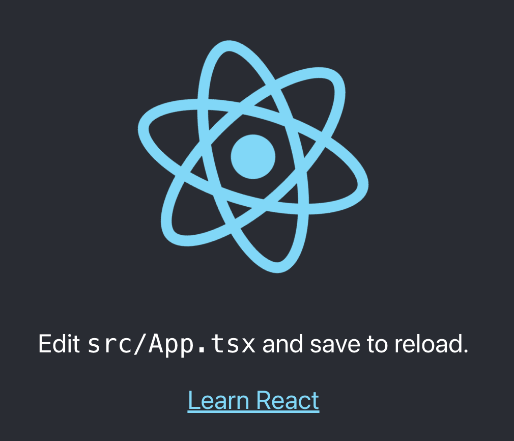
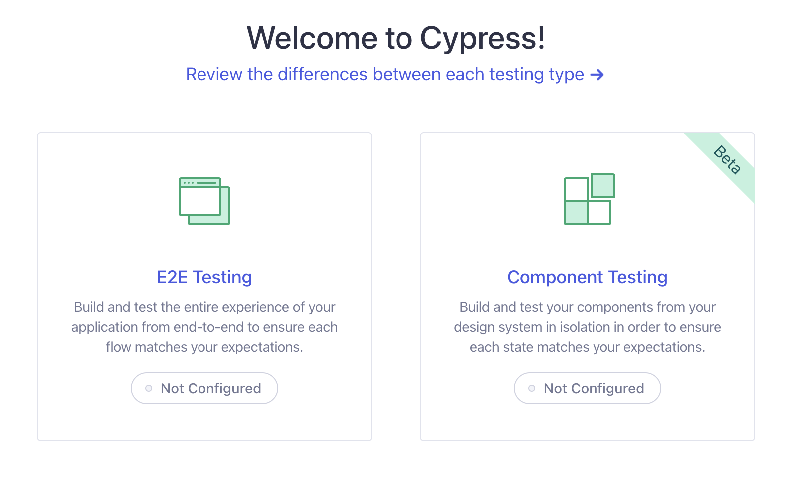
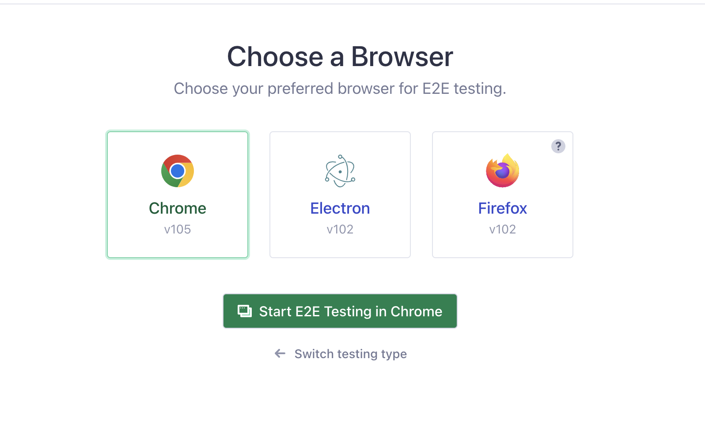
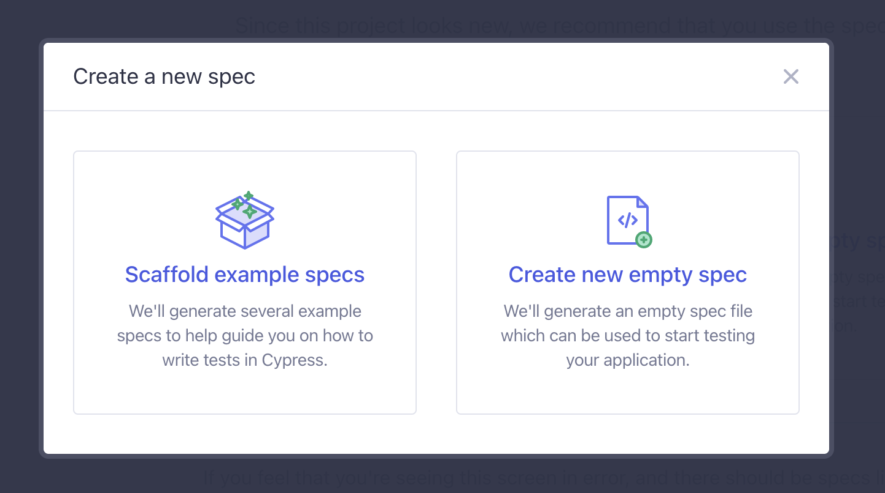
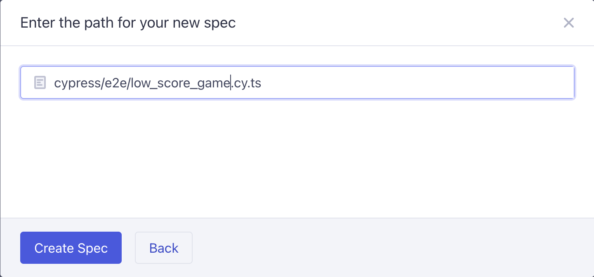
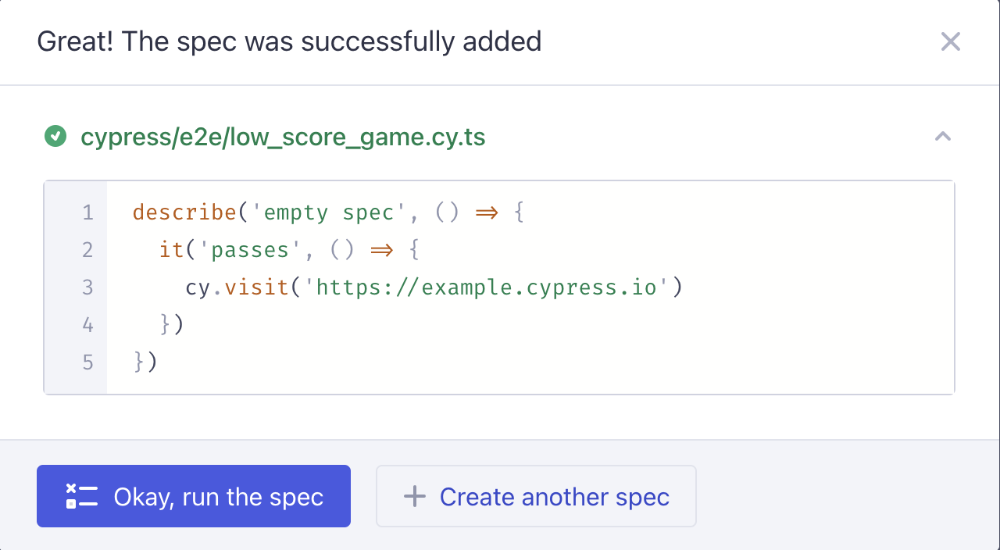
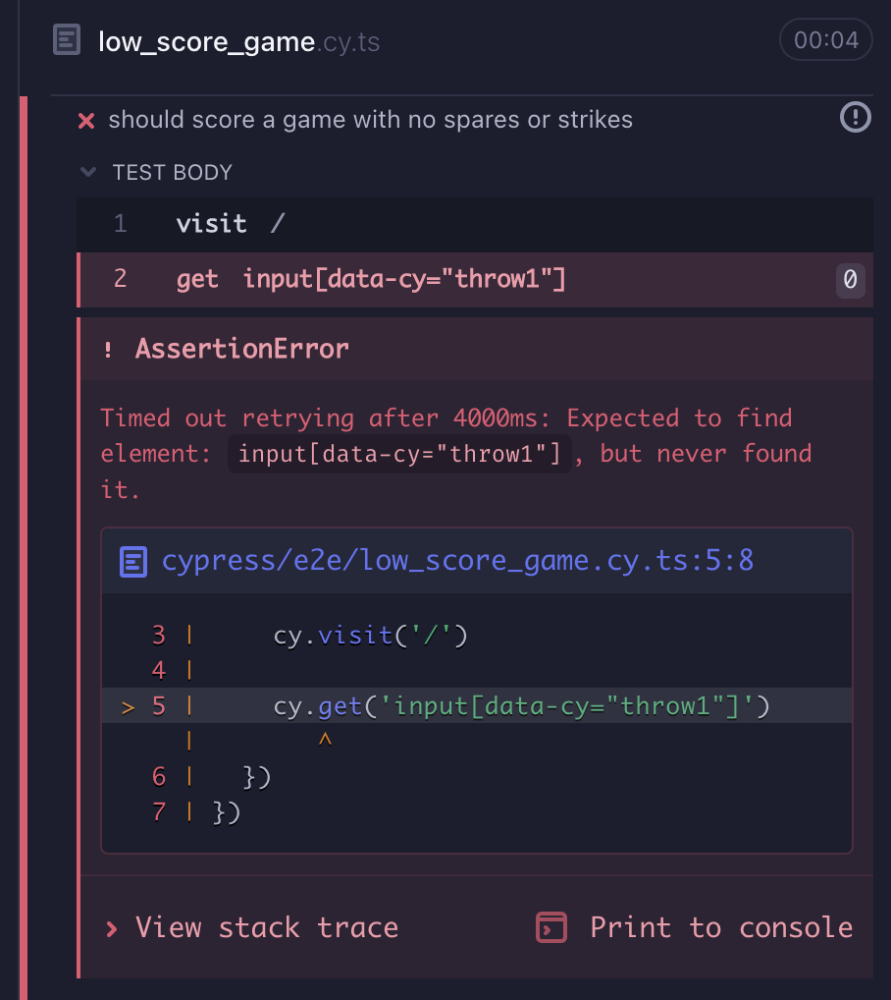

# Outside-In Testing Tutorial
This goal of this repository is to demonstrate how outside-in TDD works in step-by-step tutorial. Each step is exampled in a new branch, linked to from this file. You can follow along by checking out each branch, you can skip to what you're interested in, or you can just reference the steps below as you work through it on your own.

## The Project
The project that will be used in this tutorial is based on one of my go-to programming katas--the bowling game. The requirements are to build a simple webapp that will accept the scores of one player for a full bowling game, giving the correct total score at the end. There is no need for any database or external service, but we'll add some advanced steps at the end in order to cover how the outside-in approach can work with those communication layers.

### Requirements
Each step will clarify and refine the requirements, but these are the high-level directions.

- The page loads with an empty bowling scorecard that has a single row.
- Only the current frame is active.
- Completing a frame automatically changes focus to the next frame.
- When all frames are finished, the form is no longer editable.

### Scoring
The complexity of this application is largely in the scoring. The full details and edge cases will be covered in each step, but here is a brief rundown.

#### Incomplete Frames
There are up to 2 throws in every frame. If you do not knock down every pin between those throws, it is an _incomplete frame_.
- Enter the number of pins knocked down on the 1st throw to the left of the box in the upper right of the frame.
- Enter the number of pins knocked down on the 2nd throw inside the box in the upper right of the frame.
- Add the 2 numbers to the previous score and enter the total in the lower half of the box.

#### Spare Frames
If the 1st throw does not knock down all the pins, but the second knocks down the remainder, it is a _spare frame_.
- Enter the number of pins knocked down on the 1st throw to the left of the box in the upper right of the frame.
- Enter a slash inside the box in the upper right of the frame.
- The score of this frame will not be resolved until later.
  - The score to add into the bottom of the frame will usually be 10 plus the result of the 1st throw of the next frame.

#### Strike Frames
If the 1st throw knocks down all the pins, it is a _strike frame_.
- Enter an 'X' inside the box in the upper right of the frame.
- The score of this frame will not be resolved until later.
  - The score to add into the bottom of the frame will usually be 10 plus the results of the 1st and 2nd throws of the next frame.

## Steps
Each step describes the work to be done and how to approach it. The source code serves as an example of how I implemented each of the features.

### Step One: Set-Up
This step is just getting ready to start the tutorial. You can create your own project and work through the steps yourself or checkout this repository and reference the source as you read each step to see how I did it.

1. You will need to create a React project. I recommend using create-react with typescript, but however you prefer to do it is fine.
   1. To create this repo I used the command `npx create-react-app outside-in --template typescript`. You can name yours whatever you wish; it doesn't have to be 'outside-in'.
2. Open the project in your favorite IDE or shell.
3. Run the default application.
   1. This example uses npm, so I use `npm start`. If you use yarn or other tools use the proper command for your environment.
   
You should see the default React implementation at the URL given by the startup output. Mine looked like the below image.

That's it! You're ready for Step Two!

### Step Two: Create Page
The first thing we'll need is to have a screen just for our bowling form. No need to style anything yet--just get inputs in place.

Our high-level task list for this step is small.
1. Create one frame.
2. Create row of frames.

Let's dig in!

#### 1. Create one frame
We want to have the root application page display a single frame component to prove out the basic building block of the scoring form. In essence, this means that we'll be putting some inputs together with a rough layout. That may sound like a big step, but remember that we aren't really enabling much functionality yet. We're not adding any scores yet. We're not allowing spare or strike entry. We're not disabling entry after values are added. It's just a basic component that allows some numbers to be entered.

We'll start by writing our first test! In inside-out TDD, we might start by writing a test on a Frame JSX component. Here, we'll start by testing the default page.

##### Install Cypress
To write end-to-end tests for this tutorial, I'm using Cypress. Whatever your preference, you'll need to install it. To install Cypress with npm I used `npm install cypress --save-dev`.

Once Cypress is installed, you'll need to run it in order to configure it. With npm, run `npx cypress open`. This will run Cypress and open the window below.

We're making end-to-end tests, so select the "E2E Testing" section. Cypress will create files in your project directory. The next screen lists what has been created, and you can take a look at the file contents.

You could probably stop here, but it's worth continuing if you haven't used Cypress before. Click "Continue" and you'll see a browser selection.

Select the browser you'd like and click the button to run E2E tests. You don't have any yet, so a dialog will pop up.

We'll make an empty spec, so select the box on the right. Now you'll be prompted to enter a name for the test.

Name it "low_score_game". This will create the test file that we'll be working with for the first several steps. Click the create button, and Cypress will show you the generated test.

This generates a test that doesn't actually assert anything. It does, however, provide our starting point and the URL for [example.cypress.io](https://example.cypress.io/), which might be useful for continuing to explore cypress outside of this tutorial. Go ahead and run the test so you can see how the results are reported.

Once you have examined the test results, you can close Cypress if you wish. We'll be returning to it frequently, so you might want to leave it running, but you can always run it again when needed with `npx cypress open` (or headless with `npx cypress run`).

There are a few things you'll need to do manually now to complete setting up Cypress. Go to the `cypress/` folder. You'll see a config file, `cypress.config.ts`. Add an entry inside the `e2e` section `baseUrl: 'http://localhost:3000'` (or whatever port your application runs on). This sets the default host for Cypress to use for URLs it's given, so we'll be able to use relative paths in our tests.

Next, still inside the Cypress directory, create the file `eslint.json` with the following content.

    {
        "plugins": [
            "cypress"
        ]
    }

One additional file is needed for TypeScript support, `tsconfig.json`.

    {
        "compilerOptions": {
            "target": "es5",
            "lib": ["es5", "dom"],
            "types": ["cypress", "node"],
            "jsx": "react"
        },
        "include": ["**/*.ts", "**/*.tsx"]
    }

Now your IDE should hopefully recognize the Cypress library.

##### Test a Frame
A frame on a bowling score-sheet can take a lot of forms, but generally, there's a top section with at least one box to the right side and an open lower section. We'll make it the way that I remember from youth, with a single box in the upper right.

Our first test will be that numbers can be placed in the two upper sections.

Open the test file we just generated, `cypress/e2e/low_score_game.cy.ts`. The bulk of it looks like standard jest testing, but the sole command is `cy.visit('https://example.cypress.io'`. The global variable `cy` is the handle for interacting with Cypress commands, and `visit()` tells Cypress to load the provided URL. We'll use a relative link, loading our application's landing page.

Change the URL in the visit command to `'/'`. If your application and Cypress aren't running, start them now.

Now the Cypress loads your application instead of the Cypress example page. Let's build on that.

We'll want to make a few changes to the text of the test file. The description should be about the purpose of the test file. Let's make it match the file name "Low Score Game". Similarly, the test name should be more descriptive of its purpose. It 'should score a game with no spares or strikes'.

Now let's build some interactions for our page. Something that will spur us to build our frame component. The most direct way to get an input is to use `cy.get()`, passing it an identifier in x-path format. Cypress recommends using data attributes, so let's expect those. We have a single frame, so let's not worry about making an adaptable identifier just yet. After all, one purpose of this tutorial is to demonstrate how easy it is to evolve applications with outside-in testing.

After the visit line, type `input[data-cy="throw1"]`. Take a look at your test results. You should now see an error.

Cypress looked for the element and couldn't find it. We should correct that.

Open `src/App.tsx`. There's a lot of stuff in here that we just don't need. The JSX returned by the `App()` function can be replaced by a single input.

    return (
        <input type='text' data-cy='throw1'/>
    );

Now your test will pass!

## Learn More

If you're unfamiliar with the outside-in approach I urge you to peruse [outsidein.dev](https://outsidein.dev/concepts/outside-in-tdd/). Josh Justice does a great job of explaining it with diagrams and examples. His book *Outside-In React Development: A TDD Primer* answered a lot of questions for me about how to reduce redundant tests in front-end code.
