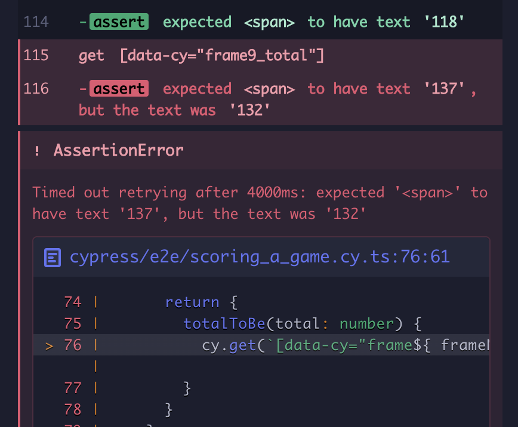
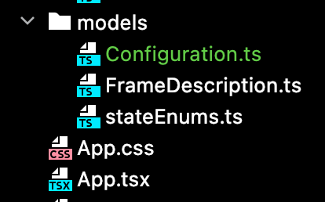
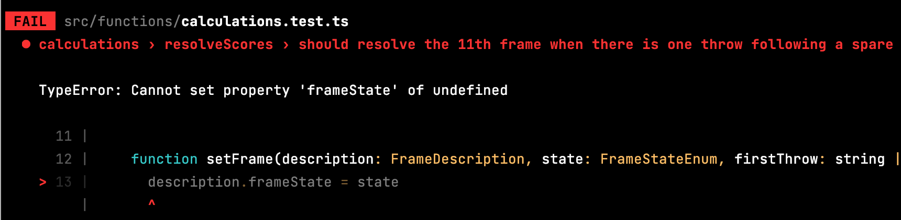

# Step Four: Handle Scoring Strikes

I'd like to say that adding strikes will be comparatively easy now. We've changed scoring quite a bit and have state changes handled relatively smoothly. There are a few new nuances, though, that will require further modifications to accommodate.

- **Skipping the second throw** The special character now goes into the first box of the frame. Allowing that entry should be trivial, but we will now need to transition past the second input.
- **Scoring requires an additional throw beyond spares** With a spare, you add the first throw of the next frame as a bonus to the spare frame. Now we have to look 2 throws ahead. This gets complicated, especially because multiple strikes in a row require shifting the frame lens even further.
- **The extra frame will require a lot of special handling** A strike in the 10th frame requires two more throws to resolve the score. No problem if they're both bad throws, but if one's another strike...

We didn't break down the work for step three, and some work got forgotten because of that. So this time let's do some more planning up front.

**Task List**
1. Allow an 'X' to be entered in the first throw. This includes making the focus shift to the next frame. By the end of this task, a game should be able to have a strike in every frame, including the extra frame.
2. Score strikes up through the 9th frame. After that, it will get more complicated, so this task ends when the 9th strike in a row has a resolved score.
3. Create a third input for the extra frame. We will need this in order to complete scoring a perfect game.
4. Resolve a strike in the 10th frame. This requires activating the second input in the extra frame. When a 10th frame strike is correctly scored with two non-special throws, this task is complete.
5. Score the extra frame with two throws. Same as the previous step, except that the 11th frame is scored correctly as well.
6. Resolve a spare after a strike in the 10th frame. This is a special case, where the extra frame's score cannot be resolved until one more throw to resolve a spare.
7. Resolve a strike in the extra frame after a 10th frame strike. You have to stop rolling at some point, and the cut-off for the extra frame is that if you fill all three boxes you're done. (A perfect game is 300 points).

But before we do any of this, we need to address a major problem. We have an *extra* extra frame. I miscounted when I established the initial requirements, and the result is that we have 10 normal frames instead of the standard 9. Big, big whoops. Let's see how outside-in handles a requirement change.

## Fix Number of Frames

We need to remove a frame. We'll start with the end-to-end tests.

    it('should score a game with no spares or strikes', () => {
      ...
      cy.visit('/')
      ...
      forFrame(9).throwOneIs(7).throwTwoIs(1).whichTotals(57)
      forFrame(10).throwOneIsDisabled().throwTwoIsDisabled()
    })

    it('should score a game with spares', () => {
      ...
      cy.visit('/')
      ...
      forFrame(9).throwOneIs(3).throwTwoIs(spare())
      forFrame(10).throwOneIs(4).throwTwoIsDisabled()
      ...
      expectFrame(9).totalToBe(137)
      expectFrame(10).totalToBe(141)
    })

Both of these, of course, fail.

One thing that needs to change is the initializer, which needs to make 10 frames rather than 11.

    for (let i = 0; i < 10; i++) {

Then we'll need to change the analyzers. There's a unit test for one of them but not the other.

    describe('analyzers', () => {
      describe('isExtraFrame', () => {
        it('identifies extra frame', ()=> {
          const descriptions = createFrameDescriptions()
          for (let i = 0; i < 10; i++) {
            expect(isExtraFrame(descriptions[i])).toBeFalsy()
          }
          expect(isExtraFrame(descriptions[10])).toBeTruthy()
        })
      })
    })

Easy enough to change the expectation, but does it add any real value? It either is or isn't the extra frame; there's no real complexity here. We didn't test the other analyzer, but the end-to-end tests work, so it doesn't matter. It doesn't even matter to the user that the function under test exists, only that the application as a whole works as expected. Let's remove this test.

There are now only two unit test files in the system: one for calculations and one for validators. Both of these modules contain complex logic that warrant edge-case testing.

Back to our analyzer functions. They're also simple enough to change.

    export function isExtraFrame(description: FrameDescription) {
      return description.index === 9
    }

    export function isLastFrame(description: FrameDescription) {
      return description.index === 8
    }

The end-to-end test for a no-spare/no-strike game passes, but the one for all spares does not.

The spares test finds a value, but it's not what we expected. Let's double-check our math. The total as of frame 8 is 118, frame 9 adds 10 for the spare plus the 4 from the first throw in the extra frame. So, 118 plus 14. That's 132, which is what the test found. Oops. We'll have to adjust the last two frames' expectations.

    expectFrame(9).totalToBe(132)
    expectFrame(10).totalToBe(136)

Now it all works! But before we declare victory, there's something we should address. To remove the extra frame, we had to decrement 3 hard-coded numbers by 1. In the context of this application, they aren't very mysterious numbers, but they do duplicate the understanding of the maximum number of frames. There's little change that we'll need to change this again, but it is true duplication so let's remove it. We'll need a good spot for the constant. It's used by the frame initializer and two calculations, but it doesn't seem to belong to either. It should be somewhere easy for those to reach. It might turn out to be overkill, but let's create a config file. We'll need a type declared.

    export type Configuration = {
      frameCount: number
    }

This is a very simple type, and I admit I'm looking far ahead in even making it. I don't know what shape it will take, but we'll eventually need to handle multiple players, teams, etc.

We're starting to fill up the `models` folder. One file per type is very much ingrained in me by my OOP background and not always appropriate for React. For now, it's more silly than problematic, but we should think about what our threshold is for consolidating them into a types file.

We'll add a constant to `initializers.ts` to set the Configuration.

    export const configuration: Configuration = {
      frameCount: 10
    }

    export function createFrameDescriptions(): FrameDescription[] {
      const descriptions: FrameDescription[] = []
      for (let i = 0; i < configuration.frameCount; i++) {
        descriptions.push({
          index: i,
          tag: `frame${i + 1}`,
          score: null,
          firstThrow: null,
          secondThrow: null,
          frameState: 'Not Started'
        })
      }
      return descriptions
    }

Now we can update the analyzers.

    export function isExtraFrame(description: FrameDescription) {
      return description.index === configuration.frameCount - 1
    }

    export function isLastFrame(description: FrameDescription) {
      return description.index === configuration.frameCount - 2
    }

I'm not sure that I like how those read, but at least they're encapsulated and tied to a common base value.

When we run tests, the Cypress assertions all pass but there's a failure in our frame resolver unit tests.

The description of the failing test gives us our first clue. `calculations > resolveScores > should resolve the 11th frame when there is one throw following a spare`.

    it('should resolve the 11th frame when there is one throw following a spare', () => {
      const descriptions = frameDescriptions()
      setFrame(descriptions[0], 'Done', '1', '0')
      setFrame(descriptions[1], 'Done', '3', '2')
      setFrame(descriptions[2], 'Done', '5', '1')
      setFrame(descriptions[3], 'Done', '0', '3')
      setFrame(descriptions[4], 'Done', '2', '4')
      setFrame(descriptions[5], 'Done', '3', '2')
      setFrame(descriptions[6], 'Done', '2', '1')
      setFrame(descriptions[7], 'Done', '4', '2')
      setFrame(descriptions[8], 'Done', '5', '3')
      setFrame(descriptions[9], 'Pending', '8', '/')
      setFrame(descriptions[10], 'Second Throw', '3')

      resolveScores(descriptions)

      assertScores(descriptions, [1, 6, 12, 15, 21, 26, 29, 35, 43, 56, 59])
    })

Is this test still useful? It helped us to create the function under test, but the specific case is covered in the spare game test. We could remove it, knowing that the functionality is tested elsewhere. We will be modifying this function extensively to add strike handling, so I'm inclined to keep the test suite intact for now as a scaffold while we're work on the score resolver. We fix the test.

    it('should resolve the extra frame when there is one throw following a spare', () => {
      const descriptions = frameDescriptions()
      setFrame(descriptions[0], 'Done', '1', '0')
      setFrame(descriptions[1], 'Done', '3', '2')
      setFrame(descriptions[2], 'Done', '5', '1')
      setFrame(descriptions[3], 'Done', '0', '3')
      setFrame(descriptions[4], 'Done', '2', '4')
      setFrame(descriptions[5], 'Done', '3', '2')
      setFrame(descriptions[6], 'Done', '2', '1')
      setFrame(descriptions[7], 'Done', '4', '2')
      setFrame(descriptions[8], 'Pending', '5', '/')
      setFrame(descriptions[9], 'Second Throw', '3')

      resolveScores(descriptions)

      assertScores(descriptions, [1, 6, 12, 15, 21, 26, 29, 35, 48, 51])
    })

This is still a brittle test. If the number of frames changes again, this will need another adjustment. We could invest in making the test more dynamic, generating data to fill in the appropriate number of frames based on the configuration so that we don't need to be dependent on knowing how many frames there are. That's a good solution for unit tests that need to adapt to a changing system, but now that we have the correct number of frames this shouldn't change again, and this test module will be deleted once the strike calculation is working anyway.

We're ready to move on to adding strikes!

## Allow Strike to Be Entered

Our first task states
> Allow an 'X' to be entered in the first throw. This includes making the focus shift to the next frame. By the end of this task, a game should be able to have a strike in every frame, including the extra frame.

We'll need a new end-to-end test.

    it('should score a game with strikes', () => {
      function forFrame(frameNumber: number) {
        const label = `frame${frameNumber}`
        return {
          enterStrike() {
            cy.get(`input[data-cy="${ label }_throw1"]`).should('have.focus').type('x').should('not.have.focus').should('be.disabled')
          }
        }
      }
      cy.visit('/')

      forFrame(1).enterStrike()
    })

It fails for the reason we expect, so we need to first allow entry of the strike character. It's represented in a scoresheet by an 'X'. We used a lowercase 'x' in the test, and we should allow either to be used. To the validator tests!

    it('should allow single digits, spares, and strikes', () => {
      fc.assert(fc.property(fc.integer({min: 0, max: 9}), (num: number) => {
        return isCharacterValid(num.toString())
      }), {numRuns: 10, skipEqualValues: true})
      fc.assert(fc.property(fc.constant('/'), (slash: string) => {
        return isCharacterValid(slash)
      }))
      fc.assert(fc.property(fc.constant('x'), (strike: string) => {
        return isCharacterValid(strike)
      }))
      fc.assert(fc.property(fc.constant('X'), (strike: string) => {
        return isCharacterValid(strike)
      }))
    })
    ...
    it('should not allow non-numeric characters', () => {
      const nonNumericPattern = new RegExp('\\D')
      fc.assert(fc.property(fc.char().filter(t => nonNumericPattern.test(t) && !['/', 'x', 'X'].includes(t)), (value: string) => {
        return !isCharacterValid(value)
      }), {numRuns: 30, skipEqualValues: true})
    })

The first test fails because we haven't changed the code yet. The second would have failed after the change, but we change it now to properly update our expectations. We just need to add few characters to our RegExp pattern.

    export function isCharacterValid(char: string): boolean {
      return new RegExp('^[\\d\\/xX]$').test(char)
    }

Our unit tests and end-to-end tests all pass!

We still need to change the focus to the next frame before the task is complete, but let's not forget to lock down strikes to only be valid for the front end. We'll add an assertion to our validators tests. Second frame validation is tricky enough, so we'll use the unit tests.

    it('should not allow a strike in the second frame', () => {
      expect(isSecondThrowValid('1', 'x')).toBeFalsy()
      expect(isSecondThrowValid('1', 'X')).toBeFalsy()
    })

Ready for the scary part? This passes with no code change. Why? Because the implementation casts the throw's value as a number, which for the x characters returns NaN. Adding a number to NaN is also NaN, which is not less than or equal to 9, which return false, which is exactly what we want! Is it clear from the code that this is excluding second frame strikes? Not unless you know way too much about Javascript. But at least we have a test that verifies the behavior we expect. I'd say it's probably fine to add a check for clarity, but I'm not going to bother since we have test coverage--particularly as we'll soon be changing this function to explicitly allow a second input strike in the extra frame under some circumstances.

Now we can return to the matter of advancing the frame.

We can mark the frame as Pending, and we'll see where that gets us. First, though, we need to add another assertion to our end-to-end test.

    forFrame(1).enterStrike()
    forFrame(2).enterStrike()

Part of our `enterStrike` implementation is to assert that the first input of the frame is in focus. This fails for the second frame, which is all that we need to get to work. We'll add a condition in the FrameInput change handler.

    const changeHandler = () => {
      if (inputRef.current?.value) {
        if (isCharacterValid(inputRef.current?.value) && isValidForThrow(inputRef.current?.value)) {
          if (inputRef.current?.value === '/' || inputRef.current?.value === 'x' || inputRef.current?.value === 'X') {
            setFrameState('Pending')
          } else {
            setFrameState(nextFrameState)
          }
        } else {
          inputRef.current.value = ''
        }
      }
    }

This makes our test pass! That was pretty simple. This is a clunky condition, though, especially with the two representations of strikes. We can extract this logic to an analyzer.

    export function requiresSpecialScoring(value: string) {
      return value === '/' || value === 'x' || value === 'X'
    }

Like the other analyzers, this is simple enough to not require an explicit test. It's functionality is implicitly tested by the end-to-end tests functioning. Now we can replace the 'Pending' condition in FrameInput.

    const changeHandler = () => {
      if (inputRef.current?.value) {
        if (isCharacterValid(inputRef.current?.value) && isValidForThrow(inputRef.current?.value)) {
          if (requiresSpecialScoring(inputRef.current.value)) {
            setFrameState('Pending')
          } else {
            setFrameState(nextFrameState)
          }
        } else {
          inputRef.current.value = ''
        }
      }
    }

That's better. One more word on this. The name `requiresSpecialScoring` violates the usual convention for naming boolean functions. That's intentional. Conventions are useful, but not at the expense of clarity. I couldn't find an `is` phrase that worked, and 'requires' has the same boolean statefulness to read similarly.

There's just one thing left to finish this task. We need to have a test that successfully puts 10 strikes into the scorecard.

    forFrame(1).enterStrike()
    forFrame(2).enterStrike()
    forFrame(3).enterStrike()
    forFrame(4).enterStrike()
    forFrame(5).enterStrike()
    forFrame(6).enterStrike()
    forFrame(7).enterStrike()
    forFrame(8).enterStrike()
    forFrame(9).enterStrike()
    forFrame(10).enterStrike()

It works! Adding assertions that already work is not the way TDD is supposed to work, but this was a happy accident. We'll need these entries for the next task, so that's alright.