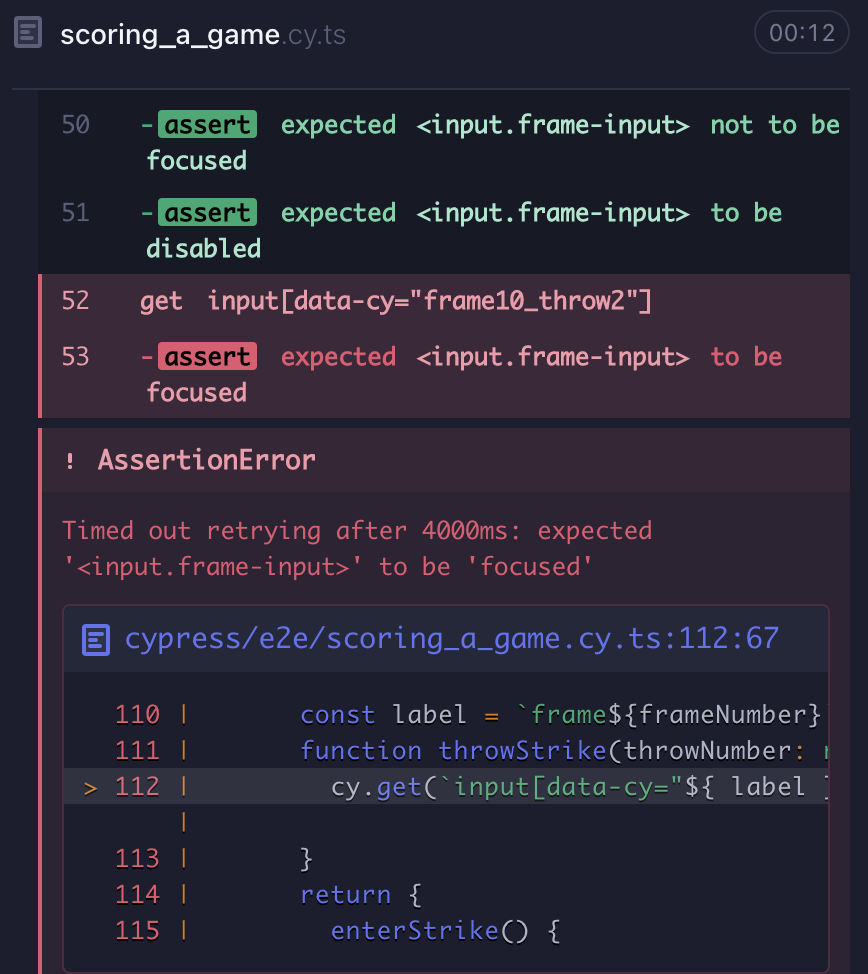
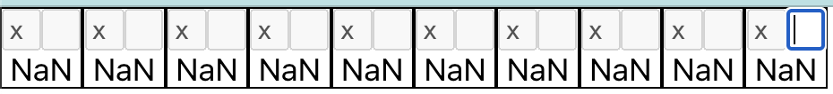
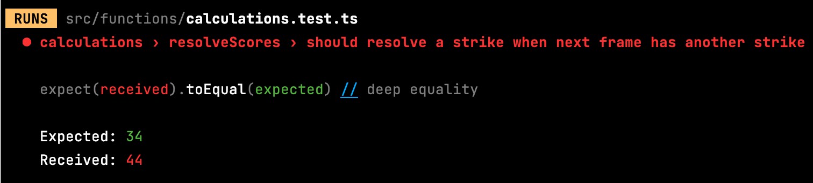
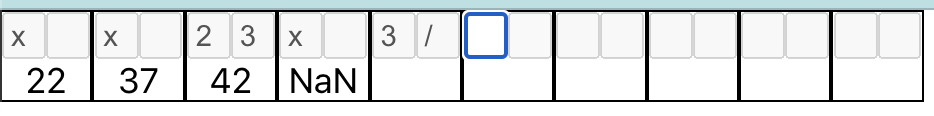
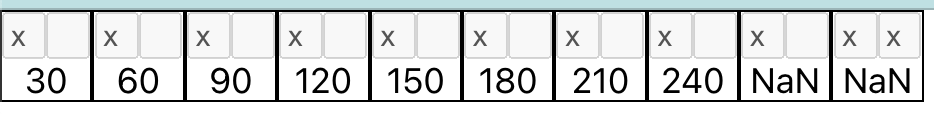
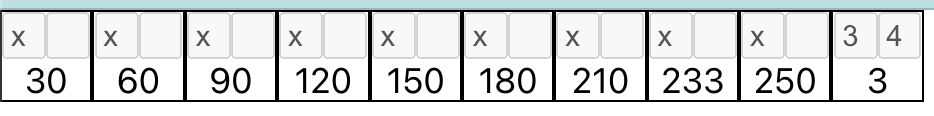
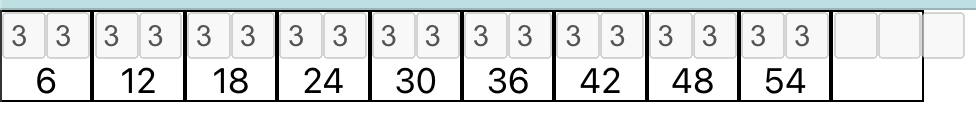
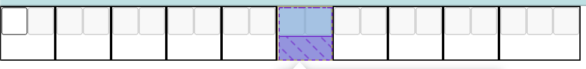

# Step Four: Handle Scoring Strikes

I'd like to say that adding strikes will be comparatively easy now. We've changed scoring quite a bit and have state changes handled relatively smoothly. There are a few new nuances, though, that will require further modifications to accommodate.

- **Skipping the second throw** The special character now goes into the first box of the frame. Allowing that entry should be trivial, but we will now need to transition past the second input.
- **Scoring requires an additional throw beyond spares** With a spare, you add the first throw of the next frame as a bonus to the spare frame. Now we have to look 2 throws ahead. This gets complicated, especially because multiple strikes in a row require shifting the frame lens even further.
- **The extra frame will require a lot of special handling** A strike in the 10th frame requires two more throws to resolve the score. No problem if they're both bad throws, but if one's another strike...

We didn't break down the work for step three, and some work got forgotten because of that. So this time let's do some more planning up front.

**Task List**
1. Allow an 'X' to be entered in the first throw. This includes making the focus shift to the next frame. By the end of this task, a game should be able to have a strike in every frame, including the extra frame.
2. Score strikes up through the 9th frame. After that, it will get more complicated, so this task ends when the 9th strike in a row has a resolved score.
3. Create a third input for the extra frame. We will need this in order to complete scoring a perfect game.
4. Resolve a strike in the 10th frame. This requires activating the second input in the extra frame. When a 10th frame strike is correctly scored with two non-special throws, this task is complete.
5. Score the extra frame with two throws. Same as the previous step, except that the 11th frame is scored correctly as well.
6. Resolve a spare after a strike in the 10th frame. This is a special case, where the extra frame's score cannot be resolved until one more throw to resolve a spare.
7. Resolve a strike in the extra frame after a 10th frame strike. You have to stop rolling at some point, and the cut-off for the extra frame is that if you fill all three boxes you're done. (A perfect game is 300 points).

But before we do any of this, we need to address a major problem. We have an *extra* extra frame. I miscounted when I established the initial requirements, and the result is that we have 10 normal frames instead of the standard 9. Big, big whoops. Let's see how outside-in handles a requirement change.

## Fix Number of Frames

We need to remove a frame. We'll start with the end-to-end tests.

    it('should score a game with no spares or strikes', () => {
      ...
      cy.visit('/')
      ...
      forFrame(9).throwOneIs(7).throwTwoIs(1).whichTotals(57)
      forFrame(10).throwOneIsDisabled().throwTwoIsDisabled()
    })

    it('should score a game with spares', () => {
      ...
      cy.visit('/')
      ...
      forFrame(9).throwOneIs(3).throwTwoIs(spare())
      forFrame(10).throwOneIs(4).throwTwoIsDisabled()
      ...
      expectFrame(9).totalToBe(137)
      expectFrame(10).totalToBe(141)
    })

Both of these, of course, fail.

One thing that needs to change is the initializer, which needs to make 10 frames rather than 11.

    for (let i = 0; i < 10; i++) {

Then we'll need to change the analyzers. There's a unit test for one of them but not the other.

    describe('analyzers', () => {
      describe('isExtraFrame', () => {
        it('identifies extra frame', ()=> {
          const descriptions = createFrameDescriptions()
          for (let i = 0; i < 10; i++) {
            expect(isExtraFrame(descriptions[i])).toBeFalsy()
          }
          expect(isExtraFrame(descriptions[10])).toBeTruthy()
        })
      })
    })

Easy enough to change the expectation, but does it add any real value? It either is or isn't the extra frame; there's no real complexity here. We didn't test the other analyzer, but the end-to-end tests work, so it doesn't matter. It doesn't even matter to the user that the function under test exists, only that the application as a whole works as expected. Let's remove this test.

There are now only two unit test files in the system: one for calculations and one for validators. Both of these modules contain complex logic that warrant edge-case testing.

Back to our analyzer functions. They're also simple enough to change.

    export function isExtraFrame(description: FrameDescription) {
      return description.index === 9
    }

    export function isLastFrame(description: FrameDescription) {
      return description.index === 8
    }

The end-to-end test for a no-spare/no-strike game passes, but the one for all spares does not.

The spares test finds a value, but it's not what we expected. Let's double-check our math. The total as of frame 8 is 118, frame 9 adds 10 for the spare plus the 4 from the first throw in the extra frame. So, 118 plus 14. That's 132, which is what the test found. Oops. We'll have to adjust the last two frames' expectations.

    expectFrame(9).totalToBe(132)
    expectFrame(10).totalToBe(136)

Now it all works! But before we declare victory, there's something we should address. To remove the extra frame, we had to decrement 3 hard-coded numbers by 1. In the context of this application, they aren't very mysterious numbers, but they do duplicate the understanding of the maximum number of frames. There's little change that we'll need to change this again, but it is true duplication so let's remove it. We'll need a good spot for the constant. It's used by the frame initializer and two calculations, but it doesn't seem to belong to either. It should be somewhere easy for those to reach. It might turn out to be overkill, but let's create a config file. We'll need a type declared.

    export type Configuration = {
      frameCount: number
    }

This is a very simple type, and I admit I'm looking far ahead in even making it. I don't know what shape it will take, but we'll eventually need to handle multiple players, teams, etc.

We're starting to fill up the `models` folder. One file per type is very much ingrained in me by my OOP background and not always appropriate for React. For now, it's more silly than problematic, but we should think about what our threshold is for consolidating them into a types file.

We'll add a constant to `initializers.ts` to set the Configuration.

    export const configuration: Configuration = {
      frameCount: 10
    }

    export function createFrameDescriptions(): FrameDescription[] {
      const descriptions: FrameDescription[] = []
      for (let i = 0; i < configuration.frameCount; i++) {
        descriptions.push({
          index: i,
          tag: `frame${i + 1}`,
          score: null,
          firstThrow: null,
          secondThrow: null,
          frameState: 'Not Started'
        })
      }
      return descriptions
    }

Now we can update the analyzers.

    export function isExtraFrame(description: FrameDescription) {
      return description.index === configuration.frameCount - 1
    }

    export function isLastFrame(description: FrameDescription) {
      return description.index === configuration.frameCount - 2
    }

I'm not sure that I like how those read, but at least they're encapsulated and tied to a common base value.

When we run tests, the Cypress assertions all pass but there's a failure in our frame resolver unit tests.

The description of the failing test gives us our first clue. `calculations > resolveScores > should resolve the 11th frame when there is one throw following a spare`.

    it('should resolve the 11th frame when there is one throw following a spare', () => {
      const descriptions = frameDescriptions()
      setFrame(descriptions[0], 'Done', '1', '0')
      setFrame(descriptions[1], 'Done', '3', '2')
      setFrame(descriptions[2], 'Done', '5', '1')
      setFrame(descriptions[3], 'Done', '0', '3')
      setFrame(descriptions[4], 'Done', '2', '4')
      setFrame(descriptions[5], 'Done', '3', '2')
      setFrame(descriptions[6], 'Done', '2', '1')
      setFrame(descriptions[7], 'Done', '4', '2')
      setFrame(descriptions[8], 'Done', '5', '3')
      setFrame(descriptions[9], 'Pending', '8', '/')
      setFrame(descriptions[10], 'Second Throw', '3')

      resolveScores(descriptions)

      assertScores(descriptions, [1, 6, 12, 15, 21, 26, 29, 35, 43, 56, 59])
    })

Is this test still useful? It helped us to create the function under test, but the specific case is covered in the spare game test. We could remove it, knowing that the functionality is tested elsewhere. We will be modifying this function extensively to add strike handling, so I'm inclined to keep the test suite intact for now as a scaffold while we're work on the score resolver. We fix the test.

    it('should resolve the extra frame when there is one throw following a spare', () => {
      const descriptions = frameDescriptions()
      setFrame(descriptions[0], 'Done', '1', '0')
      setFrame(descriptions[1], 'Done', '3', '2')
      setFrame(descriptions[2], 'Done', '5', '1')
      setFrame(descriptions[3], 'Done', '0', '3')
      setFrame(descriptions[4], 'Done', '2', '4')
      setFrame(descriptions[5], 'Done', '3', '2')
      setFrame(descriptions[6], 'Done', '2', '1')
      setFrame(descriptions[7], 'Done', '4', '2')
      setFrame(descriptions[8], 'Pending', '5', '/')
      setFrame(descriptions[9], 'Second Throw', '3')

      resolveScores(descriptions)

      assertScores(descriptions, [1, 6, 12, 15, 21, 26, 29, 35, 48, 51])
    })

This is still a brittle test. If the number of frames changes again, this will need another adjustment. We could invest in making the test more dynamic, generating data to fill in the appropriate number of frames based on the configuration so that we don't need to be dependent on knowing how many frames there are. That's a good solution for unit tests that need to adapt to a changing system, but now that we have the correct number of frames this shouldn't change again, and this test module will be deleted once the strike calculation is working anyway.

We're ready to move on to adding strikes!

## Allow Strike to Be Entered

Our first task states
> Allow an 'X' to be entered in the first throw. This includes making the focus shift to the next frame. By the end of this task, a game should be able to have a strike in every frame, including the extra frame.

We'll need a new end-to-end test.

    it('should score a game with strikes', () => {
      function forFrame(frameNumber: number) {
        const label = `frame${frameNumber}`
        return {
          enterStrike() {
            cy.get(`input[data-cy="${ label }_throw1"]`).should('have.focus').type('x').should('not.have.focus').should('be.disabled')
          }
        }
      }
      cy.visit('/')

      forFrame(1).enterStrike()
    })

It fails for the reason we expect, so we need to first allow entry of the strike character. It's represented in a scoresheet by an 'X'. We used a lowercase 'x' in the test, and we should allow either to be used. To the validator tests!

    it('should allow single digits, spares, and strikes', () => {
      fc.assert(fc.property(fc.integer({min: 0, max: 9}), (num: number) => {
        return isCharacterValid(num.toString())
      }), {numRuns: 10, skipEqualValues: true})
      fc.assert(fc.property(fc.constant('/'), (slash: string) => {
        return isCharacterValid(slash)
      }))
      fc.assert(fc.property(fc.constant('x'), (strike: string) => {
        return isCharacterValid(strike)
      }))
      fc.assert(fc.property(fc.constant('X'), (strike: string) => {
        return isCharacterValid(strike)
      }))
    })
    ...
    it('should not allow non-numeric characters', () => {
      const nonNumericPattern = new RegExp('\\D')
      fc.assert(fc.property(fc.char().filter(t => nonNumericPattern.test(t) && !['/', 'x', 'X'].includes(t)), (value: string) => {
        return !isCharacterValid(value)
      }), {numRuns: 30, skipEqualValues: true})
    })

The first test fails because we haven't changed the code yet. The second would have failed after the change, but we change it now to properly update our expectations. We just need to add few characters to our RegExp pattern.

    export function isCharacterValid(char: string): boolean {
      return new RegExp('^[\\d\\/xX]$').test(char)
    }

Our unit tests and end-to-end tests all pass!

We still need to change the focus to the next frame before the task is complete, but let's not forget to lock down strikes to only be valid for the front end. We'll add an assertion to our validators tests. Second frame validation is tricky enough, so we'll use the unit tests.

    it('should not allow a strike in the second frame', () => {
      expect(isSecondThrowValid('1', 'x')).toBeFalsy()
      expect(isSecondThrowValid('1', 'X')).toBeFalsy()
    })

Ready for the scary part? This passes with no code change. Why? Because the implementation casts the throw's value as a number, which for the x characters returns NaN. Adding a number to NaN is also NaN, which is not less than or equal to 9, which return false, which is exactly what we want! Is it clear from the code that this is excluding second frame strikes? Not unless you know way too much about Javascript. But at least we have a test that verifies the behavior we expect. I'd say it's probably fine to add a check for clarity, but I'm not going to bother since we have test coverage--particularly as we'll soon be changing this function to explicitly allow a second input strike in the extra frame under some circumstances.

Now we can return to the matter of advancing the frame.

We can mark the frame as Pending, and we'll see where that gets us. First, though, we need to add another assertion to our end-to-end test.

    forFrame(1).enterStrike()
    forFrame(2).enterStrike()

Part of our `enterStrike` implementation is to assert that the first input of the frame is in focus. This fails for the second frame, which is all that we need to get to work. We'll add a condition in the FrameInput change handler.

    const changeHandler = () => {
      if (inputRef.current?.value) {
        if (isCharacterValid(inputRef.current?.value) && isValidForThrow(inputRef.current?.value)) {
          if (inputRef.current?.value === '/' || inputRef.current?.value === 'x' || inputRef.current?.value === 'X') {
            setFrameState('Pending')
          } else {
            setFrameState(nextFrameState)
          }
        } else {
          inputRef.current.value = ''
        }
      }
    }

This makes our test pass! That was pretty simple. This is a clunky condition, though, especially with the two representations of strikes. We can extract this logic to an analyzer.

    export function requiresSpecialScoring(value: string) {
      return value === '/' || value === 'x' || value === 'X'
    }

Like the other analyzers, this is simple enough to not require an explicit test. It's functionality is implicitly tested by the end-to-end tests functioning. Now we can replace the 'Pending' condition in FrameInput.

    const changeHandler = () => {
      if (inputRef.current?.value) {
        if (isCharacterValid(inputRef.current?.value) && isValidForThrow(inputRef.current?.value)) {
          if (requiresSpecialScoring(inputRef.current.value)) {
            setFrameState('Pending')
          } else {
            setFrameState(nextFrameState)
          }
        } else {
          inputRef.current.value = ''
        }
      }
    }

That's better. One more word on this. The name `requiresSpecialScoring` violates the usual convention for naming boolean functions. That's intentional. Conventions are useful, but not at the expense of clarity. I couldn't find an `is` phrase that worked, and 'requires' has the same boolean statefulness to read similarly.

There's just one thing left to finish this task. We need to have a test that successfully puts 10 strikes into the scorecard.

    forFrame(1).enterStrike()
    forFrame(2).enterStrike()
    forFrame(3).enterStrike()
    forFrame(4).enterStrike()
    forFrame(5).enterStrike()
    forFrame(6).enterStrike()
    forFrame(7).enterStrike()
    forFrame(8).enterStrike()
    forFrame(9).enterStrike()
    forFrame(10).enterStrike()

It works! Adding assertions that already work is not the way TDD is supposed to work, but this was a happy accident. We'll need these entries for the next task, so that's alright.

## Score Strikes Not in Extra Frame

Our task description, as a reminder, is as follows.

> Score strikes up through the 9th frame. After that, it will get more complicated, so this task ends when the 9th strike in a row has a resolved score.

There's a lot that will go into this. We'll need to modify the score resolver, and that will require looking further ahead than we currently are. We'll also need to put in some special handling for the extra frame to allow a second throw in it. We'll start by adding some more assertions to our strike test.

    function forFrame(frameNumber: number) {
      const label = `frame${frameNumber}`
      function throwStrike(throwNumber: number) {
        cy.get(`input[data-cy="${ label }_throw${throwNumber}"]`).should('have.focus').type('x').should('not.have.focus').should('be.disabled')
      }
      return {
        enterStrike() {
          throwStrike(1)
        },
        enterSecondStrike() {
          throwStrike(2)
        }
      }
    }
    function expectFrame(frameNumber: number) {
      return {
        totalToBe(total: number) {
          cy.get(`[data-cy="frame${ frameNumber }_total"]`).should('have.text', String(total))
        }
      }
    }
    ...
    forFrame(10).enterStrike()
    forFrame(10).enterSecondStrike()

    expectFrame(1).totalToBe(30)
    expectFrame(2).totalToBe(60)
    expectFrame(3).totalToBe(90)
    expectFrame(4).totalToBe(120)
    expectFrame(5).totalToBe(150)
    expectFrame(6).totalToBe(180)
    expectFrame(7).totalToBe(210)
    expectFrame(8).totalToBe(240)
    expectFrame(9).totalToBe(270)

The `expectFrame` assertion chain is taken from the spares test. This is a fully duplicated function, so we should probably address that. Not right now, however. Our test is failing before it even checks on the scores.

We can't enter anything in the second input of the extra frame. We have an analyzer to detect the extra frame, so we can leverage that for special-casing in ScoreCardRow.

    const updateThrows = (firstThrow: string, secondThrow: string | null) => {
      setFrameThrows(firstThrow, secondThrow)
      const descriptions = [...frameDescriptions]
      resolveScores(descriptions)
      setFrameDescriptions(descriptions)
      if (activeFrame) {
        if (activeFrame.frameState === 'Done' && isLastFrame(activeFrame)) {
          setActiveFrame(null)
        } else if ((activeFrame.frameState === 'Done' || activeFrame.frameState === 'Pending') && !isExtraFrame(activeFrame)) {
          setActiveFrame(frameDescriptions[activeFrame.index + 1])
      } else if (isExtraFrame(activeFrame)) {
        const previousFrame = descriptions[activeFrame.index - 1]
        if (previousFrame.secondThrow === '/' && activeFrame.frameState === 'Second Throw') {
          setFrameState('Done', activeFrame.index)
        } else if (previousFrame.firstThrow === 'x' || previousFrame.firstThrow === 'X') {
          setFrameState('Second Throw', activeFrame.index)
        }
      }
    }

The rules for the extra frame are complicated, so we remove the math check for out of bound frames for 'Done' or 'Pending' and replace it with a verification that the active frame is not the extra one. This provides the safety we had before of not reaching out of bounds, plus we explicitly leave extra frame handling for later.

That handling checks the state of the previous frame for spares and strikes. As before, if it was a spare we set the extra flag as 'Done', although it's more explicit now. If it's a strike (of either character) we set the state to 'Second Throw'. It may already be that, if 9 or fewer pins were struck in the first throw, but it could be a strike, in which case the state would be 'Pending'. This isn't going to hold when we handle a full extra frame of strikes, but it works for now. I'm also not altogether happy with the logic, so we'll see what it's like when we do the perfect game later in this step. We've also removed the `blur` calls from Frame. While experimenting with putting the changes in Frame, I saw those calls and thought they were redundant now that the frame state itself drives whether the inputs are enabled. I removed the calls and everything still worked, so let's leave them out.

The second input of the extra frame now gets the focus it needs, but we can't add a strike in it. That's because of the validation we have that disallows strikes in the second throw. More precisely, that's because the second-throw validation doesn't even know about strikes but does not allow any non-numbers but spares.

    export function isSecondThrowValid(firstThrow: string, secondThrow: string): boolean {
      if (secondThrow === '/') {
        return true
      } else {
        return Number(firstThrow) + Number(secondThrow) <= 9
      }
    }

If we were to add allowance for strikes here, it would have to know how to tell whether this was the extra frame. By default, it should not allow a strike, but for the extra frame it's possible--but only if the first throw was also a strike. Logically, if the first throw was anything else, a strike would not be possible for the second. We'll write some tests.

    it('should not allow a strike in the second throw for normal frame', () => {
      expect(isSecondThrowValid('1', 'x')).toBeFalsy()
      expect(isSecondThrowValid('1', 'X')).toBeFalsy()
    })

    it('should allow a strike in the second throw for an extra frame', () => {
      expect(isSecondThrowValid('x', 'x', true)).toBeTruthy()
      expect(isSecondThrowValid('X', 'X', true)).toBeTruthy()
    })

    it("should not allow a strike in the second throw of an extra frame when there aren't 10 pins to knock down", () => {
      expect(isSecondThrowValid('1', 'x', true)).toBeFalsy()
      expect(isSecondThrowValid('1', 'X', true)).toBeFalsy()
    })

For the extra frame tests, we add a third parameter. It indicated that it's possible for a strike to be valid. There's a bit of duplication going on in the invalid test cases, but let's make them pass first.

    export function isSecondThrowValid(firstThrow: string, secondThrow: string, mayHaveSecondStrike: boolean = false): boolean {
      if (secondThrow === '/') {
        return true
      } else if (mayHaveSecondStrike && (firstThrow === 'x' || firstThrow === 'X') && (secondThrow === 'x' || secondThrow === 'X')) {
        return true
      } else{
        return Number(firstThrow) + Number(secondThrow) <= 9
      }
    }

This works, but it makes me feel the shame. Let's add an analyzer to handle the complexity around strikes.

    export function requiresSpecialScoring(value: string) {
      return value === '/' || isStrike(value)
    }

    export function isStrike(value: string) {
      return value === 'x' || value === 'X'
    }

Notice that we immediately use it in the `requiresSpecialScoring` function above. Seems like we should add one for spares as well, but let's complete our thought first. Now the validator can be cleaned up.

    export function isSecondThrowValid(firstThrow: string, secondThrow: string, mayHaveSecondStrike: boolean = false): boolean {
      if (secondThrow === '/') {
        return true
      } else if (mayHaveSecondStrike && isStrike(firstThrow) && isStrike(secondThrow)) {
        return true
      } else{
        return Number(firstThrow) + Number(secondThrow) <= 9
      }
    }

Better, but I still don't like having two separate conditionals that just return true. We'll check for other hard-coded strike detection and then come back here.

There's an instance of it in ScoreCardRow in the extra frame handling, so we'll clean that up.

    } else if (isExtraFrame(activeFrame)) {
      const previousFrame = descriptions[activeFrame.index - 1]
      if (previousFrame.secondThrow === '/' && activeFrame.frameState === 'Second Throw') {
        setFrameState('Done', activeFrame.index)
      } else if (isStrike(previousFrame.firstThrow ?? '')) {
        setFrameState('Second Throw', activeFrame.index)
      }
    }

That's a lot better, even though we're now null coalescing. Note that there's a spare detection here as well.

There aren't any more checks for strikes by character outside of analyzers now. We'll go ahead and handle spares while we're at it.

    export function requiresSpecialScoring(value: string) {
      return isSpare(value) || isStrike(value)
    }

    export function isSpare(value: string) {
      return value === '/'
    }

We'll use it in the validators.

    export function isFirstThrowValid(firstThrow: string) {
      return !isSpare(firstThrow)
    }

    export function isSecondThrowValid(firstThrow: string, secondThrow: string, mayHaveSecondStrike: boolean = false): boolean {
      if (isSpare(secondThrow)) {
        return true
      } else if (mayHaveSecondStrike && isStrike(firstThrow) && isStrike(secondThrow)) {
        return true
      } else{
        return Number(firstThrow) + Number(secondThrow) <= 9
      }
    }

It's a lot clearer what the first throw validation does now. The second throw is still a bit of a mess. It would be simple enough to combine the spare and strike conditions, but that would be messy. Let's try extracting a method for clarity.

    export function isSecondThrowValid(firstThrow: string, secondThrow: string, mayHaveSecondStrike: boolean = false): boolean {
      if (isSpare(secondThrow) || (isStrike(secondThrow) && isStrikeValid(mayHaveSecondStrike, firstThrow))) {
        return true
      } else{
        return Number(firstThrow) + Number(secondThrow) <= 9
      }
    }

    function isStrikeValid(mayHaveSecondStrike: boolean, firstThrow: string) {
      return mayHaveSecondStrike && isStrike(firstThrow);
    }

That's not too bad, and it's semantically clear about what's going on. Let's move to the ScoreCardRow, where we saw that spare checking.

    } else if (isExtraFrame(activeFrame)) {
      const previousFrame = descriptions[activeFrame.index - 1]
      if (isSpare(previousFrame.secondThrow ?? '') && activeFrame.frameState === 'Second Throw') {
        setFrameState('Done', activeFrame.index)
      } else if (isStrike(previousFrame.firstThrow ?? '')) {
        setFrameState('Second Throw', activeFrame.index)
      }
    }

That's nice, but now we have a second instance of null coalescing. Because a throw can be null, we don't know if it even has a value without checking. We could make our analyzers allow nulls, which seems silly, or we could coalesce to empty string, which also seems silly. To me, it's worse to explicitly supply a value that will never result in a true outcome than to pass whatever we have and rely on the analyzer. So here we'll change the analyzers to allow nulls.

    export function isSpare(value: string | null) {
      return value === '/'
    }

    export function isStrike(value: string | null) {
      return value === 'x' || value === 'X'
    }

Having cleaned up after ourselves, we're now ready to use the new signature for second throw validity. Let's take a look at the second input declaration in Frame.

    <FrameInput
        dataCy={ `${description.tag}_throw2` }
        active={description.frameState === 'Second Throw'}
        inputRef={throwTwoInput}
        isValidForThrow={(value: string) => isSecondThrowValid(throwOneInput.current?.value ?? '', value)}
        setFrameState={(frameState) => setFrameState(frameState, description.index)}
        nextFrameState={'Done'}
    />

We're passing an anonymous callback for the `isValidForThrow` property. It already calls our function, but it doesn't have the new optional parameter to signal that a strike may be entered.

    <FrameInput
        dataCy={ `${description.tag}_throw2` }
        active={description.frameState === 'Second Throw'}
        inputRef={throwTwoInput}
        isValidForThrow={(value: string) => isSecondThrowValid(throwOneInput.current?.value ?? '', value, isExtraFrame(description))}
        setFrameState={(frameState) => setFrameState(frameState, description.index)}
        nextFrameState={'Done'}
    />

This works, and the strike test can now enter the second throw strike for the extra frame. It now fails because the focus doesn't move. We can fix that, but first let's fix our validator. It no longer needs to default the third parameter, as in all implementation cases it's called with a value.

    export function isSecondThrowValid(firstThrow: string, secondThrow: string, mayHaveSecondStrike: boolean): boolean {
      if (isSpare(secondThrow) || (isStrike(secondThrow) && isStrikeValid(mayHaveSecondStrike, firstThrow))) {
        return true
      } else{
        return Number(firstThrow) + Number(secondThrow) <= 9
      }
    }

The tests update accordingly.

    it('should allow totals under 10 or a spare', () => {
        fc.assert(fc.property(generateValidThrows(), (pinCounts: string[]) => {
        return isSecondThrowValid(pinCounts[0], pinCounts[1], false)
      }), {numRuns: 20, skipEqualValues: true})
      fc.assert(fc.property(fc.integer({min: 0, max: 9}), (firstThrow: number) => {
        return isSecondThrowValid(String(firstThrow), '/', false)
      }))
    })

    it('should not allow totals over 10', () => {
      fc.assert(fc.property(generateInvalidThrows(), (pinCounts: string[]) => {
        return !isSecondThrowValid(pinCounts[0], pinCounts[1], false)
      }), {numRuns: 20, skipEqualValues: true})
    })

    it('should not allow a strike in the second throw for normal frame', () => {
      expect(isSecondThrowValid('1', 'x', false)).toBeFalsy()
      expect(isSecondThrowValid('1', 'X', false)).toBeFalsy()
    })

    it('should allow a strike in the second throw for an extra frame', () => {
      expect(isSecondThrowValid('x', 'x', true)).toBeTruthy()
      expect(isSecondThrowValid('X', 'X', true)).toBeTruthy()
    })

    it("should not allow a strike in the second throw of an extra frame when there aren't 10 pins to knock down", () => {
      expect(isSecondThrowValid('1', 'x', true)).toBeFalsy()
      expect(isSecondThrowValid('1', 'X', true)).toBeFalsy()
    })

Oh, right. The tests. We meant to take a look at those to see if we could improve the false cases. We've also now introduced a whole new path of tests, in which the boolean could be true. Let's try reworking this, since validation is critical to test.

    it('should not allow a strike in the second throw for normal frame', () => {
      fc.assert(fc.property(fc.integer({min: 0, max: 9}), (firstThrow: number) => {
        return !isSecondThrowValid(String(firstThrow), 'x', false)
                && !isSecondThrowValid(String(firstThrow), 'X', false)
      }), {numRuns: 10, skipEqualValues: true})
      fc.assert(fc.property(fc.constant('x'), (strike: string) => {
        return !isSecondThrowValid(strike, 'x', false)
                && !isSecondThrowValid(strike, 'X', false)
      }))
      fc.assert(fc.property(fc.constant('X'), (strike: string) => {
        return !isSecondThrowValid(strike, 'x', false)
            && !isSecondThrowValid(strike, 'X', false)
      }))
    })

    it('should allow a strike in the second throw for an extra frame', () => {
      expect(isSecondThrowValid('x', 'x', true)).toBeTruthy()
      expect(isSecondThrowValid('X', 'X', true)).toBeTruthy()
    })

    it("should not allow a strike in the second throw of an extra frame when there aren't 10 pins to knock down", () => {
      fc.assert(fc.property(fc.integer({min: 0, max: 9}), (firstThrow: number) => {
        return !isSecondThrowValid(String(firstThrow), 'x', true)
            && !isSecondThrowValid(String(firstThrow), 'X', true)
      }), {numRuns: 10, skipEqualValues: true})
    })

Far from consolidating them, I've made the false cases property tests to ensure that we're covering all the possibilities of throw values. That makes them more complex, so we'll leave them separate. The test names can add clarity for the distinctions.

Now we can return to that second throw of the extra frame and make it surrender focus. Later in this step, we'll have to enable shifting focus to the third throw, but that's not even in the system yet, so we'll move to the null active frame.

This brings us back to the `updateThrows` function in ScoreCardRow. So far we're looking only at the previous frame's throws. We now need to consider what's in the extra frame.

    } else if (isStrike(previousFrame.firstThrow)) {
      if (secondThrow) {
        setFrameState('Done', activeFrame.index)
      } else {
        setFrameState('Second Throw', activeFrame.index)
      }
    }

When the second throw of the extra frame has a value, we consider the previous frame's strike resolved and mark the extra frame 'Done'. This requires an additional change further up.

    if (activeFrame.frameState === 'Done' && (isLastFrame(activeFrame) || isExtraFrame(activeFrame))) {
      setActiveFrame(null)
    }

Now, whether we're in the last or extra frame, we null out the active frame. This makes it so that nothing has focus.

Now we can move on to scoring!

The first test we'll add to `calculations.test.ts` is to assert that it takes more than a single throw to resolve a strike.

    it('should leave a strike unresolved when next frame has no second throw', () => {
      const descriptions = frameDescriptions()
      setFrame(descriptions[0], 'Pending', 'x')
      setFrame(descriptions[1], 'Second Throw', '6')

      resolveScores(descriptions)

      assertScores(descriptions, [])
    })

This scores as '16', because 'Pending' is scored as 10 plus the first throw of the next frame. We now need to know what *kind* of score is pending.

    } else if (current.frameState === 'Pending' && next) {
      if (isSpare(current.secondThrow) && next.firstThrow) {
        current.score = add(cumulativeScore, 10, next.firstThrow)
      } else if (isStrike(current.firstThrow) && next.secondThrow) {
        current.score = add(cumulativeScore, 10, next.firstThrow, next.secondThrow)
      }
    }

This passes the unit test we wrote, but the only effect it has on the all-strikes game is to replace the 'NaN' scores with blanks. This is because before it was always trying to add an 'x' or 'X' to 10 to resolve a spare, but now that it knows strikes are different, there's no second throw to resolve the strike with. We'll need to add more to the lens so that we can see two frames ahead when necessary.

    function lensOn(frameDescriptions: FrameDescription[], index: number) {
      return [
          frameDescriptions[index - 1] ?? null,
          frameDescriptions[index],
          frameDescriptions[index + 1] ?? null,
          frameDescriptions[index + 2] ?? null
      ]
    }

Then we can use it to look for the resolving score. Whoops! Better write a new unit test, because this is going to get complicated.

    it('should resolve a strike when next frame has two throws', () => {
      const descriptions = frameDescriptions()
      setFrame(descriptions[0], 'Pending', 'x')
      setFrame(descriptions[1], 'Second Throw', '4')
      setFrame(descriptions[1], 'Done', '3')
      setFrame(descriptions[2], 'First Throw')

      resolveScores(descriptions)

      assertScores(descriptions, [17, 24])
    })

This fails, which surprises me. The logic looks right.

    } else if (isStrike(current.firstThrow) && next.secondThrow) {
      current.score = add(cumulativeScore, 10, next.firstThrow, next.secondThrow)
    }

If we're scoring a strike, and the next frame has an entry for the second throw, we add the cumulative score, 10, and the 2 throws together. What's wrong with that?

    it('should resolve a strike when next frame has two throws', () => {
      const descriptions = frameDescriptions()
      setFrame(descriptions[0], 'Pending', 'x')
      setFrame(descriptions[1], 'Done', '4', '3')
      setFrame(descriptions[2], 'First Throw')

      resolveScores(descriptions)

      assertScores(descriptions, [17, 24])
    })

Heh. Forgot how the test works. Both throws needed to be in one `setFrame` call. Now that it's correctly set up, it's passing, and now that it's passing, we can add a test for resolving two strikes in a row.

    it('should resolve a strike when next frame has another strike', () => {
      const descriptions = frameDescriptions()
      setFrame(descriptions[0], 'Pending', 'x')
      setFrame(descriptions[1], 'Pending', 'X')
      setFrame(descriptions[2], 'Done', '5', '4')
      setFrame(descriptions[3], 'First Throw')

      resolveScores(descriptions)

      assertScores(descriptions, [25, 34, 43])
    })

Because the second frame is also a strike, the first frame's score is 10 for its strike, another 10 for the second frame's strike, plus the 5 for the first throw of the third frame. I believe I mentioned that this gets complicated.

    } else if (current.frameState === 'Pending' && next) {
      if (isSpare(current.secondThrow) && next.firstThrow) {
        current.score = add(cumulativeScore, 10, next.firstThrow)
      } else if (isStrike(current.firstThrow)) {
        if (next.secondThrow) {
          current.score = add(cumulativeScore, 10, next.firstThrow, next.secondThrow)
        } else if (afterNext && afterNext.firstThrow) {
          current.score = add(cumulativeScore, 20, afterNext.firstThrow)
        }
      }
    }

This gets a value, but it doesn't match our expectation.

The calculation returns a 44 for the second frame instead of the 34 we expected. The 25 for the first frame matches. The second frame is a strike, with a 5 and a 4 following in the next frame. That's 19 to add to the cumulative score, which was 25... Yeah, that's 44. Math is hard. That's why we're writing a program.

    assertScores(descriptions, [25, 44, 53])

With the expectations adjusted, the test passes. The end-to-end test has gotten no further, because our scoring can't handle three strikes in a row yet. Running the app just to check things, there's another problem. A spare following a strike results in a strike frame score of 'NaN'. The spare character is not a number, so adding it results in NaN. I've been considering writing a mixed-game end-to-end test, and I certainly could. I feel like this sort of edge testing belongs at the unit level, though, so I'll add to the unit tests.

    it('should resolve a strike when next frame is a spare', () => {
      const descriptions = frameDescriptions()
      setFrame(descriptions[0], 'Pending', 'x')
      setFrame(descriptions[1], 'Pending', '5', '/')
      setFrame(descriptions[2], 'Done', '8', '1')
      setFrame(descriptions[3], 'First Throw')

      resolveScores(descriptions)

      assertScores(descriptions, [20, 38, 47])
    })

A strike followed by a spare is 20 points--10 for the strike and 10 for knocking down all the pins in the next two throws. There's no bonus to the strike for following it with a spare, just the normal bonus for the spare frame itself.

    } else if (isStrike(current.firstThrow)) {
      if (next.secondThrow) {
        if (isSpare(next.secondThrow)) {
          current.score = add(cumulativeScore, 20)
        } else {
          current.score = add(cumulativeScore, 10, next.firstThrow, next.secondThrow)
        }
      } else if (afterNext && afterNext.firstThrow) {
        current.score = add(cumulativeScore, 20, afterNext.firstThrow)
      }
    }

That works, but I don't really like it. We still have to handle more, so let's see if any duplication becomes clearer once we do that.

    it('should resolve a strike followed by two strikes', () => {
      const descriptions = frameDescriptions()
      setFrame(descriptions[0], 'Pending', 'x')
      setFrame(descriptions[1], 'Pending', 'X')
      setFrame(descriptions[2], 'Pending', 'x')
      setFrame(descriptions[3], 'Done', '4', '2')
      setFrame(descriptions[4], 'First Throw')

      resolveScores(descriptions)

      assertScores(descriptions, [30, 54, 70, 76])
    })

The score for a strike followed by two more strikes is 30. I double-checked the math, and hopefully it's right this time.

    } else if (isStrike(current.firstThrow)) {
      if (next.secondThrow) {
        if (isSpare(next.secondThrow)) {
          current.score = add(cumulativeScore, 20)
        } else {
          current.score = add(cumulativeScore, 10, next.firstThrow, next.secondThrow)
        }
      } else if (afterNext && afterNext.firstThrow) {
        if (isStrike(afterNext.firstThrow)) {
          current.score = add(cumulativeScore, 30)
        } else {
          current.score = add(cumulativeScore, 20, afterNext.firstThrow)
        }
      }
    }

This brings us very close to meeting the goal of the task! Looking at the results of our all-strike game, everything is scored properly up until the 9th and 10th frames.

The 9th frame needs special handling, because it's possible for the next (extra) frame to have a value in the second throw even if there's a strike in the first. Out of curiosity, I manually tried a game where a strike in the last frame is followed by two low throws in the extra frame.

In that manual test, the last frame gets scored correctly! However, the extra frame simply has the count of it's first throw as the finished score. Whoops. We'll get back to that. First, we need to get the last frame working when followed by strikes.

## Correct Tasks

Actually, looking over the task list, I never corrected it after noticing the extra normal frame, so we've done more than I planned on in one task! Let's rewrite

1. ~~Allow an 'X' to be entered in the first throw. This includes making the focus shift to the next frame. By the end of this task, a game should be able to have a strike in every frame, including the extra frame.~~
2. ~~Score strikes up through the 8th frame. After that, it will get more complicated, so this task ends when the 8th strike in a row has a resolved score.~~
3. Create a third input for the extra frame. We will need this in order to complete scoring a perfect game.
4. ~~Resolve a strike in the 9th frame. This requires activating the second input in the extra frame. When a 9th frame strike is correctly scored with two non-special throws, this task is complete.~~
5. Score the extra frame with two throws. Same as the previous step, except that the 10th frame is scored correctly as well.
6. Resolve a spare after a strike in the 9th frame. This is a special case, where the extra frame's score cannot be resolved until one more throw to resolve a spare.
7. Resolve a strike in the extra frame after a 9th frame strike. You have to stop rolling at some point, and the cut-off for the extra frame is that if you fill all three boxes you're done. (A perfect game is 300 points).

After correcting for the miscount, it looks like we completed tasks 2 and 4 together. Let's move to the next task!

## Create Third Input

According to our updated tasks, we need to do the following.

> Create a third input for the extra frame. We will need this in order to complete scoring a perfect game.

This shouldn't be *too* bad, I think. It doesn't need to do anything except never be in focus yet.

There's really no *need* for the frame yet, so there's no reason to test anything about it. It's just a component we wish we had. The assertions will come soon. Very soon.

    {isExtraFrame(description) && (
        <FrameInput
            dataCy={ `${description.tag}_throw3` }
            active={false}
            inputRef={throwThreeInput}
            isValidForThrow={() => false}
            setFrameState={() => {}}
            nextFrameState={'Done'}
        />
      )
    }

A quick visual check confirms that the third input has been added, however there's a problem.

The frame needs to grow to accommodate the new input. Let's take a look at `Frame.css`.

    .frame {
        background: white;
        display: flex;
        flex-direction: column;
        width: 2.5rem;
        height: 2.5rem;
        border: 1px solid black;
        padding: 0;
        margin: 0;
    }

The frame inputs have a declared width in their own CSS, so it's possible that we don't need one here.

Removing the width from frame seems to do the trick! That's it for task 3. We'll move on to task 5.