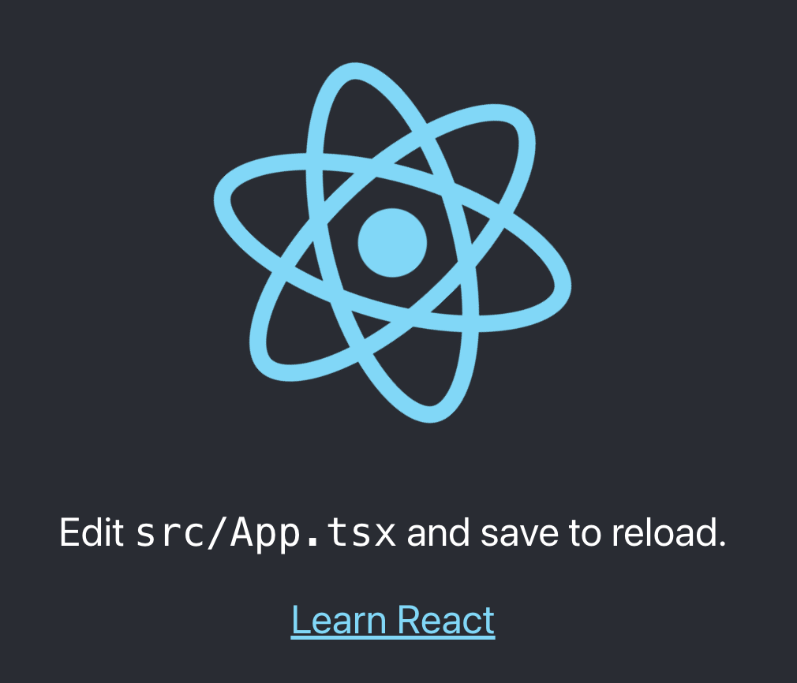

# Step One: Set-Up
This step is just getting ready to start the tutorial. You can create your own project and work through the steps yourself or checkout this repository and reference the source as you read each step to see how I did it.

1. You will need to create a React project. I recommend using create-react with typescript, but however you prefer to do it is fine. To create this repo I used the command `npx create-react-app outside-in --template typescript`. You can name yours whatever you wish; it doesn't have to be 'outside-in'.
2. Open the project in your favorite IDE or shell.
3. Run the default application. This example uses npm, so I use `npm start`. If you use yarn or other tools use the proper command for your environment.

You should see the default React implementation at the URL given by the startup output. Mine looked like the below image.

That's it! You're ready for [Step Two](step_two.md)!