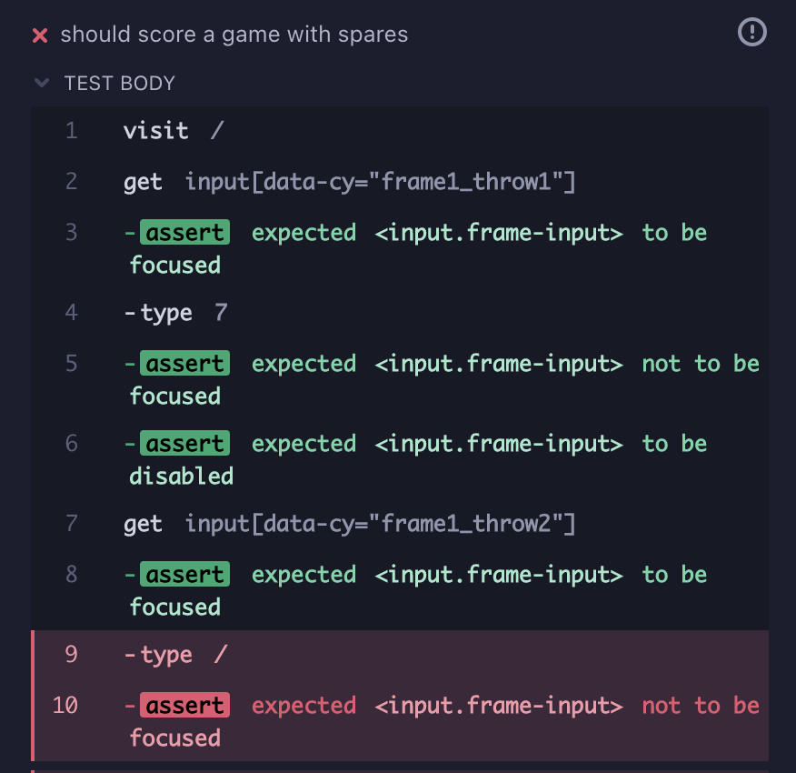
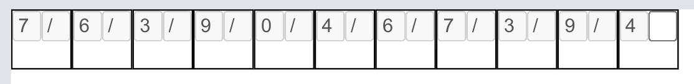
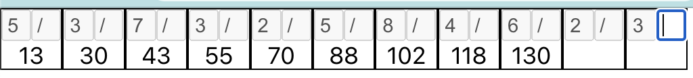
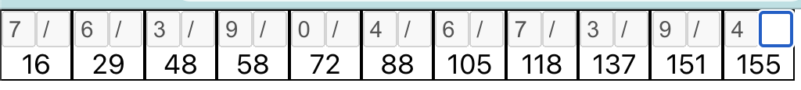
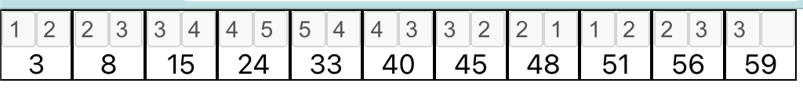
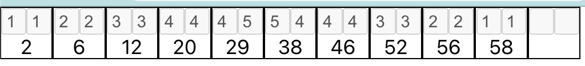

# Step Three: Handle Scoring Spares

With the initial ten frames in place, it's time to introduce spares. To review, a spare is marked as a forward slash, and its frame's total can't be resolved until the first throw of the next frame.

There's only one task this time: score spares. It could be a little tricky, but hopefully it won't take much work.

## Write Cypress test

Our existing Cypress test is for entering the scores for one (not very good) player for a full game. We could add a second test in there for a game with spares. It would make sense for the test runs based on scoring a game to be together, and we could probably leverage that chained function. The file name is a problem, though. It explicitly states that it's for a low scoring game. Let's rename the file `scoring_a_game.cy.ts` and the describe block to 'Scoring a Game'.

    it('should score a game with spares', () => {
      function spare() {
        return '/'
      }
      function forFrame(frameNumber: number) {
        const label = `frame${frameNumber}`
        function rollBall(throwNumber: number, pinsKnockedDown: number | string) {
          cy.get(`input[data-cy="${ label }_throw${throwNumber}"]`).should('have.focus').type(String(pinsKnockedDown)).should('not.have.focus').should('be.disabled')
        }
        return {
          throwOneIs(pinsKnockedDown1: number) {
            rollBall(1, pinsKnockedDown1)
            return {
              throwTwoIs(pinsKnockedDown2: string) {
                rollBall(2, pinsKnockedDown2)
              }
            }
          }
        }
      }
      function expectFrame(frameNumber: number) {
        return {
          totalToBe(total: number) {
            cy.get(`[data-cy="frame${ frameNumber }_total"]`).should('have.text', String(total))
          }
        }
      }

      cy.visit('/')

      forFrame(1).throwOneIs(7).throwTwoIs(spare())
      forFrame(2).throwOneIs(6).throwTwoIs(spare())
      forFrame(3).throwOneIs(3).throwTwoIs(spare())
      forFrame(4).throwOneIs(9).throwTwoIs(spare())
      forFrame(5).throwOneIs(0).throwTwoIs(spare())
      forFrame(6).throwOneIs(4).throwTwoIs(spare())
      forFrame(7).throwOneIs(6).throwTwoIs(spare())
      forFrame(8).throwOneIs(7).throwTwoIs(spare())
      forFrame(9).throwOneIs(3).throwTwoIs(spare())
      forFrame(10).throwOneIs(9).throwTwoIs(spare())
      forFrame(11).throwOneIs(4)

      expectFrame(1).totalToBe(16)
      expectFrame(2).totalToBe(29)
      expectFrame(3).totalToBe(48)
      expectFrame(4).totalToBe(58)
      expectFrame(5).totalToBe(72)
      expectFrame(6).totalToBe(88)
      expectFrame(7).totalToBe(105)
      expectFrame(8).totalToBe(118)
      expectFrame(9).totalToBe(137)
      expectFrame(10).totalToBe(156)
      expectFrame(11).totalToBe(160)
    })

We can't check for the frame totals in the same chain as the entries for the frame's throws, because the frames don't have a score until later. Rather than try to reshape the existing function chain from the other test, I altered a copy of it to match the new requirements. The second throw now takes a forward slash (extracted as a named function). There's a new frame added to allow for the additional frame needed to complete the final spare. There's also an additional function chain to handle asserting that the totals are all filled in when the game is done. We could intermix those with the other assertions to ensure that they resolve as soon as the next frame is completed, but that was more difficult to read. Maybe we'll further customize the `forFrame` chain to check for previous frame's total. For now, this should be enough to prompt the code changes that we need.

When we run this test, the first error that we get is when we enter the spare. Cypress enters the slash in the input field, and the focus doesn't move. When we look at the output, there's nothing in the second box for the frame. If you'll recall, we have a validation function to ensure that only numbers between 0 and 9 are allowed as input. Now we need to allow slashes.

## Allow spares in input field

We need to go back to `validators.test.ts` and make an adjustment.

The first change is to the non-numeric characters test.

    it('should not allow non-numeric characters', () => {
      const nonNumericPattern = new RegExp('\\D')
      fc.assert(fc.property(fc.char().filter(t => nonNumericPattern.test(t) && t !== '/'), (value: string) => {
        return !isCharacterValid(value)
      }), {numRuns: 30, skipEqualValues: true})
    })

All we need here is to add another check to the generated character filter to exclude the '/' character.

Next, we need to add a test that the spare is valid. Every test in this file so far uses fast-check, because we want to try different values, sometimes over a number of runs. We could change the valid check to generate characters limited to 0-9 and '/'. That's some serious post-generation processing, though, so I'll just add it as an extra assertion after the other valid cases.

    it('should allow single digits and spares', () => {
      fc.assert(fc.property(fc.integer({min: 0, max: 9}), (num: number) => {
        console.log(num)
        return isCharacterValid(num.toString())
      }), {numRuns: 10, skipEqualValues: true})
      fc.assert(fc.property(fc.constant('/'), (slash: string) => {
        return isCharacterValid(slash)
      }))
    })

The initial fast-check assert still runs and will fail if any of the digits don't succeed, but now it's followed up by a second assertion that spares are valid. It uses the `fc.constant()` function, which provides an arbitrary that is not actually changeable. Is it overkill to keep the structure of fast-check here for a single hard-coded value? Maybe. But it reads the same as the rest of the assertions in the file, so unless it becomes a problem I'd rather keep it. We might consider putting some negative assertions together to reduce the overhead of instantiating test runs in jest, but I do like how explicit the conditions are in the test names.

The regex, because I cling inexplicably to regex, is easy to change.

    export function isCharacterValid(char: string): boolean {
      return new RegExp('^[\\d\\/]$').test(char)
    }

The pattern now adds a forward slash as a valid character and limits the pattern to a single character. Running our Cypress test, we see it still doesn't get past entering the slash. Didn't we have another validation? The `isTotalValid` function takes a number, which '/' is not. Let's remind ourselves of how that's used. The useEffect for scoring in the Frame component verifies the total when the frame state is 'Done'.

    useEffect(() => {
      if (frameState === 'Done') {
        if (throwOneInput.current && throwTwoInput.current) {
          const value1 = Number(throwOneInput.current.value)
          const value2 = Number(throwTwoInput.current.value)
          const frameTotal = value1 + value2
          if (isTotalValid(frameTotal)) {
            const newTotal = (previousFrameScore ?? 0) + frameTotal
            setTotal(newTotal)
            throwTwoInput.current.blur()
            onFinish(newTotal)
          } else {
            throwTwoInput.current.value = ''
            setFrameState('Second Throw')
          }
        }
      } else if (frameState === 'First Throw') {
        throwOneInput.current?.focus()
      } else {
        throwTwoInput.current?.focus()
      }
    }, [frameState, previousFrameScore])

We could add more logic to the 'Done' handling to consider spares, but a frame that ends in a spare isn't actually done until the next throw. I think it makes more sense to add another state.

    export type FrameStateEnum = 'Not Started' | 'First Throw' | 'Second Throw' | 'Pending' | 'Done'

We'll call the new state 'Pending' for now. I suspect that we'll need to distinguish between spares and strikes eventually, but I don't know for certain, so a generic name will serve until we know more.

We'll need to set the new state when an input registers a spare.

    const changeHandler = () => {
      if (inputRef.current?.value) {
        if (isCharacterValid(inputRef.current?.value)) {
          if (inputRef.current?.value === '/')
          {
            setFrameState('Pending')
          } else {
            setFrameState(nextFrameState)
          }
        } else {
          inputRef.current.value = ''
        }
      }
    }

I'm not very sure of this design yet, but at the very least it's sending the desired state to the Frame component. Our test for a game of spares now goes past the first input of a spare and fails because the next frame is not in focus. We can fix that in `Frame.ts`.

    useEffect(() => {
      if (frameState === 'Done') {
        if (throwOneInput.current && throwTwoInput.current) {
          const value1 = Number(throwOneInput.current.value)
          const value2 = Number(throwTwoInput.current.value)
          const frameTotal = value1 + value2
          if (isTotalValid(frameTotal)) {
            const newTotal = (previousFrameScore ?? 0) + frameTotal
            setTotal(newTotal)
            throwTwoInput.current.blur()
            onFinish(newTotal)
          } else {
            throwTwoInput.current.value = ''
            setFrameState('Second Throw')
          }
        }
      } else if (frameState === 'Pending') {
        throwTwoInput.current?.blur()
        onFinish(null)
      } else if (frameState === 'First Throw') {
        throwOneInput.current?.focus()
      } else {
        throwTwoInput.current?.focus()
      }
    }, [frameState, previousFrameScore])

When our state is 'Pending', we now blur the second input and pass null to the onFinish hook. We're overriding the meaning of 'finish' here, because we aren't actually finished. Sending a null as the throws total isn't great either. Basically we just want to advance to the next Frame. In the ScoreCardRow's advanceFrame function, we accept a null in addition to number and wrap the frame's score setting in a null check.

    const advanceFrame = (frameTotal: number | null) => {
      if (frameTotal) {
        activeFrame.score = frameTotal
      }
      if (activeFrame.index + 1 < frameDescriptions.length) {
        setActiveFrame(frameDescriptions[activeFrame.index + 1])
      }
    }

This is super gross, but looking at the test, we now get through all the frame entries until it fails to find the 11th one.

## Add 11th Frame

The 11th frame is special. It only exists to enter extra rolls for final spares and strikes. It also has three throws, but since we don't need all of them yet, we'll just add a regular Frame component to the end. That's just a minor adjustment in the frame initializer.

    export function createFrameDescriptions(): FrameDescription[] {
      const descriptions: FrameDescription[] = []
      for (let i = 0; i < 11; i++) {
        descriptions.push({
          index: i,
          tag: `frame${i + 1}`,
          score: null,
        })
      }
      return descriptions
    }

Now the test gets past the 11th frame and fails on the check for the first frame's total. Looking at the Cypress display, we can see that there is not a single total on the screen.

That makes sense, because we're leaving every Frame in the 'Pending' state. We need to let the pending Frames know how to complete their scores. Or, to be more accurate, we need to give the row enough information to set the scores for 'Pending' Frames. Let's take another look at the scoring useEffect in `Frame.tsx`.

    useEffect(() => {
      if (frameState === 'Done') {
        if (throwOneInput.current && throwTwoInput.current) {
          const value1 = Number(throwOneInput.current.value)
          const value2 = Number(throwTwoInput.current.value)
          const frameTotal = value1 + value2
          if (isTotalValid(frameTotal)) {
            const newTotal = (previousFrameScore ?? 0) + frameTotal
            setTotal(newTotal)
            throwTwoInput.current.blur()
            onFinish(newTotal)
          } else {
            throwTwoInput.current.value = ''
            setFrameState('Second Throw')
          }
        }
      } else if (frameState === 'Pending') {
        throwTwoInput.current?.blur()
        onFinish(null)
      } else if (frameState === 'First Throw') {
        throwOneInput.current?.focus()
      } else {
        throwTwoInput.current?.focus()
      }
    }, [frameState, previousFrameScore])

We're currently taking in the property `previousFrameScore`, which works when the previous frame is scored but does nothing to get us the next Frame's first throw. Now that we're dependent on the previous and next Frame to calculate the current Frame's total, it doesn't make a lot of sense to handle totals at this level. Let's try pulling that up.

## Refactor Scoring 

It looks like we can easily switch to sending the throw data in the `onFinish` function, but what about the `isTotalValid` guard? It feels appropriate to be checking at this level, but do we want to go through all the trouble to create a total to validate and then throw it away? What do we actually need at this level?

As far as an individual Frame is concerned, the total being under 10 is too narrow (and misleading) of a check. What we really need to know is if the second throw is acceptable in the context of the first. There are now two positive cases: it is a number that will result in a 9 or less, or it is a spare. (Incidentally, we will need to circle back to ensure that spares can't occur on the first throw.)

Let's change the function `isTotalValid` to `isSecondThrowValid`.

    export function isSecondThrowValid(total: number): boolean {
      return total <= 9
    }

This is unit tested, so let's go to `validators.test.ts` to update our expectations.

    describe('isSecondThrowValid', () => {
      it('should allow totals over 10 or a spare', () => {
        fc.assert(fc.property(fc.integer({min: 0, max: 9}), (firstThrow: number) => {
          return isSecondThrowValid(firstThrow, 9 - firstThrow)
        }), {numRuns: 10, skipEqualValues: true})
        fc.assert(fc.property(fc.integer({min: 0, max: 9}), (firstThrow: number) => {
          return isSecondThrowValid(firstThrow, '/')
        }))
      })

      it('should not allow totals over 10', () => {
        fc.assert(fc.property(fc.integer({min: 0, max: 9}), (firstThrow: number) => {
          return !isSecondThrowValid(firstThrow, 10 - firstThrow)
        }), {numRuns: 10, skipEqualValues: true})
      })
    })

We're still only generating a single number in each assert, but we're using it for the first throw. In the valid numeric case, we use the first throw to create the largest second throw that works. For the failure test, we create the smallest second throw that fails. We've also added a valid assertion that allows the second throw to be a spare given any valid first throw.

Easy enough to make the test pass.

    export function isSecondThrowValid(firstThrow: number, secondThrow: number | string): boolean {
      if (secondThrow === '/') {
        return true
      } else {
        return firstThrow + Number(secondThrow) <= 9
      }
    }

Now we see where our validator is being used. We can pass the throws in now, instead of their sum.

    useEffect(() => {
      if (frameState === 'Done') {
        if (throwOneInput.current && throwTwoInput.current) {
          const value1 = Number(throwOneInput.current.value)
          const value2 = Number(throwTwoInput.current.value)
          const frameTotal = value1 + value2
          if (isSecondThrowValid(value1, value2)) {
            const newTotal = (previousFrameScore ?? 0) + frameTotal
            setTotal(newTotal)
            throwTwoInput.current.blur()
            onFinish(newTotal)
          } else {
            throwTwoInput.current.value = ''
            setFrameState('Second Throw')
          }
        }
      } else if (frameState === 'Pending') {
        throwTwoInput.current?.blur()
        onFinish(null)
      } else if (frameState === 'First Throw') {
        throwOneInput.current?.focus()
      } else {
        throwTwoInput.current?.focus()
      }
    }, [frameState, previousFrameScore])

We're not getting a score after a spare yet, but we're closer to passing the responsibility of scoring to the ScoreCardRow.

Before we can remove the total calculation from Frame, it needs to be duplicated in ScoreCardRow. We'll start by passing the individual scores along with the total in the `onFinish` callback. In the Frame we make a few adjustments to send the data.

    useEffect(() => {
      if (frameState === 'Done') {
        if (throwOneInput.current && throwTwoInput.current) {
          const value1 = Number(throwOneInput.current.value)
          const value2 = Number(throwTwoInput.current.value)
          const frameTotal = value1 + value2
          if (isSecondThrowValid(value1, value2)) {
            const newTotal = (previousFrameScore ?? 0) + frameTotal
            setTotal(newTotal)
            throwTwoInput.current.blur()
            onFinish(newTotal, throwOneInput.current.value, throwTwoInput.current.value)
          } else {
            throwTwoInput.current.value = ''
            setFrameState('Second Throw')
          }
        }
      } else if (frameState === 'Pending') {
        if (throwOneInput.current && throwTwoInput.current) {
          throwTwoInput.current?.blur()
          onFinish(null, throwOneInput.current.value, throwTwoInput.current.value)
        }
      } else if (frameState === 'First Throw') {
        throwOneInput.current?.focus()
      } else {
        throwTwoInput.current?.focus()
      }
    }, [frameState, previousFrameScore])

In ScoreCareRow, we just add the parameters in our `advanceFrame` function.

    const advanceFrame = (frameTotal: number | null, firstThrow: string, secondThrow: string) => {
      if (frameTotal) {
        activeFrame.score = frameTotal
      }
      if (activeFrame.index + 1 < frameDescriptions.length) {
        setActiveFrame(frameDescriptions[activeFrame.index + 1])
      }
    }

No new tests have broken, so we'll keep going. With the components of the score now available, we'll change the function to create the total from those. We need one more thing, though--the previous frame's total.

    const advanceFrame = (frameTotal: number | null, firstThrow: string, secondThrow: string) => {
      const previousFrame = (activeFrame.index - 1 >= 0) ? frameDescriptions[activeFrame.index - 1] : null
      if (secondThrow !== '/') {
        activeFrame.score = (previousFrame?.score ?? 0) + Number(firstThrow) + Number(secondThrow)
      }
      if (activeFrame.index + 1 < frameDescriptions.length) {
        setActiveFrame(frameDescriptions[activeFrame.index + 1])
      }
    }

We get the previous frame data and essentially rewrite the logic to calculate the total, putting a guard around it for the spare handling. We still aren't ready to score a spare frame, but the pieces are nearly in place to allow that.

We need to pass the total down to the frame for display, but first let's remove total from the parameters of `advanceFrame`. It's a simple change at both levels.

With that out of the way, we can think about how to pass the description score down to Frame. We're already passing most of the contents of description into Frame. Feels like the best way to get the score passed in is on the description itself.

    

      {
        frameDescriptions.map(description => {
          return <Frame
              key={description.tag}
              description={description}
              dataCy={description.tag}
              isActive={activeFrame.index === description.index}
              onFinish={advanceFrame}
              previousFrameScore={frameDescriptions[description.index - 1]?.score ?? 0}
          />
        })
      }
    

Then in the Frame we can populate the total display directly from the description's score and eliminate the state management.

    export function Frame({description, dataCy, isActive, onFinish, previousFrameScore}: FrameProps) {
      const [frameState, setFrameState] = useState<FrameStateEnum>('Not Started')
      const throwOneInput = useRef<HTMLInputElement>(null)
      const throwTwoInput = useRef<HTMLInputElement>(null)

      useEffect(() => {
        if (frameState === 'Done') {
          if (throwOneInput.current && throwTwoInput.current) {
            const value1 = Number(throwOneInput.current.value)
            const value2 = Number(throwTwoInput.current.value)
            if (isSecondThrowValid(value1, value2)) {
              throwTwoInput.current.blur()
              onFinish(throwOneInput.current.value, throwTwoInput.current.value)
            } else {
              throwTwoInput.current.value = ''
              setFrameState('Second Throw')
            }
          }
        } else if (frameState === 'Pending') {
          if (throwOneInput.current && throwTwoInput.current) {
            throwTwoInput.current?.blur()
            onFinish(throwOneInput.current.value, throwTwoInput.current.value)
          }
        } else if (frameState === 'First Throw') {
          throwOneInput.current?.focus()
        } else {
          throwTwoInput.current?.focus()
        }
      }, [frameState, previousFrameScore])
      useEffect(() => {
        if (isActive && frameState === 'Not Started') {
          setFrameState('First Throw')
        }
      }, [frameState, isActive])
      return (
        

          

            <FrameInput
                dataCy={ `${dataCy}_throw1` }
                active={frameState === 'First Throw'}
                inputRef={throwOneInput}
                setFrameState={setFrameState}
                nextFrameState={'Second Throw'}
            />
            <FrameInput
                dataCy={ `${dataCy}_throw2` }
                active={frameState === 'Second Throw'}
                inputRef={throwTwoInput}
                setFrameState={setFrameState}
                nextFrameState={'Done'}
            />
          

          

            {description.score}
          

        

      );
    }

There's a lot of cruft left to remove from Frame, but now it's total is coming directly from the definition object, making this much more of a reactive component. Looking at the remaining frameState useEffect in Frame, it looks as though we can remove the dependency on previousFrameScore as part of our cleanup.

    export function Frame({description, dataCy, isActive, onFinish}: FrameProps) {
      const [frameState, setFrameState] = useState<FrameStateEnum>('Not Started')
      const throwOneInput = useRef<HTMLInputElement>(null)
      const throwTwoInput = useRef<HTMLInputElement>(null)

      useEffect(() => {
        if (frameState === 'Done') {
          if (throwOneInput.current && throwTwoInput.current) {
            const value1 = Number(throwOneInput.current.value)
            const value2 = Number(throwTwoInput.current.value)
            if (isSecondThrowValid(value1, value2)) {
              throwTwoInput.current.blur()
              onFinish(throwOneInput.current.value, throwTwoInput.current.value)
            } else {
              throwTwoInput.current.value = ''
              setFrameState('Second Throw')
            }
          }
        } else if (frameState === 'Pending') {
          if (throwOneInput.current && throwTwoInput.current) {
            throwTwoInput.current?.blur()
            onFinish(throwOneInput.current.value, throwTwoInput.current.value)
          }
        } else if (frameState === 'First Throw') {
          throwOneInput.current?.focus()
        } else {
          throwTwoInput.current?.focus()
        }
      }, [frameState])
      useEffect(() => {
        if (isActive && frameState === 'Not Started') {
          setFrameState('First Throw')
        }
      }, [frameState, isActive])
      return (
        

          

            <FrameInput
                dataCy={ `${dataCy}_throw1` }
                active={frameState === 'First Throw'}
                inputRef={throwOneInput}
                setFrameState={setFrameState}
                nextFrameState={'Second Throw'}
            />
            <FrameInput
                dataCy={ `${dataCy}_throw2` }
                active={frameState === 'Second Throw'}
                inputRef={throwTwoInput}
                setFrameState={setFrameState}
                nextFrameState={'Done'}
            />
          

          

            {description.score}
          

        

      );
    }

Ever so slightly better. Our instantiation of Frame is a line shorter now, too.

    

      {
        frameDescriptions.map(description => {
          return <Frame
              key={description.tag}
              description={description}
              dataCy={description.tag}
              isActive={activeFrame.index === description.index}
              onFinish={advanceFrame}
          />
        })
      }
    

It looks like we're still converting secondThrow into a number before running validation. It gets converted to a number inside the validation, so we don't need to do that. Let's change `isSecondThrowValid` to always take a string.

    export function isSecondThrowValid(firstThrow: number, secondThrow: string): boolean {
      if (secondThrow === '/') {
        return true
      } else {
        return firstThrow + Number(secondThrow) <= 9
      }
    }

The test needs to change to only ever pass strings now.

    describe('isSecondThrowValid', () => {
      it('should allow totals over 10 or a spare', () => {
        fc.assert(fc.property(fc.integer({min: 0, max: 9}), (firstThrow: number) => {
          return isSecondThrowValid(firstThrow, String(9 - firstThrow))
        }), {numRuns: 10, skipEqualValues: true})
        fc.assert(fc.property(fc.integer({min: 0, max: 9}), (firstThrow: number) => {
          return isSecondThrowValid(firstThrow, '/')
        }))
      })

      it('should not allow totals over 10', () => {
        fc.assert(fc.property(fc.integer({min: 0, max: 9}), (firstThrow: number) => {
          return !isSecondThrowValid(firstThrow, String(10 - firstThrow))
        }), {numRuns: 10, skipEqualValues: true})
      })
    })

Slightly messy, but I'd rather have that in the test than in the code. We'll be back here for more validation tweaks later, so we'll take a look then at cleaning this up.

With that done, we can return to the Frame.

    if (frameState === 'Done') {
      if (throwOneInput.current && throwTwoInput.current) {
        if (isSecondThrowValid(Number(throwOneInput.current.value), throwTwoInput.current.value)) {
          throwTwoInput.current.blur()
          onFinish(throwOneInput.current.value, throwTwoInput.current.value)
        } else {
          throwTwoInput.current.value = ''
          setFrameState('Second Throw')
        }
      }
    }

The 'Done' state handling is significantly smaller, as we can pass the input values directly to the validator. There's a lot of repetition of drilling into the refs, and I don't like that we're converting the first throw into a number, since the Frame doesn't need to know that it even *can* be a number. The validator could handle that transformation as well.

    export function isSecondThrowValid(firstThrow: string, secondThrow: string): boolean {
      if (secondThrow === '/') {
        return true
      } else {
        return Number(firstThrow) + Number(secondThrow) <= 9
      }
    }

Independently, there is some risk in accepting any string and expecting it to be a number. In our small codebase, though, we know that we're already using `isCharacterValid` to narrow the input values to single digits or a forward slash. But what if the spare is in the first input? Well, technically that's a strike, which we aren't allowing to be entered yet. But we are not preventing a spare from being entered for the first throw, and that's a pretty bad gap. We'll want to shore that up before we can say that we're handling spares. For now, we're still midway through our parameter change.

The tests need another small update.

    describe('isSecondThrowValid', () => {
      it('should allow totals over 10 or a spare', () => {
        fc.assert(fc.property(fc.integer({min: 0, max: 9}), (firstThrow: number) => {
          return isSecondThrowValid(String(firstThrow), String(9 - firstThrow))
        }), {numRuns: 10, skipEqualValues: true})
        fc.assert(fc.property(fc.integer({min: 0, max: 9}), (firstThrow: number) => {
          return isSecondThrowValid(String(firstThrow), '/')
        }))
      })

      it('should not allow totals over 10', () => {
        fc.assert(fc.property(fc.integer({min: 0, max: 9}), (firstThrow: number) => {
          return !isSecondThrowValid(String(firstThrow), String(10 - firstThrow))
        }), {numRuns: 10, skipEqualValues: true})
      })
    })

Now that we're converting *both* values to strings inline, this has passed from awkward to ridiculous. The test needs some light refinement. After we update Frame.

    if (frameState === 'Done') {
      if (throwOneInput.current && throwTwoInput.current) {
        if (isSecondThrowValid(throwOneInput.current.value, throwTwoInput.current.value)) {
          throwTwoInput.current.blur()
          onFinish(throwOneInput.current.value, throwTwoInput.current.value)
        } else {
          throwTwoInput.current.value = ''
          setFrameState('Second Throw')
        }
      }
    }

The change is slight, but it does make me feel better. Now let's see if we can clean up that validator test quickly.

    it('should allow totals over 10 or a spare', () => {
      fc.assert(fc.property(fc.integer({min: 0, max: 9}).chain(first => fc.tuple(fc.constant(String(first)), fc.constant(String(9-first)))), (pinCounts: string[]) => {
        return isSecondThrowValid(pinCounts[0], pinCounts[1])
      }), {numRuns: 10, skipEqualValues: true})
      fc.assert(fc.property(fc.integer({min: 0, max: 9}), (firstThrow: number) => {
        return isSecondThrowValid(String(firstThrow), '/')
      }))
    })

This makes the innermost assertion nice, but the line setting up the input values is horrifying.

    function generateThrowsThatAddToNine() {
      return fc.integer({min: 0, max: 9}).chain(first => fc.tuple(fc.constant(String(first)), fc.constant(String(9-first))))
    }

    it('should allow totals over 10 or a spare', () => {
        fc.assert(fc.property(generateThrowsThatAddToNine(), (pinCounts: string[]) => {
        return isSecondThrowValid(pinCounts[0], pinCounts[1])
      }), {numRuns: 10, skipEqualValues: true})
      fc.assert(fc.property(fc.integer({min: 0, max: 9}), (firstThrow: number) => {
        return isSecondThrowValid(String(firstThrow), '/')
      }))
    })

That's just extracting the ugliness. I'm not really happy with that, and the function name is a bit too on the nose for my liking, but I can console myself that this is in test code, so as long as we make the test itself readable it's okay. Let's change the bad case and see if that gives us more ideas for cleaning this up.

    describe('isSecondThrowValid', () => {

      function generateThrowsThatAddToNine() {
        return fc.integer({min: 0, max: 9}).chain(first => fc.tuple(fc.constant(String(first)), fc.constant(String(9-first))))
      }

      function generateThrowsThatAddToTen() {
        return fc.integer({min: 0, max: 9}).chain(first => fc.tuple(fc.constant(String(first)), fc.constant(String(10-first))))
      }

      it('should allow totals over 10 or a spare', () => {
          fc.assert(fc.property(generateThrowsThatAddToNine(), (pinCounts: string[]) => {
          return isSecondThrowValid(pinCounts[0], pinCounts[1])
        }), {numRuns: 10, skipEqualValues: true})
        fc.assert(fc.property(fc.integer({min: 0, max: 9}), (firstThrow: number) => {
          return isSecondThrowValid(String(firstThrow), '/')
        }))
      })

      it('should not allow totals over 10', () => {
        fc.assert(fc.property(generateThrowsThatAddToTen(), (pinCounts: string[]) => {
          return !isSecondThrowValid(pinCounts[0], pinCounts[1])
        }), {numRuns: 10, skipEqualValues: true})
      })
    })

Those two generator functions look extremely similar, but before we combine them, let's make sure that they're doing everything we want. They both create tuples of scores that add to a single value. One is the max valid value and one is the min invalid value. Boundary testing is good, but we're missing assurance of things like whether a total of 1 is valid and one of 15 is not. We can leverage fc arbitraries to create additional tests to fit both valid and invalid cases. Let's make these stronger before we combine them.

    function generateValidThrows() {
      return fc.integer({min: 0, max: 9}).chain(first => fc.tuple(fc.constant(String(first)), fc.integer({min: 0, max: 9 - first}).chain(num => fc.constant(String(num)))))
    }

    function generateInvalidThrows() {
      return fc.integer({min: 1, max: 9}).chain(first => fc.tuple(fc.constant(String(first)), fc.integer({min: 10 - first, max: 9}).chain(num => fc.constant(String(num)))))
    }

What you might not have expected (I certainly had not), was that there can't be an invalid second throw after a first throw of 0. We're already blocking any value over nine, so any allowable value after a 0 will result in a valid total. But once you enter a 1, then 9 is allowed but invalid. The names are better, I think, but the functions got even messier.

    describe('isSecondThrowValid', () => {

      type ThrowConstraints = {
        min: number,
        max: number,
      }

      type ConstraintCalculator = {
        min: (seed: number) => number,
        max: (seed: number) => number,
      }

      function calculateConstraints(calculator: ConstraintCalculator, seed: number): ThrowConstraints {
        return {
          min: calculator.min(seed),
          max: calculator.max(seed),
        }
      }

      function throwGenerator(firstThrowConstraints: ThrowConstraints, secondThrowCalculator: ConstraintCalculator) {
        return fc.integer(firstThrowConstraints).chain((first) => {
          return fc.tuple(
              fc.constant(String(first)),
              fc.integer(calculateConstraints(secondThrowCalculator, first)).chain(num => {
                  return fc.constant(String(num))
              })
          );
        })
      }

      function generateValidThrows() {
        return throwGenerator({min: 0, max: 9}, {min: (_: number) => 0, max: (first: number) => 9 - first})
      }

      function generateInvalidThrows() {
        return throwGenerator({min: 1, max: 9}, {min: (first: number) => 10 - first, max: (_: number) => 9})
      }

      it('should allow totals over 10 or a spare', () => {
          fc.assert(fc.property(generateValidThrows(), (pinCounts: string[]) => {
          return isSecondThrowValid(pinCounts[0], pinCounts[1])
        }), {numRuns: 20, skipEqualValues: true})
        fc.assert(fc.property(fc.integer({min: 0, max: 9}), (firstThrow: number) => {
          return isSecondThrowValid(String(firstThrow), '/')
        }))
      })

      it('should not allow totals over 10', () => {
        fc.assert(fc.property(generateInvalidThrows(), (pinCounts: string[]) => {
          return !isSecondThrowValid(pinCounts[0], pinCounts[1])
        }), {numRuns: 20, skipEqualValues: true})
      })
    })

Okay, that's about all I can take for now. The base generator is pretty nasty, but it's reasonably clear what's happening in the code that uses it. Okay, it's really not. I'm going to stop touching it and hope I have clarity later.

We still need to verify that a check can't be entered for the first throw, but I'd like to continue to put that off. Just mentioning it to help remember it needs doing. We're still in the midst of redesigning the Frame component.

Now that we have a FrameDescription passed to the Frame component, we don't need to pass the `dataCy` value anymore. It's the same as the `tag` property in the description.

That's an easy cleanup. Let's take stock of where we are.

    const changeHandler = () => {
      if (inputRef.current?.value) {
        if (isCharacterValid(inputRef.current?.value)) {
          if (inputRef.current?.value === '/') {
            setFrameState('Pending')
          } else {
            setFrameState(nextFrameState)
          }
        } else {
          inputRef.current.value = ''
        }
      }
    }

The input handler in FrameInput sets the frame state to 'Pending' when it registers a spare.

    } else if (frameState === 'Pending') {
      if (throwOneInput.current && throwTwoInput.current) {
        throwTwoInput.current?.blur()
        onFinish(throwOneInput.current.value, throwTwoInput.current.value)
      }
    }

The useEffect on frame state in Frame sends the input values up to ScoreCardRow.

    const advanceFrame = (firstThrow: string, secondThrow: string) => {
      const previousFrame = (activeFrame.index - 1 >= 0) ? frameDescriptions[activeFrame.index - 1] : null
      if (secondThrow !== '/') {
        activeFrame.score = (previousFrame?.score ?? 0) + Number(firstThrow) + Number(secondThrow)
      }
      if (activeFrame.index + 1 < frameDescriptions.length) {
        setActiveFrame(frameDescriptions[activeFrame.index + 1])
      }
    }

The ScoreCardRow sets the score if there is not a spare but otherwise ignores spares. It needs to check for unresolved previous frames and see if they can now be scored. This sounds like an algorithm, so we should create a function to process the array of descriptions. This isn't a validator or initializer; we'll need something else. It's almost a visitor, but also a calculator. Let's throw caution to the wind. We'll create a calculations file and a score resolver function in it.

    describe('calculators', () => {
      describe('resolveScores', () => {
        function frameDescription(): FrameDescription {
          return {
            index: 1,
            tag: 'frame1',
            score: null,
          }
        }
        it('ignores frames that are still active or not yet begun', () => {
          const descriptions: FrameDescription[] = {
            frameDescription()
          }
        })
      })
    })

I stopped working on this test at the point where I realized that the descriptions don't have enough information to calculate scores at all. If we want to just hand over the frameDefinitions to an algorithm to handle scoring, they need to know the individual throws *and* the frame's current state.

    it.skip('ignores frames that are still active or not yet begun', () => {
      // const descriptions: FrameDescription[] = {
      //   frameDescription()
      // }
    })

We'll put the test on hold and go add those properties to the FrameDescription.

    import { FrameStateEnum } from "./stateEnums";

    export type FrameDescription = {
      index: number;
      tag: string;
      score: number | null;
      firstThrow: string | null;
      secondThrow: string | null;
      frameState: FrameStateEnum;
    }

That should be everything we need. Now to fix everything that isn't compiling.

    export function createFrameDescriptions(): FrameDescription[] {
      const descriptions: FrameDescription[] = []
      for (let i = 0; i < 11; i++) {
        descriptions.push({
          index: i,
          tag: `frame${i + 1}`,
          score: null,
          firstThrow: null,
          secondThrow: null,
          frameState: 'Not Started'
        })
      }
      return descriptions
    }

This still doesn't have enough logic in it to really benefit from a test, as it either works or it doesn't. We'll move on.

    it('should not allow more than 10 pins to be recorded', () => {
      const description: FrameDescription = {
        index: 0,
        tag: 'frame',
        score: null,
        firstThrow: null,
        secondThrow: null,
        frameState: 'First Throw',
      }
      render(<Frame description={description} isActive={true} onFinish={jest.fn()}/>)
      const inputs = screen.getAllByRole('textbox')
      userEvent.type(inputs[0], '7')
      userEvent.type(inputs[1], '9')
      expect(inputs[1]).toHaveDisplayValue('')
      expect(inputs[1]).toHaveFocus()
    })

The `frameState` property is set to 'First Throw' so that the Frame logic will work correctly once the Frame uses the description instead of internal state.

Let's see if we can set frame status on the descriptions as our first step.

    export function Frame({description, isActive, onFinish}: FrameProps) {
      const [internalFrameState, setInternalFrameState] = useState<FrameStateEnum>('Not Started')
      const throwOneInput = useRef<HTMLInputElement>(null)
      const throwTwoInput = useRef<HTMLInputElement>(null)

      function setFrameState(frameState: FrameStateEnum) {
        setInternalFrameState(frameState)
      }
      useEffect(() => {
        if (internalFrameState === 'Done') {
          if (throwOneInput.current && throwTwoInput.current) {
            if (isSecondThrowValid(throwOneInput.current.value, throwTwoInput.current.value)) {
              throwTwoInput.current.blur()
              onFinish(throwOneInput.current.value, throwTwoInput.current.value)
            } else {
              throwTwoInput.current.value = ''
              setFrameState('Second Throw')
            }
          }
        } else if (internalFrameState === 'Pending') {
          if (throwOneInput.current && throwTwoInput.current) {
            throwTwoInput.current?.blur()
            onFinish(throwOneInput.current.value, throwTwoInput.current.value)
          }
        } else if (internalFrameState === 'First Throw') {
          throwOneInput.current?.focus()
        } else {
          throwTwoInput.current?.focus()
        }
      }, [internalFrameState])
      useEffect(() => {
        if (isActive && internalFrameState === 'Not Started') {
          setInternalFrameState('First Throw')
        }
      }, [internalFrameState, isActive])

      return (
        

          

            <FrameInput
                dataCy={ `${description.tag}_throw1` }
                active={internalFrameState === 'First Throw'}
                inputRef={throwOneInput}
                setFrameState={setInternalFrameState}
                nextFrameState={'Second Throw'}
            />
            <FrameInput
                dataCy={ `${description.tag}_throw2` }
                active={internalFrameState === 'Second Throw'}
                inputRef={throwTwoInput}
                setFrameState={setInternalFrameState}
                nextFrameState={'Done'}
            />
          

          

            {description.score}
          

        

      );
    }

First we create a new function in Frame to directly manage setting the frameState, now renamed `internalFrameState` for clarity.

Now we can make a function in ScoreCardRow to update a description's state by index.

    const [frameDescriptions, setFrameDescriptions] = useState<FrameDescription[]>(createFrameDescriptions())
    const [activeFrame, setActiveFrame] = useState<FrameDescription>(frameDescriptions[0])

    function setFrameState(frameState: FrameStateEnum, index: number) {
      const descriptions = [...frameDescriptions]
      descriptions[index].frameState = frameState
      setFrameDescriptions(descriptions)
    }

We can accept it in Frame under a temporary awkward name.

    export type FrameProps = {
      description: FrameDescription
      isActive: boolean
      onFinish: (firstThrow: string, secondThrow: string) => void
      setStateForFrame: (frameState: FrameStateEnum, index: number) => void
    }

And we can use it in the Frame's function for setting frame state.

    function setFrameState(frameState: FrameStateEnum) {
      setInternalFrameState(frameState)
      setStateForFrame(frameState, description.index)
    }

This keeps the descriptions' frame states in sync with the individual Frames' states. Be sure to convert all calls to `setInternalFrameState` to the new `setFrameState`.

Now we can safely attempt using the state from the descriptions instead of the ones internally kept by Frames.

    export function Frame({description, isActive, onFinish, setStateForFrame}: FrameProps) {
      const throwOneInput = useRef<HTMLInputElement>(null)
      const throwTwoInput = useRef<HTMLInputElement>(null)

      function setFrameState(frameState: FrameStateEnum) {
        setStateForFrame(frameState, description.index)
      }
      useEffect(() => {
        if (description.frameState === 'Done') {
          if (throwOneInput.current && throwTwoInput.current) {
            if (isSecondThrowValid(throwOneInput.current.value, throwTwoInput.current.value)) {
              throwTwoInput.current.blur()
              onFinish(throwOneInput.current.value, throwTwoInput.current.value)
            } else {
              throwTwoInput.current.value = ''
              setFrameState('Second Throw')
            }
          }
        } else if (description.frameState === 'Pending') {
          if (throwOneInput.current && throwTwoInput.current) {
            throwTwoInput.current?.blur()
            onFinish(throwOneInput.current.value, throwTwoInput.current.value)
          }
        } else if (description.frameState === 'First Throw') {
          throwOneInput.current?.focus()
        } else {
          throwTwoInput.current?.focus()
        }
      }, [description.frameState])
      useEffect(() => {
        if (isActive && description.frameState === 'Not Started') {
          setFrameState('First Throw')
        }
      }, [description.frameState, isActive])

      return (
        

          

            <FrameInput
                dataCy={ `${description.tag}_throw1` }
                active={description.frameState === 'First Throw'}
                inputRef={throwOneInput}
                setFrameState={setFrameState}
                nextFrameState={'Second Throw'}
            />
            <FrameInput
                dataCy={ `${description.tag}_throw2` }
                active={description.frameState === 'Second Throw'}
                inputRef={throwTwoInput}
                setFrameState={setFrameState}
                nextFrameState={'Done'}
            />
          

          

            {description.score}
          

        

      );
    }

When we make this change, the first Cypress test still passes. However, the Frame unit test fails. Up until now, when it has failed it's been for the changes in the properties, which are easily fixed. Now, the problem is more complex. The failing assertion is a check on whether the second frame is in focus after receiving invalid input. This test worked when the frame state was managed internally. Now that it is data passed in from a higher layer, the unit test doesn't have enough components to run correctly.

We have a few options here to make the test work again, but with so few unit tests we should take the time to make sure they're adding all the value they can.

The description of the test is 'Frame Test > form validation > should not allow more than 10 pins to be recorded'. On reflection, that's probably too specific, but the point is that it's checking how the Frame handles invalid data in the second input. It does seem useful to verify the behavior of the Frame in error states, so this does feel like the right level to test this. But what's the important thing to test? That it emits the right message? That given a frame state it responds appropriately?

Maybe this is the wrong place to test. Invalid data is contextual, and the responses are similar for a variety of them. Testing for flags being set doesn't prove anything from a behavior standpoint. Testing that switching state effects the component is marginally better, but the state is still only an internal flag. Since we're testing the logic used to determine validity, maybe what we need is a functional test, an integration test, or an end-to-end test.

Let's delete this unit test now that the functionality has spread beyond one component, and add another Cypress test in its place to try this case and other invalid states.

    it('should not allow invalid data in the game', () => {
      function forFrame(frameNumber: number) {
        const label = `frame${frameNumber}`
        function rollBall(throwNumber: number, pinsKnockedDown: string) {
          cy.get(`input[data-cy="${ label }_throw${throwNumber}"]`).should('have.focus').type(pinsKnockedDown)
        }
        function andIsReadyForInput(throwNumber: number) {
          cy.get(`input[data-cy="${ label }_throw${ throwNumber }"]`).should('have.focus').should('have.value', '')
        }
        function throwTwoIs(pinsKnockedDown: string) {
          const throwNo = 2
          rollBall(throwNo, pinsKnockedDown)
          return {
            andIsReadyForInput() {
              andIsReadyForInput(throwNo)
            },
            whichTotals(total: number) {
              cy.get(`[data-cy="${ label }_total"]`).should('have.text', String(total))
            }
          }
        }
        return {
          throwOneIs(pinsKnockedDown: string) {
            const throwNo = 1
            rollBall(throwNo, pinsKnockedDown)
            return {
              andIsReadyForInput() {
                andIsReadyForInput(throwNo)
              },
              throwTwoIs
            }
          },
          throwTwoIs
        }
      }

      cy.visit('/')

      forFrame(1).throwOneIs('s').andIsReadyForInput()
      forFrame(1).throwOneIs('8').throwTwoIs('9').andIsReadyForInput()
      forFrame(1).throwTwoIs('w').andIsReadyForInput()
      forFrame(1).throwTwoIs('1').whichTotals(9)
    })

In addition to the total being too great, we're also testing the response to invalid characters. We'll be adding on to this later for frame 11 input handling. I think.

Now we can try that score resolver again. Here's the test (`calculations.tsx`).

    describe('calculations', () => {
      describe('resolveScores', () => {
        function frameDescriptions() {
          return createFrameDescriptions()
        }

        function setFrame(description: FrameDescription, state: FrameStateEnum, firstThrow: string | null = null, secondThrow: string | null = null) {
          description.frameState = state
          description.firstThrow = firstThrow
          description.secondThrow = secondThrow
        }

        function assertScores(descriptions: FrameDescription[], expectedScores: number[]) {
          for (let i = 0; i < expectedScores.length; i++) {
            expect(descriptions[i].score).toEqual(expectedScores[i])
          }
          for (let i = expectedScores.length; i < descriptions.length; i++) {
            expect(descriptions[i].score).toBeNull()
          }
        }

        it('should total a frame under 9', () => {
          const descriptions = frameDescriptions()
          setFrame(descriptions[0], 'Done', '5', '2')
          setFrame(descriptions[1], 'First Throw')

          resolveScores(descriptions)

          assertScores(descriptions, [7])
        })

        it('should add the cumulative totals', () => {
          const descriptions = frameDescriptions()
          setFrame(descriptions[0], 'Done', '5', '2')
          setFrame(descriptions[1], 'Done', '4', '0')
          setFrame(descriptions[2], 'Done', '1', '5')
          setFrame(descriptions[3], 'Done', '3', '4')
          setFrame(descriptions[4], 'First Throw')

          resolveScores(descriptions)

          assertScores(descriptions, [7, 11, 17, 24])
        })

        it('should leave a spare unresolved when next frame has no first throw', () => {
          const descriptions = frameDescriptions()
          setFrame(descriptions[0], 'Pending', '7', '/')
          setFrame(descriptions[1], 'First Throw')

          resolveScores(descriptions)

          assertScores(descriptions, [])
        })

        it('should resolve a spare when the next frame has a throw', () => {
          const descriptions = frameDescriptions()
          setFrame(descriptions[0], 'Pending', '6', '/')
          setFrame(descriptions[1], 'Second Throw', '3')

          resolveScores(descriptions)

          assertScores(descriptions, [13])
        })
      })
    })

We're affirming that the previous calculations still work through this function, for a single frame as well as the cumulative score. We verify that the Pending frame is unresolved if there isn't an extra throw to add in. Finally, we get to what the whole step is about--testing that a frame with a spare scores as 10 plus the next throw once that throw is available. The implementation is in `calculations.ts`.

    export function resolveScores(frameDescriptions: FrameDescription[]) {
      function cumulativeScore(index: number) {
        if (index === 0) {
          return 0
        }
        return frameDescriptions[index - 1].score
      }
      function nextFrameFirstThrow(index: number) {
        return frameDescriptions[index + 1].firstThrow
      }
      frameDescriptions.forEach((description) => {
        if (description.frameState === 'Done' && description.score === null) {
          description.score = (cumulativeScore(description.index) ?? 0) + Number(description.firstThrow) + Number(description.secondThrow)
        } else if (description.frameState === 'Pending') {
          const firstThrowOfNextFrame = nextFrameFirstThrow(description.index)
          if (firstThrowOfNextFrame) {
            description.score = (cumulativeScore(description.index) ?? 0) + 10 + Number(firstThrowOfNextFrame)
          }
        }
      })
    }

Honestly, I'm not a fan. It's kind of hard to read, and I feel like there are edge cases I've missed, even though the tests show that we're covering the cases we need. There's a little obvious duplication with the cumulative store defaulting to 0, but I'd rather wait until we see what strikes do to the scores before touching that.

Let's call it good enough until then and make another adjustment to the frame descriptions. Before we can switch to using our new function for scoring, we need to ensure that the frame descriptions it iterates over are populated with the throw data.

    export type FrameProps = {
      description: FrameDescription
      isActive: boolean
      updateThrows: (firstThrow: string, secondThrow: string) => void
      setFrameState: (frameState: FrameStateEnum, index: number) => void
    }

    export function Frame({description, isActive, updateThrows, setFrameState}: FrameProps) {
      const throwOneInput = useRef<HTMLInputElement>(null)
      const throwTwoInput = useRef<HTMLInputElement>(null)

      useEffect(() => {
        if (description.frameState === 'Done') {
          if (throwOneInput.current && throwTwoInput.current) {
            if (isSecondThrowValid(throwOneInput.current.value, throwTwoInput.current.value)) {
              throwTwoInput.current.blur()
              updateThrows(throwOneInput.current.value, throwTwoInput.current.value)
            } else {
              throwTwoInput.current.value = ''
              setFrameState('Second Throw', description.index)
            }
          }
        } else if (description.frameState === 'Pending') {
          if (throwOneInput.current && throwTwoInput.current) {
            throwTwoInput.current?.blur()
            updateThrows(throwOneInput.current.value, throwTwoInput.current.value)
          }
        } else if (description.frameState === 'First Throw') {
          throwOneInput.current?.focus()
        } else if (description.frameState === 'Second Throw') {
          throwTwoInput.current?.focus()
        }
      }, [description.frameState])
      useEffect(() => {
        if (isActive && description.frameState === 'Not Started') {
          setFrameState('First Throw', description.index)
        }
      }, [description.frameState, isActive])

      return (
        

          

            <FrameInput
                dataCy={ `${description.tag}_throw1` }
                active={description.frameState === 'First Throw'}
                inputRef={throwOneInput}
                setFrameState={(frameState) => setFrameState(frameState, description.index)}
                nextFrameState={'Second Throw'}
            />
            <FrameInput
                dataCy={ `${description.tag}_throw2` }
                active={description.frameState === 'Second Throw'}
                inputRef={throwTwoInput}
                setFrameState={(frameState) => setFrameState(frameState, description.index)}
                nextFrameState={'Done'}
            />
          

          

            {description.score}
          

        

      );
    }

We've mostly changed names here. We aren't calling `onFinish` anymore, but there's a new function with the same signature called in the same places named `updateThrows`. This is because the function will now serve primarily to set the throws on the appropriate Frame's description. The new piece of logic here is to specify that focusing on the second throw's input is not a default action but should be done only when the state is 'Second Throw'. This should probably have been done earlier but wasn't necessary because of timing. Each component would set its second input as focused, only to have the focus shifted by setting the first frame as the active one. Happily, that works out to override the other settings. Now, the potential bug is removed, as 'Not Started' will no longer set the focus. (Had the timing caused a problem, the Cypress tests would fail on the first throw.)

With that changed, `ScoreCardRow.tsx` needs to change as well.

    export function ScoreCardRow() {
      const [frameDescriptions, setFrameDescriptions] = useState<FrameDescription[]>(createFrameDescriptions())
      const [activeFrame, setActiveFrame] = useState<FrameDescription>(frameDescriptions[0])

      function setFrameState(frameState: FrameStateEnum, index: number) {
        const descriptions = [...frameDescriptions]
        descriptions[index].frameState = frameState
        setFrameDescriptions(descriptions)
      }

      function setFrameThrows(firstThrow: string, secondThrow: string) {
        const descriptions = [...frameDescriptions]
        descriptions[activeFrame.index].firstThrow = firstThrow
        descriptions[activeFrame.index].secondThrow = secondThrow
        setFrameDescriptions(descriptions)
      }

      const updateThrows = (firstThrow: string, secondThrow: string) => {
        setFrameThrows(firstThrow, secondThrow)
        const previousFrame = (activeFrame.index - 1 >= 0) ? frameDescriptions[activeFrame.index - 1] : null
        if (secondThrow !== '/') {
          activeFrame.score = (previousFrame?.score ?? 0) + Number(firstThrow) + Number(secondThrow)
        }
        if ((activeFrame.frameState === 'Done' || activeFrame.frameState === 'Pending') && activeFrame.index + 1 < frameDescriptions.length) {
          setActiveFrame(frameDescriptions[activeFrame.index + 1])
        }
      }
      return (
          

            {
              frameDescriptions.map(description => {
                return <Frame
                    key={description.tag}
                    description={description}
                    isActive={activeFrame.index === description.index}
                    updateThrows={updateThrows}
                    setFrameState={setFrameState}
                />
              })
            }
          

      )
    }

The biggest difference is the addition of the `setFrameThrows` callback that is called from the renamed `updateThrows` callback. Like the `setFrameState` function, it creates a new array from the existing descriptions, sets values on the target description, and reassigns the list to state. There's a new guard around setting a new active frame, ensuring that only FrameDescriptions with the 'Done' or 'Pending' state result in advancement.

All the tests except the Cypress one for a game with spares are passing, so we're still good. We're even ready, at last, to try making that test pass!

    const updateThrows = (firstThrow: string, secondThrow: string) => {
      setFrameThrows(firstThrow, secondThrow)
      const descriptions = [...frameDescriptions]
      resolveScores(descriptions)
      setFrameDescriptions(descriptions)
      if ((activeFrame.frameState === 'Done' || activeFrame.frameState === 'Pending') && activeFrame.index + 1 < frameDescriptions.length) {
        setActiveFrame(frameDescriptions[activeFrame.index + 1])
      }
    }

With this change in ScoreCardRow, the spare scoring test gets a lot further. There's still one problem; Frame 10 isn't resolving after the extra throw in the 11th. This is because we're only calling `updateThrows` when the Frame has two throws. So we need to update the description with every throw.

## Resolve Spare in 10th

We need to change the 'Second Throw' part of Frame's useEffect.

    } else if (description.frameState === 'Second Throw') {
      if (throwOneInput.current) {
        updateThrows(throwOneInput.current.value, null)
      }
      throwTwoInput.current?.focus()

A call to `updateThrows` with only the first throw ensures that our first throw in the 11th Frame is recorded and resolved. There are a number of places where the second throw needs to be allowed to be null, but the linter should make those easy to find.

Now our test fails because of a math error in the test. The test expects the 10th Frame to have the total 156, but checking the math again it should be what it's actually getting, 151. We'll change that and set the 11th frame to expect 155.

This works for the 10th frame, but the 11th remains unresolved. It's still following the conventional frame rules instead of the additional frame. Since the 10th ended in a spare, one and only one more roll is needed to resolve the 10th. After that, the roll is added again for a bonus in the 11th. Now we need to figure out how to differentiate the extra frame.

Since the behavior of the 11th frame is highly contextual and changes the rules of scoring, maybe we try putting the special casing logic in the score resolver.

    it('should resolve the 11th frame when there is one throw following a spare', () => {
      const descriptions = frameDescriptions()
      setFrame(descriptions[0], 'Done', '1', '0')
      setFrame(descriptions[1], 'Done', '3', '2')
      setFrame(descriptions[2], 'Done', '5', '1')
      setFrame(descriptions[3], 'Done', '0', '3')
      setFrame(descriptions[4], 'Done', '2', '4')
      setFrame(descriptions[5], 'Done', '3', '2')
      setFrame(descriptions[6], 'Done', '2', '1')
      setFrame(descriptions[7], 'Done', '4', '2')
      setFrame(descriptions[8], 'Done', '5', '3')
      setFrame(descriptions[9], 'Pending', '8', '/')
      setFrame(descriptions[10], 'Second Throw', '3')

      resolveScores(descriptions)

      assertScores(descriptions, [1, 6, 12, 15, 21, 26, 29, 35, 43, 56, 59])
    })

The test is self-explanatory and uses the same techniques that the other score resolver tests do. Unsurprisingly, it reveals the same problem as our Cypress test--the single throw in the 11th frame is not processed for scoring as its own frame is not complete. Now we can modify `resolveScores`.

    export function resolveScores(frameDescriptions: FrameDescription[]) {
      function cumulativeScore(index: number) {
        if (index === 0) {
          return 0
        }
        return frameDescriptions[index - 1].score
      }
      function nextFrameFirstThrow(index: number) {
        return frameDescriptions[index + 1].firstThrow
      }
      function previousState(index: number) {
        return frameDescriptions[index - 1].frameState
      }
      frameDescriptions.forEach((description) => {
        if (description.frameState === 'Done' && description.score === null) {
          description.score = (cumulativeScore(description.index) ?? 0) + Number(description.firstThrow) + Number(description.secondThrow)
        } else if (description.frameState === 'Pending') {
          const firstThrowOfNextFrame = nextFrameFirstThrow(description.index)
          if (firstThrowOfNextFrame) {
            description.score = (cumulativeScore(description.index) ?? 0) + 10 + Number(firstThrowOfNextFrame)
          }
        } else if (description.index === 10 && previousState(description.index) === 'Pending') {
          if (description.firstThrow) {
            description.score = (cumulativeScore(description.index) ?? 0) + Number(description.firstThrow)
          }
        }
      })
    }

We now check to see if the FrameDescription under examination is the extra frame *and* if the previous frame was 'Pending'. If so, and there is a first throw, we score the frame as though it were 'Done'.

With that, the new unit test *and* the Cypress test for scoring spares both pass! We're done!

## Disable Second Throw in 11th Frame

Well, no. There is still some work to do before we close out this step. In terms of functionality, the final input should be disabled, as any further entries are irrelevant. We also need to clean up the code, particularly the tangled mess that handles our scoring.

Let's get that final piece of functionality in place. Following the example of the non-spare end-to-end test, we can add to the assertion chain of the 11th frame in the spare test.

    ...
    throwTwoIsDisabled() {
      cy.get(`input[data-cy="${ label }_throw2"]`).should('be.disabled')
    }
    ...
    forFrame(11).throwOneIs(4).throwTwoIsDisabled()
    ...

Easy enough to add. Not so easy to implement. Where should the functionality be? FrameInputs are disabled by default, only becoming enabled if the conditions set in the Frames are met. Specifically, they are enabled by their Frame's FrameStateEnum value. While the setter for frame state is in the ScoreCardRow, calls to it so far are all in Frame. Frames have access to their own index, but they don't have any insight into what an id represents (outside of being a hopefully unique identifier). It feels like the ScoreCardRow might be the place to handle this, but it would help to have an easy and readable way to check if it's the extra frame.

Let's create a new file called `analyzers.ts`.

    describe('analyzers', () => {
      describe('isExtraFrame', () => {
        it('identifies extra frame', ()=> {
          const descriptions = createFrameDescriptions()
          for (let i = 0; i < 10; i++) {
            expect(isExtraFrame(descriptions[i])).toBeFalsy()
          }
          expect(isExtraFrame(descriptions[10])).toBeTruthy()
        })
      })
    })

The test runs through every FrameDescription, asserting that the first 10 are not the extra frame and the 11th is. One of the commonly-stated principles of good design is to send the lowest order parameter possible, but in this case I'd rather make usage clearer by not allowing the index to be passed directly. Anywhere that needs to know that it's the extra frame should already have the FrameDescription, so asking for that object ensures that the correct number is used as the index. This could turn out to be the wrong decision, but it feels better for now.

    export function isExtraFrame(description: FrameDescription) {
      return description.index === 10
    }

The implementation of the function is extremely simple, but it successfully encapsulates both the logic and the magic variable in a semantically clear way. Let's use it.

    export function resolveScores(frameDescriptions: FrameDescription[]) {
      function cumulativeScore(index: number) {
        if (index === 0) {
          return 0
        }
        return frameDescriptions[index - 1].score
      }
      function nextFrameFirstThrow(index: number) {
        return frameDescriptions[index + 1].firstThrow
      }
      function previousState(index: number) {
        return frameDescriptions[index - 1].frameState
      }
      frameDescriptions.forEach((description) => {
        if (description.frameState === 'Done' && description.score === null) {
          description.score = (cumulativeScore(description.index) ?? 0) + Number(description.firstThrow) + Number(description.secondThrow)
        } else if (description.frameState === 'Pending') {
          const firstThrowOfNextFrame = nextFrameFirstThrow(description.index)
          if (firstThrowOfNextFrame) {
            description.score = (cumulativeScore(description.index) ?? 0) + 10 + Number(firstThrowOfNextFrame)
          }
        } else if (isExtraFrame(description) && previousState(description.index) === 'Pending') {
          if (description.firstThrow) {
            description.score = (cumulativeScore(description.index) ?? 0) + Number(description.firstThrow)
          }
        }
      })
    }

Overall, the `resolveScores` function is still a mess, but at least the check against index 10 is replaced with clearer code. We can also use the function to detect when to special-case for frame advancement. For now, let's handle it in the `updateThrows` function in ScoreCardRow.

    const updateThrows = (firstThrow: string, secondThrow: string | null) => {
      setFrameThrows(firstThrow, secondThrow)
      const descriptions = [...frameDescriptions]
      resolveScores(descriptions)
      setFrameDescriptions(descriptions)
      if ((activeFrame.frameState === 'Done' || activeFrame.frameState === 'Pending') && activeFrame.index + 1 < frameDescriptions.length) {
        setActiveFrame(frameDescriptions[activeFrame.index + 1])
      } else if (isExtraFrame(activeFrame)) {
        setFrameState('Done', activeFrame.index)
      }
    }

We could leave it as a separate if statement, but it really doesn't make sense that one active frame would need the functionality of both conditions, even if it could technically meet them. Still, this doesn't feel right at all. Fortunately, we're in a position to clean up our code again.

## Redesign

Let's start by looking at `calculations.ts` again.

    export function resolveScores(frameDescriptions: FrameDescription[]) {
      function cumulativeScore(index: number) {
        if (index === 0) {
          return 0
        }
        return frameDescriptions[index - 1].score
      }
      function nextFrameFirstThrow(index: number) {
        return frameDescriptions[index + 1].firstThrow
      }
      function previousState(index: number) {
        return frameDescriptions[index - 1].frameState
      }
      frameDescriptions.forEach((description) => {
        if (description.frameState === 'Done' && description.score === null) {
          description.score = (cumulativeScore(description.index) ?? 0) + Number(description.firstThrow) + Number(description.secondThrow)
        } else if (description.frameState === 'Pending') {
          const firstThrowOfNextFrame = nextFrameFirstThrow(description.index)
          if (firstThrowOfNextFrame) {
            description.score = (cumulativeScore(description.index) ?? 0) + 10 + Number(firstThrowOfNextFrame)
          }
        } else if (isExtraFrame(description) && previousState(description.index) === 'Pending') {
          if (description.firstThrow) {
            description.score = (cumulativeScore(description.index) ?? 0) + Number(description.firstThrow)
          }
        }
      })
    }

This is very awkward implementation. It has a lot of declared functions, but it isn't very functional. It's the equivalent of an ugly Object method "cleaned up" by extracting more methods. It's still complicated; it's just been spread out to look less frightening. Here's a slight improvement.

    function lensOn(frameDescriptions: FrameDescription[], index: number) {
      return [
          frameDescriptions[index - 1] ?? null,
          frameDescriptions[index],
          frameDescriptions[index + 1] ?? null
      ]
    }

    export function resolveScores(frameDescriptions: FrameDescription[]) {
      for (let i = 0; i < frameDescriptions.length; i++) {
        const [previous, current, next] = lensOn(frameDescriptions, i)
        const cumulativeScore = previous?.score ?? 0
        if ( current.score === null && current.frameState === 'Done') {
          current.score = cumulativeScore + Number(current.firstThrow) + Number(current.secondThrow)
        } else if (current.frameState === 'Pending') {
          if (next?.firstThrow) {
            current.score = cumulativeScore + 10 + Number(next.firstThrow)
          }
        } else if (isExtraFrame(current) && previous?.frameState === 'Pending') {
          if (current.firstThrow) {
            current.score = cumulativeScore + Number(current.firstThrow)
          }
        }
      }
    }

The structure of the logic is the same, but now instead of looking at each frame in isolation, we're grabbing up to three frames at a time. Apart from the first frame, we always want to reference the previous one for the score. This makes it seem an ideal case for an array reducer, and that's what I tried at first. However, in the case of resolving spares we also need to look at the next frame. There are forms of reduce that pass the array for referencing, but honestly I'm not as well-versed in that as I'd like. As a compromise, I've opted for a shifting lens approach to the iterator, always centering a current frame while having a view of the previous and next build in. This has greatly reduced the complexity caused by the many functions meant to dynamically access properties of surrounding frames. There's now only one function that is simple enough to understand by its usage, and with that it's simple enough to extract the default of the accumulated score to a local constant. Complication still remains. As before, we still have to deal with the previous and next frames being null at the ends of the iteration. I think the Number casting makes it harder to read the arithmetic, and honestly it's still not easy to understand the conditions at a glance. Maybe a little more work to add clarity.

    function lensOn(frameDescriptions: FrameDescription[], index: number) {
      return [
          frameDescriptions[index - 1] ?? null,
          frameDescriptions[index],
          frameDescriptions[index + 1] ?? null
      ]
    }

    function add(base: number, ...addends: Array<number | string | null>) {
      return addends.reduce((acc: number, addend) => {
        return acc + Number(addend)
      }, base)
    }

    export function resolveScores(frameDescriptions: FrameDescription[]) {
      for (let i = 0; i < frameDescriptions.length; i++) {
        const [previous, current, next] = lensOn(frameDescriptions, i)
        if (current.score === null) {
          const cumulativeScore = previous?.score ?? 0
          if (current.frameState === 'Done') {
            current.score = add(cumulativeScore, current.firstThrow, current.secondThrow)
          } else if (current.frameState === 'Pending' && next?.firstThrow) {
            current.score = add(cumulativeScore, 10, next.firstThrow)
          } else if (isExtraFrame(current) && previous?.frameState === 'Pending' && current.firstThrow) {
            current.score = add(cumulativeScore, current.firstThrow)
          }
        }
      }
    }

The guard condition for whether a frame needs its score resolved have been moved to encompass the entire set of conditionals. Moreover, the inner conditionals about whether the throws exist have been moved to their parent conditions, leaving the individual blocks very simple. The conditions themselves get a bit unwieldy, but for now it's significantly better than it was.

There's one more bit of functionality we need to implement before we can say we're done with scoring spares. We need to make sure that a spare can't be entered for the first throw. That would be a strike, which we're not handling yet, and it would be a different character. There's already a validator for the second throw to ensure that it is either a spare or a number that will add to the first throw to be under 10. Because of the complexity of that calculation, it made sense to have a unit test to ensure that the code handles the range of cases. Here, however, we're already limited to a set of 11 valid characters and need to make sure a single one of them is not used. If we added a check to our Cypress test for this type of invalid entry, it would simply duplicate the unit test. Since we're doing outside-in, let's write our validation test to the error handling test.

    forFrame(1).throwOneIs('s').andIsReadyForInput()
    forFrame(1).throwOneIs('8').throwTwoIs('9').andIsReadyForInput()
    forFrame(1).throwTwoIs('w').andIsReadyForInput()
    forFrame(1).throwTwoIs('1').whichTotals(9)
    forFrame(2).throwOneIs('/').andIsReadyForInput()

With that additional assertion, the test fails. Now we can write our validation.

    export function isFirstThrowValid(firstThrow: string) {
      return firstThrow !== '/'
    }

Devoid of context, you could certainly ensure that this function only accepted strings that represented single non-negative digits, but we've already written validation that only a small number of characters are allowed at all. This only needs to say that in the context of the first throw a spare is not allowed. The end-to-end test confirms that the code is structured correctly such that this validation stacks appropriately with the general one for allowable characters. Or at least it will, once we use this function in Frame.

    } else if (description.frameState === 'Pending') {
      if (throwOneInput.current && throwTwoInput.current) {
        if (isFirstThrowValid(throwOneInput.current.value)) {
          throwTwoInput.current?.blur()
          updateThrows(throwOneInput.current.value, throwTwoInput.current.value)
        } else {
          throwOneInput.current.value = ''
          setFrameState('First Throw', description.index)
        }
      }
    } else if (description.frameState === 'First Throw') {

You might think that the check should go in the processing for 'Second Throw', but the entry of a spare is hard-coded to set the state to 'Pending'. This now feels like a strange workflow. When a spare is entered erroneously in the first throw, we set the state to 'Pending' so the throw information to be set in the description, activating the following frame. The error handling happens in the middle of this process rather than before it's started, meaning that we're cleaning up after mistakes that were allowed into the system. The same thing occurs with second throw values that result in more than 10 pins for the frame.

That's not great. The contextual validation should happen in FrameInput, alongside the generic character validation.

    useEffect(() => {
      if (description.frameState === 'Done') {
        if (throwOneInput.current && throwTwoInput.current) {
          throwTwoInput.current.blur()
          updateThrows(throwOneInput.current.value, throwTwoInput.current.value)
        }
      } else if (description.frameState === 'Pending') {
        if (throwOneInput.current && throwTwoInput.current) {
          throwTwoInput.current?.blur()
          updateThrows(throwOneInput.current.value, throwTwoInput.current.value)
        }
      } else if (description.frameState === 'First Throw') {
        throwOneInput.current?.focus()
      } else if (description.frameState === 'Second Throw') {
        if (throwOneInput.current) {
          updateThrows(throwOneInput.current.value, null)
        }
        throwTwoInput.current?.focus()
      }
    }, [description.frameState])

That's better. The useEffect can proceed without having to know that there are validation rules or how to handle invalid data. The validations are passed to the inputs where they're needed.

    <FrameInput
        dataCy={ `${description.tag}_throw1` }
        active={description.frameState === 'First Throw'}
        inputRef={throwOneInput}
        isValidForThrow={isFirstThrowValid}
        setFrameState={(frameState) => setFrameState(frameState, description.index)}
        nextFrameState={'Second Throw'}
    />
    <FrameInput
        dataCy={ `${description.tag}_throw2` }
        active={description.frameState === 'Second Throw'}
        inputRef={throwTwoInput}
        isValidForThrow={(value: string) => isSecondThrowValid(throwOneInput.current?.value ?? '', value)}
        setFrameState={(frameState) => setFrameState(frameState, description.index)}
        nextFrameState={'Done'}
    />

We pass the specific validations in the new function parameter `isValidForThrow`. This allows us to pass the proper validation function into the input for evaluation at the correct level, without the inputs knowing anything about how that validation works or even which throw they are. The implementation in FrameInput is simple.

    const changeHandler = () => {
       if (inputRef.current?.value) {
         if (isCharacterValid(inputRef.current?.value) && isValidForThrow(inputRef.current?.value)) {
           if (inputRef.current?.value === '/') {
             setFrameState('Pending')
           } else {
             setFrameState(nextFrameState)
           }
         } else {
           inputRef.current.value = ''
         }
       }
    }

The only change is to add a second validation call after the first. The input knows it's responsible for not letting invalid data in but has no idea what the particulars are. As it should be!

There's one other change. I deleted the test for FrameInput. Absolutely everything in it was covered by the Cypress test on bad data. I'd meant to delete this test once the end-to-end test was in place, but I'd forgotten. I only noticed it now because the change in parameters broke the unit test. It wasn't worth fixing a redundant unit test, so out it goes!

Now we're done with step three!

## Bug Fix

We aren't done.

There's a problem that's been introduced to the system by the introduction of our spare-resolving 11th frame. It correctly allows spare resolution and ends entry after that. Unfortunately, it allows first throw entry in the extra frame when the 10th frame isn't a spare. That's against the rules, so we need to fix that behavior.

I made note of this a few times above but had forgotten about doing it. My bad.

This is a problem that should appear in the no-spare/no-strike game, so let's add to that test.

    function forFrame(frameNumber: number) {
      ...
      function throwIsDisabled(throwNumber: number) {
        cy.get(`input[data-cy="${ label }_throw${ throwNumber }"]`).should('not.have.focus').should('be.disabled')
      }
      return {
        throwOneIs(pinsKnockedDown1: number) {
          ...
        },
        throwOneIsDisabled() {
          throwIsDisabled(1)
          return {
            throwTwoIsDisabled() {
              throwIsDisabled(2)
            }
          }
        }
      }
    }
    ...
    forFrame(11).throwOneIsDisabled().throwTwoIsDisabled()

It's not that hard to extend our test to assert that the 11th frame is not open to entry, and as expected it fails.

This should probably happen in the ScoreCardRow so that we can prevent the 11th frame from even being activated.

    export function ScoreCardRow() {
      const [frameDescriptions, setFrameDescriptions] = useState<FrameDescription[]>(createFrameDescriptions())
      const [activeFrame, setActiveFrame] = useState<FrameDescription | null>(frameDescriptions[0])

      function setFrameState(frameState: FrameStateEnum, index: number) {
        const descriptions = [...frameDescriptions]
        descriptions[index].frameState = frameState
        setFrameDescriptions(descriptions)
      }

      function setFrameThrows(firstThrow: string, secondThrow: string | null) {
        if (activeFrame) {
          const descriptions = [ ...frameDescriptions ]
          descriptions[activeFrame.index].firstThrow = firstThrow
          descriptions[activeFrame.index].secondThrow = secondThrow
          setFrameDescriptions(descriptions)
        }
      }

      const updateThrows = (firstThrow: string, secondThrow: string | null) => {
        setFrameThrows(firstThrow, secondThrow)
        const descriptions = [...frameDescriptions]
        resolveScores(descriptions)
        setFrameDescriptions(descriptions)
        if (activeFrame) {
          if (activeFrame.frameState === 'Done' && activeFrame.index === 9) {
            setActiveFrame(null)
          } else if ((activeFrame.frameState === 'Done' || activeFrame.frameState === 'Pending') && activeFrame.index + 1 < frameDescriptions.length) {
            setActiveFrame(frameDescriptions[activeFrame.index + 1])
          } else if (isExtraFrame(activeFrame)) {
            setFrameState('Done', activeFrame.index)
          }
        }
      }
      return (
          

            {
              frameDescriptions.map(description => {
                return <Frame
                    key={description.tag}
                    description={description}
                    isActive={activeFrame?.index === description.index}
                    updateThrows={updateThrows}
                    setFrameState={setFrameState}
                />
              })
            }
          

      )
    }

In order to make this work, we needed a way to say that no frame was active, so a lot of small guards were required to null coalesce and null check. The mystery number 9 for the frame isn't great, so let's put that in an analyzer.

    export function isLastFrame(description: FrameDescription) {
      return description.index === 9
    }

Then the conditional can be changed to use this function.

    if (activeFrame.frameState === 'Done' && isLastFrame(activeFrame))

And with that, we are *finally* done with scoring spares!

