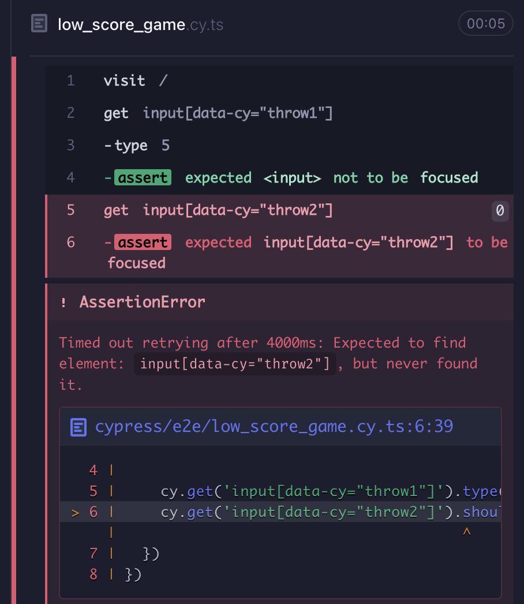
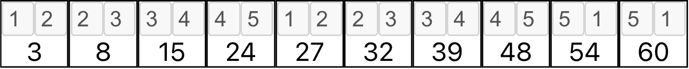

# Step Two: Create Score-Card Row

This step takes us from creating a single frame to a full row for a low-score bowling score-card using outside-in testing principles. Introduces installation of and testing with Cypress and fast-check.

This step will go into great detail to show how to use Cypress to test drive. Later steps will be less prescriptive, focusing instead on overall approach.

The first thing we'll need is to have a screen just for our bowling form. No need to style anything yet--just get inputs in place.

Our high-level task list for this step is small.
1. Create one frame.
2. Create row of frames.

Let's dig in!

## 1. Create one frame
We want to have the root application page display a single frame component to prove out the basic building block of the scoring form. In essence, this means that we'll be putting some inputs together with a rough layout. That may sound like a big step, but remember that we aren't really enabling much functionality yet. We're not adding any scores yet. We're not allowing spare or strike entry. We're not disabling entry after values are added. It's just a basic component that allows some numbers to be entered.

We'll start by writing our first test! In inside-out TDD, we might start by writing a test on a Frame JSX component. Here, we'll start by testing the default page.

### Install Cypress
To write end-to-end tests for this tutorial, I'm using Cypress. Whatever your preference, you'll need to install it. To install Cypress with npm I used `npm install cypress --save-dev`.

Once Cypress is installed, you'll need to run it in order to configure it. With npm, run `npx cypress open`. This will run Cypress and open the window below.


We're making end-to-end tests, so select the "E2E Testing" section. Cypress will create files in your project directory. The next screen lists what has been created, and you can take a look at the file contents.

You could probably stop here, but it's worth continuing if you haven't used Cypress before. Click "Continue" and you'll see a browser selection.


Select the browser you'd like and click the button to run E2E tests. You don't have any yet, so a dialog will pop up.


We'll make an empty spec, so select the box on the right. Now you'll be prompted to enter a name for the test.


Name it "low_score_game". This will create the test file that we'll be working with for the first several steps. Click the create button, and Cypress will show you the generated test.


This generates a test that doesn't actually assert anything. It does, however, provide our starting point and the URL for [example.cypress.io](https://example.cypress.io/), which might be useful for continuing to explore cypress outside of this tutorial. Go ahead and run the test so you can see how the results are reported.

Once you have examined the test results, you can close Cypress if you wish. We'll be returning to it frequently, so you might want to leave it running, but you can always run it again when needed with `npx cypress open` (or headless with `npx cypress run`).

There are a few things you'll need to do manually now to complete setting up Cypress. Go to the `cypress/` folder. You'll see a config file, `cypress.config.ts`. Add an entry inside the `e2e` section `baseUrl: 'http://localhost:3000'` (or whatever port your application runs on). This sets the default host for Cypress to use for URLs it's given, so we'll be able to use relative paths in our tests.

Next, still inside the Cypress directory, create the file `eslint.json` with the following content.

    {
        "plugins": [
            "cypress"
        ]
    }

One additional file is needed for TypeScript support, `tsconfig.json`.

    {
        "compilerOptions": {
            "target": "es5",
            "lib": ["es5", "dom"],
            "types": ["cypress", "node"],
            "jsx": "react"
        },
        "include": ["**/*.ts", "**/*.tsx"]
    }

Now your IDE should hopefully recognize the Cypress library.

### Test a Frame
A frame on a bowling score-sheet can take a lot of forms, but generally, there's a top section with at least one box to the right side and an open lower section. We'll make it the way that I remember from youth, with a single box in the upper right.

Our first test will be that numbers can be placed in the two upper sections.

Open the test file we just generated, `cypress/e2e/low_score_game.cy.ts`. The bulk of it looks like standard jest testing, but the sole command is `cy.visit('https://example.cypress.io'`. The global variable `cy` is the handle for interacting with Cypress commands, and `visit()` tells Cypress to load the provided URL. We'll use a relative link, loading our application's landing page.

Change the URL in the visit command to `'/'`. If your application and Cypress aren't running, start them now.

Now the Cypress loads your application instead of the Cypress example page. Let's build on that.

We'll want to make a few changes to the text of the test file. The description should be about the purpose of the test file. Let's make it match the file name "Low Score Game". Similarly, the test name should be more descriptive of its purpose. It 'should score a game with no spares or strikes'.

Now let's build some interactions for our page. Something that will spur us to build our frame component. The most direct way to get an input is to use `cy.get()`, passing it an identifier in x-path format. Cypress recommends using data attributes, so let's expect those. We have a single frame, so let's not worry about making an adaptable identifier just yet. After all, one purpose of this tutorial is to demonstrate how easy it is to evolve applications with outside-in testing.

After the visit line, type `input[data-cy="throw1"]`. Take a look at your test results. You should now see an error.


Cypress looked for the element and couldn't find it. We should correct that.

Open `src/App.tsx`. There's a lot of stuff in here that we just don't need. The JSX returned by the `App()` function can be replaced by a single input.

    return (
        <input type='text' data-cy='throw1'/>
    );

Now your test will pass! Let's break it again, so we can add more code!

Modify our `get()` command to type in the number 5.

    cy.get('input[data-cy="throw1"]').type('5')

The test still passes but enters the 5 into the input field. We want to move directly to the next input after entering a number, so let's start by asserting that the input we just used is no longer in focus. Cypress allows chaining, so we can add an assertion onto the same line.

    cy.get('input[data-cy="throw1"]').type('5').should('not.have.focus')

Good. Now we can add a blur action to the input.

    <input type='text' data-cy='throw1' onChange={(event) => event.target.blur()}/>

Our test passes, but we still don't have our frame yet. Let's add the second input. We should expect that after the first input loses focus the second input gains it. Using a similar expectation to the previous one, we can construct our new assertion.

    cy.get('input[data-cy="throw2"]').should('have.focus')

Oops. That error looks familiar.



Before we can give the input focus, it has to exist! We need to add the 2nd input.

    <>
        <input type='text' data-cy='throw1' onChange={(event) => event.target.blur()}/>
        <input type='text' data-cy='throw2'/>
    </>

It doesn't have the onChange callback, because there isn't a failing test to require it yet. Our test still fails, but now because the input doesn't have focus. We'll need to edit the onChange of the first input. We'll use a ref to transfer focus.

    function App() {
        const throwTwoInput = useRef<HTMLInputElement>(null)
        return (
            <>
                <input type='text' data-cy='throw1' onChange={() => throwTwoInput.current !== null && throwTwoInput.current.focus()}/>
                <input type='text' data-cy='throw2' ref={throwTwoInput}/>
            </>
        );
    }

That's better, but it points out something we missed earlier. Instead of makng the user click into the 1st input, we should start with it having focus. Let's amend our first assertion chain.

    cy.get('input[data-cy="throw1"]').should('have.focus').type('5').should('not.have.focus')

Our Cypress test fails, so we should set our initial focus. We'll accomplish that with another ref and a layout effect.

    function App() {
        const throwOneInput = useRef<HTMLInputElement>(null)
        const throwTwoInput = useRef<HTMLInputElement>(null)
        useLayoutEffect(() => {
            throwOneInput.current !== null && throwOneInput.current.focus()
        })
        return (
            <>
                <input type='text' data-cy='throw1' ref={throwOneInput} onChange={() => throwTwoInput.current !== null && throwTwoInput.current.focus()}/>
                <input type='text' data-cy='throw2' ref={throwTwoInput}/>
            </>
        );
    }

Good. Now we're getting somewhere, and we're producing quite a lot of duplication. We won't deal with that yet. We have a lot of functionality to add yet, so it's possible that the current similarities could diverge again. Or they'll become stable enough to see the real duplication.

Now we'll finish the assertion chain for the 2nd throw's input.

    cy.get('input[data-cy="throw2"]').should('have.focus').type('3').should('not.have.focus')

The assertions are now fully duplicated, apart for the data-cy and text values. That's okay. If it really bothers you, you can make a custom Cypress command for the chain. That's a bit much for right now, so let's just let it be.

Our code change is going to look familiar.

    <input type='text' data-cy='throw2' ref={throwTwoInput} onChange={(event) => event.target.blur()}/>

Our test passes again, and we have half of our frame completed! Now we need to finish it with a text display of the total. Since this is the simplest case, we can simply add the two values, but we need a new assertion.

    cy.get('[data-cy="total"]').should('have.text', '8')

Here we're using another one of Cypress's semantic assertions. The `have.text` assertion operates much like a text content assertion in jest. Of course, our test is failing before it event gets there. We've seen the failure for no element found before, so I'll skip slightly ahead to show the code that makes the whole assertion pass.

    function App() {
        const [total, setTotal] = useState<number|null>(null)
        const throwOneInput = useRef<HTMLInputElement>(null)
        const throwTwoInput = useRef<HTMLInputElement>(null)
        const closeSecondThrow = () => {
            if (throwOneInput.current !== null && throwTwoInput.current !== null) {
                throwTwoInput.current.blur()
                const value1 = Number(throwOneInput.current.value)
                const value2 = Number(throwTwoInput.current.value)
                setTotal(value1 + value2)
            }
        }
        useLayoutEffect(() => {
            throwOneInput.current !== null && throwOneInput.current.focus()
        })
        return (
            <>
                <input type='text' data-cy='throw1' ref={throwOneInput} onChange={() => throwTwoInput.current !== null && throwTwoInput.current.focus()}/>
                <input type='text' data-cy='throw2' ref={throwTwoInput} onChange={closeSecondThrow}/>
                <span data-cy='total'>{total}</span>
            </>
        );
    }

Now we have a frame that fully implements the happy path for two throws that total under 10. There's a lot to be desired, though. The code has a lot of duplication, there are no assertions to demonstrate that numbers can't be entered, there's no assurance that the numbers can't be re-entered, and the layout looks nothing like we want.


### Handle Frame Logic
Let's handle the form behavior. We could expand the Cypress test to try entering a letter, but what do we expect to happen? We could allow invalid entry, show a warning, and return focus. At that point, we may as well reset the value to empty and save the user a delete stroke.

So, we should just add an assertion before the valid entries, right? Well, we could, but that would be hiding error flow functionality in a happy path test. We could make a failure path Cypress test, but it wouldn't have much to it. That's a lot of Cypress resetting just for a single assertion, and we would only be testing a single bad value. Let's zoom in for a unit test.

In outside-in testing, we favor end-to-end tests over unit tests, but we still use unit tests where appropriate. Logic such as edge-case testing are perfect for unit tests. The only problem is that we have no unit.

So far we've been writing directly into the App component. Now that we want to specifically test the frame, we should probably extract it into a component. Here we see one of the benefits of outside-in; we can change the composition of components without changing the Cypress tests. The users don't care about the structure of our code, and neither does Cypress. Only our unit tests will care about component interfaces and composition, so we'll keep the number of them down and focus on only the logic.

Almost all the current implementation in our App component is directly related to the frame, so let's extract it to a new Frame component.

App.tsx

    import React from 'react';
    import './App.css';
    import Frame from "./Frame";

    function App() {
        return (
            <Frame/>
        );
    }

    export default App;


Frame.tsx

    import React, { useLayoutEffect, useRef, useState } from 'react';

    function Frame() {
        const [total, setTotal] = useState<number|null>(null)
        const throwOneInput = useRef<HTMLInputElement>(null)
        const throwTwoInput = useRef<HTMLInputElement>(null)
        const closeSecondThrow = () => {
            if (throwOneInput.current !== null && throwTwoInput.current !== null) {
                throwTwoInput.current.blur()
                const value1 = Number(throwOneInput.current.value)
                const value2 = Number(throwTwoInput.current.value)
                setTotal(value1 + value2)
            }
        }
        useLayoutEffect(() => {
            throwOneInput.current !== null && throwOneInput.current.focus()
        })
        return (
            <>
                <input type='text' data-cy='throw1' ref={throwOneInput} onChange={() => throwTwoInput.current !== null && throwTwoInput.current.focus()}/>
                <input type='text' data-cy='throw2' ref={throwTwoInput} onChange={closeSecondThrow}/>
                <span data-cy='total'>{total}</span>
            </>
        );
    }

    export default Frame;

A quick check assures us that the Cypress test still passes. Now we have an appropriate unit to test. We'll create a `Frame.test.tsx` file for it.

import { render, screen } from "@testing-library/react";
import Frame from "./Frame";
import userEvent from "@testing-library/user-event";

    describe('Frame', () => {
        describe('character validation', () => {
            it('should not allow a letter character in the first throw', () => {
                render(<Frame/>)
                const inputElements = screen.getAllByRole('textbox')
                userEvent.type(inputElements[0], 'x')
                expect(inputElements[0]).toHaveDisplayValue('')
                expect(inputElements[0]).toHaveFocus();
            })
        })
    })

We have two assertions in there, but they're both part of the same expectation. After entering an invalid character, the input remains empty and in focus. Let's run `npm test`

We got 2 failures! One is for the test we just wrote. The other is the default React test, `App.test.tsx`.

    test('renders learn react link', () => {
        render(<App />);
        const linkElement = screen.getByText(/learn react/i);
        expect(linkElement).toBeInTheDocument();
    });

This test is irrelevant now. Let's just delete it. Now we just have the one we wrote to look at.

It's currently failing because the display value is an 'x' instead of ''. We can fix that, but first we should refactor the onChange callback function for the input.

We'll just extract the current onChange function.

    const firstThrowOnChange = () => throwTwoInput.current !== null && throwTwoInput.current.focus()
    useLayoutEffect(() => {
        throwOneInput.current !== null && throwOneInput.current.focus()
    })
    return (
        <>
            <input type='text' data-cy='throw1' ref={throwOneInput} onChange={firstThrowOnChange}/>
            <input type='text' data-cy='throw2' ref={throwTwoInput} onChange={closeSecondThrow}/>
            <span data-cy='total'>{total}</span>
        </>
    );

Test still fails, but now we have some room to work. Now we want to put a guard on the input to reset the value to blank if it's an 'x'. Yes, I want to be that specific for the moment.

    const firstThrowOnChange = () => {
        if (throwOneInput.current?.value === 'x') {
            throwOneInput.current.value = ''
        }
        throwTwoInput.current !== null && throwTwoInput.current.focus()
    }

Is this awful? Yes. Does it work? Well, the test shows that the 'x' is gone, but now it fails because the input has lost focus. We can fix that with a quick adjustment.

    const firstThrowOnChange = () => {
        if (throwOneInput.current?.value === 'x') {
            throwOneInput.current.value = ''
            throwOneInput.current.focus()
        } else {
            throwTwoInput.current !== null && throwTwoInput.current.focus()
        }
    }

That did it! I feel bad, but the code does what I want. Let's let that nastiness fester for a little while we add another test to make it worse!


    it('should not allow a letter character in the second throw', () => {
        render(<Frame/>)
        const inputElements = screen.getAllByRole('textbox')
        userEvent.type(inputElements[0], '3')
        userEvent.type(inputElements[1], 'y')
        expect(inputElements[1]).toHaveDisplayValue('')
        expect(inputElements[1]).toHaveFocus();
    })

It's almost exactly the same, except that it adds a value for the 1st throw and tries a 'y' for the 2nd. This is already feeling wrong, as it's more of a user-focused test than a unit test should be, and it's testing essentially the same behavior on a second input within the same component. Let's see how bad it gets.

The new test fails because the display value is a 'y' instead of ''. Very familiar. Let's add make some familiar changes.

    const firstThrowOnChange = () => {
        if (throwOneInput.current?.value === 'x') {
            throwOneInput.current.value = ''
            throwOneInput.current.focus()
        } else {
            throwTwoInput.current !== null && throwTwoInput.current.focus()
        }
    }
    const secondThrowOnChange = () => {
        if (throwTwoInput.current?.value === 'y') {
            throwTwoInput.current.value = ''
            throwTwoInput.current.focus()
        } else if (throwOneInput.current !== null && throwTwoInput.current !== null) {
            throwTwoInput.current.blur()
            const value1 = Number(throwOneInput.current.value)
            const value2 = Number(throwTwoInput.current.value)
            setTotal(value1 + value2)
        }
    }

We changed the function `closeSecondThrow` to `secondThrowOnChange` and there is some very clear duplication here. Before we start pulling out common code, let's look at the common _patterns_. Both of the inputs are now identical, apart from the names of the refs and change handlers. Similarly, both change handlers check their tied refs for bad values and handle them the same way then proceed to additional logic that manages the focus and adds the values. There's a lot going on here in our little inputs! It seems like we can make things more similar to find a way to extract the full commonality. What if the change handlers could be made to look the same?

How about this?

    export type FrameStateEnum = 'First Throw' | 'Second Throw' | 'Done'
    function Frame() {
      const [total, setTotal] = useState<number | ''>('')
      const [frameState, setFrameState] = useState<FrameStateEnum>('First Throw')
      const throwOneInput = useRef<HTMLInputElement>(null)
      const throwTwoInput = useRef<HTMLInputElement>(null)

      const firstThrowOnChange = () => {
        if (throwOneInput.current?.value === 'x') {
          throwOneInput.current.value = ''
        } else {
          setFrameState('Second Throw')
        }
      }
      const secondThrowOnChange = () => {
        if (throwTwoInput.current?.value === 'y') {
          throwTwoInput.current.value = ''
        } else {
          setFrameState('Done')
        }
      }
      useLayoutEffect(() => {
        throwOneInput.current !== null && throwOneInput.current.focus()
      })
      useEffect(() => {
        if (frameState === 'Done') {
          const value1 = Number(throwOneInput.current?.value)
          const value2 = Number(throwTwoInput.current?.value)
          setTotal(value1 + value2)
          throwOneInput.current?.blur() && throwTwoInput.current?.blur()
        } else if (frameState === 'First Throw') {
          throwOneInput.current?.focus()
        } else {
          throwTwoInput.current?.focus()
        }
      }, [frameState])
      return (
        <>
          <input type='text' data-cy='throw1' ref={throwOneInput} onChange={firstThrowOnChange}/>
          <input type='text' data-cy='throw2' ref={throwTwoInput} onChange={secondThrowOnChange}/>
          <span data-cy='total'>{total}</span>
        </>
      );
    }

In some ways this is a little uglier, but it does pass the unit and behavior tests, and now the two input fields are identical in structure. We're ready to make our lives and the code a little better. Let's extract a new component to represent the input field. For lack of a better name, let's call it FrameInput.

    export type FrameInputProps = {
        inputRef: RefObject<HTMLInputElement>
        setFrameState: (state: FrameStateEnum) => void
        nextFrameState: FrameStateEnum
        dataCy: string
    }

    export function FrameInput({inputRef, setFrameState, nextFrameState, dataCy}: FrameInputProps) {
        const changeHandler = () => {
            if (inputRef.current?.value === 'x' || inputRef.current?.value === 'y') {
                inputRef.current.value = ''
            } else {
                setFrameState(nextFrameState)
            }
        }
        return <input type='text' ref={inputRef} onChange={changeHandler} data-cy={dataCy}/>
    }

Everything for an individual input is now in `FrameInput.tsx`. That includes the entry validation and passing the frame state when the data is valid. The Frame is now somewhat simpler.

    export type FrameStateEnum = 'First Throw' | 'Second Throw' | 'Done'
    function Frame() {
        const [total, setTotal] = useState<number | ''>('')
        const [frameState, setFrameState] = useState<FrameStateEnum>('First Throw')
        const throwOneInput = useRef<HTMLInputElement>(null)
        const throwTwoInput = useRef<HTMLInputElement>(null)

        useEffect(() => {
          if (frameState === 'Done') {
            const value1 = Number(throwOneInput.current?.value)
            const value2 = Number(throwTwoInput.current?.value)
            setTotal(value1 + value2)
            throwTwoInput.current?.blur()
          } else if (frameState === 'First Throw') {
            throwOneInput.current?.focus()
          } else {
            throwTwoInput.current?.focus()
          }
        }, [frameState])
        return (
          <>
            <FrameInput dataCy='throw1' inputRef={throwOneInput} setFrameState={setFrameState} nextFrameState={'Second Throw'}/>
            <FrameInput dataCy='throw2' inputRef={throwTwoInput} setFrameState={setFrameState} nextFrameState={'Done'}/>
            <span data-cy='total'>{total}</span>
          </>
        );
    }

Now it's a bunch of declarations and a clunky useEffect. We'll just live with that for a bit, because I suspect that once we add the rest of the frames for our first Cypress test we'll have a better idea of where that logic belongs.

What about our unit tests? We have two tests in `Frame.test.tsx` that are virtually identical. Let's create a new test file called `FrameInput.test.tsx`.

    describe('Frame Input', () => {
        function TestWrapper() {
            const [_, setState] = useState<FrameStateEnum>('First Throw')
            const ref = useRef<HTMLInputElement>(null)
            return <FrameInput inputRef={ref} setFrameState={setState} nextFrameState={'Second Throw'} dataCy={'field'}/>
        }
        describe('character validation', () => {
            it('should not allow a letter character', () => {
                render(<TestWrapper/>)
                const inputElement = screen.getByRole('textbox')
                userEvent.type(inputElement, 'x')
                expect(inputElement).toHaveDisplayValue('')
                expect(inputElement).toHaveFocus();
            })
            it('should not allow a different letter character', () => {
                render(<TestWrapper/>)
                const inputElement = screen.getByRole('textbox')
                userEvent.type(inputElement, 'y')
                expect(inputElement).toHaveDisplayValue('')
                expect(inputElement).toHaveFocus();
            })
        })
    })

It's basically a copy (in fact I started by just renaming the old test--we don't need it anymore), but now there's a TestWrapper component. In order to make a ref to pass to our component, we need to have a parent component that defines it. For now, it's a weird layer in our test, but these things have a way of becoming useful, so we'll hope that's the case.

The bigger problem is that our tests are extremely similar and oddly specific. We could create a parameterized test, but do we want to go through every single character? One invalid character is enough to demonstrate that the field behaves properly with that input; repeatedly recreating a JSX element and testing its callbacks seems excessive when what we really want to do is confirm that our validation code is well-tested.

Sounds like we need a function for validating inputs! While we're at it, let's use property testing, an approach that's well-suited for generating data in customizable tests. Let's try out fast-check, just because someone pointed it out to me. Run `npm install fast-check --save-dev`.

Now we need a function to test. Let's create a module for it, `validators.ts`.

    export function isCharacterValid(char: string): boolean {
        return false
    }

Looks like `src` is getting messy.


Our new file is now lost beneath a lot of root level boilerplate files. We should do something about that, but let's complete our thought first. Let's get our property test started.

We'll start with a positive case: adding a test for number characters.

    import * as fc from 'fast-check';
    import { isCharacterValid } from "./validators";

    describe('validator tests', () => {
        describe('isCharacterValid', () => {
            it('should allow single digits', () => {
                fc.assert(fc.property(fc.integer(), (num: number) => {
                    return isCharacterValid(num.toString())
                }))
            })
        })
    })

The fast-check functions nest within a jest test to describe the assertion and the property inputs. It will run for a configurable number of times, stopping if the inner return value is false. The values are randomized within the constraint given (here, integer), so your initial run will likely differ from mine. I get the following error.

    Error: Property failed after 1 tests
    { seed: 1868652023, path: "0:0", endOnFailure: true }
    Counterexample: [0]
    Shrunk 1 time(s)
    Got error: Property failed by returning false

The counter example is the case that failed, in my run that's the number '0'. Let's just flip it to always return true, so we can write more test for what isn't allowed.

That passes, because now it can't fail! Let's double-check what `fc.integer()` is generating with a console statement.

Logging out the values of num, I get a wide range: 1550083637, -961876303, -12, 1335476520, 287667531, 1561356392, 2147483628, 2.... It goes on for quite some time. Most of the values are not numbers that are valid, and only need to run it up to 10 times to hit all the valid integers. Here's where constraints come in.

    it('should allow single digits', () => {
        fc.assert(fc.property(fc.integer({min: 0, max: 9}), (num: number) => {
            return isCharacterValid(num.toString())
        }), {numRuns: 10, skipEqualValues: true})
    })

Now the integer generator will only return values between 0 and 9. Additionally, the assertion is limited to 10 runs and will not re-use any values. Every positive case for our Cypress test is covered!

Now we'll confirm that users can't paste in a larger number.

    it('should not allow numbers over one digit', () => {
        fc.assert(fc.property(fc.integer({min: 10}), (num: number) => {
            return !isCharacterValid(num.toString())
        }), {numRuns: 10, skipEqualValues: true})
    })

It's very similar to the positive case. We've changed the min value to 10 and removed the max altogether. We'll leave the limits on values for now, since we don't need duplicates, and we only need a handful of values to prove the point.

    Error: Property failed after 1 tests
    { seed: -1124627812, path: "0:0", endOnFailure: true }
    Counterexample: [10]
    Shrunk 1 time(s)
    Got error: Property failed by returning false

Well, that's a 2-digit number failing to be invalid. Time to put in some work.

    export function isCharacterValid(char: string): boolean {
        const number = Number(char);
        if (!isNaN(number)) {
            return number < 10
        }
        return true
    }

I think we can agree this is terrible, but I really want the implementation to be driven by the tests. I'll skip ahead to where we have this fully tested.

    it('should not allow negative numbers', () => {
        fc.assert(fc.property(fc.integer({max: -1}), (num: number) => {
            return !isCharacterValid(num.toString())
        }), {numRuns: 10, skipEqualValues: true})
    })

    it('should not allow non-numeric characters', () => {
        const nonNumericPattern = new RegExp('\\D')
        fc.assert(fc.property(fc.char().filter(t => nonNumericPattern.test(t)), (value: string) => {
            return !isCharacterValid(value)
        }), {numRuns: 30, skipEqualValues: true})
    })

I'm letting the non-numeric check run 30 times, since there are a lot more of those. It's not comprehensive, but it will cover a broad sampling--enough to verify that we're doing validation. The other thing to note here is the addition of a filter on the _arbitrary_, `fc.char().filter(t => nonNumericPattern.test(t))`. Think of this as an advanced constraint. Fast-check will generate a single character, but it will use the appended filter to determine whether to use it. If any of the 30 runs generates a numeric character, that run will be retried until a non-numeric character is generated. Our code is now a simple regex check, because I overuse regex.

    export function isCharacterValid(char: string): boolean {
      return new RegExp('^\\d$').test(char)
    }

That RegExp could be a constant, and maybe I'll worry about that sometime. So now we have a fully tested validator to keep out entries that are never valid! Let's plug it in.

    const changeHandler = () => {
        if (inputRef.current?.value) {
            if (isCharacterValid(inputRef.current?.value)) {
                setFrameState(nextFrameState)
            } else {
                inputRef.current.value = ''
            }
        }
    }

I rewrote it so that the valid case is first, and the logic is wrapped in a check for the existence of value because you can't set a potentially undefined property. We're now using our well-tested validation!

Looking back in `FrameInput.test.tsx`, we see that there are still two different tests for invalid characters. We can reduce that to one now and rename it to be more explicit about what's being tested.

    it('should reset invalid data', () => {
        render(<TestWrapper/>)
        const inputElement = screen.getByRole('textbox')
        userEvent.type(inputElement, 'N')
        expect(inputElement).toHaveDisplayValue('')
        expect(inputElement).toHaveFocus();
    })

It is clear now that the test is about the behavior of the input when given a bad value, and with outside-in we can assume that it's using the validator that we just property tested. There's another validation to do here, and I'm going to jump ahead to show you the finished code after adding it. It's about ensuring that the second throw doesn't knock down more pins than are left after the first. Here is the new validation test.

    describe('isTotalValid', () => {
        it('should allow 9 and under', () => {
            fc.assert(fc.property(fc.integer({min: 0, max: 9}), (total: number) => {
                return isTotalValid(total)
            }), {numRuns: 10, skipEqualValues: true})
        })

        it('should not allow totals over 10', () => {
            fc.assert(fc.property(fc.integer({min: 10}), (total: number) => {
                return !isTotalValid(total)
            }), {numRuns: 10, skipEqualValues: true})
        })
    })

We're disallowing a total of 10. Technically, that's a spare, and we'll deal with that later. Otherwise, this should look familiar. The implementation in `validations.ts` is extremely simple.

    export function isTotalValid(total: number): boolean {
        return total <= 9
    }

The Frame test makes a return to establish that the second input is reset if the total is too large.

    describe('Frame test', () => {
        describe('form validation', () => {
            it('should not allow more than 10 pins to be recorded', () => {
                render(<Frame/>)
                const inputs = screen.getAllByRole('textbox')
                userEvent.type(inputs[0], '7')
                userEvent.type(inputs[1], '9')
                expect(inputs[1]).toHaveDisplayValue('')
                expect(inputs[1]).toHaveFocus()
            })
        })
    })

And the new useEffect in `Frame.tsx`.

    useEffect(() => {
        if (frameState === 'Done') {
            if (throwOneInput.current && throwTwoInput.current) {
                const value1 = Number(throwOneInput.current.value)
                const value2 = Number(throwTwoInput.current.value)
                const total = value1 + value2
                if (isTotalValid(total)) {
                    setTotal(total)
                    throwTwoInput.current.blur()
                } else {
                    throwTwoInput.current.value = ''
                    setFrameState('Second Throw')
                }
            }
        } else if (frameState === 'First Throw') {
            throwOneInput.current?.focus()
        } else {
            throwTwoInput.current?.focus()
        }
    }, [frameState])

It's a bit unwieldy, but it does the trick.

We have one more thing to do before we close out our first task. Once an acceptable value has been entered in a frame, the input should be disabled. Let's add to our Cypress test.

    it('should score a game with no spares or strikes', () => {
        cy.visit('/')

        cy.get('input[data-cy="throw1"]').should('have.focus').type('5').should('not.have.focus').should('be.disabled')
        cy.get('input[data-cy="throw2"]').should('have.focus').type('3').should('not.have.focus').should('be.disabled')
        cy.get('[data-cy="total"]').should('have.text', '8')
    })

It's a visual effect, so we can just add onto the assertion chains a check that after valid entry they are disabled. The mechanism by which this works is a new property on FrameInput.

    export function FrameInput({inputRef, active, setFrameState, nextFrameState, dataCy}: FrameInputProps) {
      const changeHandler = () => {
        if (inputRef.current?.value) {
          if (isCharacterValid(inputRef.current?.value)) {
            setFrameState(nextFrameState)
          } else {
            inputRef.current.value = ''
          }
        }
      }
      return <input type='text' ref={inputRef} disabled={!active} onChange={changeHandler} data-cy={dataCy}/>
    }

At this level it's just a matter of passing a boolean prop to the FrameInput to tell it whether it's active. It makes the disabled call inverse, but the call from Frame (which is where we know the state) reads very nicely!

    <FrameInput dataCy='throw1' active={frameState === 'First Throw'} inputRef={throwOneInput} setFrameState={setFrameState} nextFrameState={'Second Throw'}/>
    <FrameInput dataCy='throw2' active={frameState === 'Second Throw'} inputRef={throwTwoInput} setFrameState={setFrameState} nextFrameState={'Done'}/>

I'm getting an itch to merge frame state with the dataCy tag and next frame state, but we'll be changing up how those work when we put together multiple frames, so I'll hold off for a bit to see what levels everything winds up at. One last change I had to make was to add the active property to the TestWrapper instance in `FrameInput.test.ts`.

    function TestWrapper() {
        const [_, setState] = useState<FrameStateEnum>('First Throw')
        const ref = useRef<HTMLInputElement>(null)
        return <FrameInput inputRef={ref} active={true} setFrameState={setState} nextFrameState={'Second Throw'} dataCy={'field'}/>
    }

### Style the Frame

Now that the frame is functional, we need to make it look more like, well, a frame. Ready for the test? Good instinct, but this is purely cosmetic. If we were to test the design, Cypress and jest (on their own) would not be the best approach. Design is finicky and dependent on human verification, so some mixture of QA/QC or some form of Approval test for once the design is settled. We might explore that when we're done, but for now, we'll just style the Frame.

I added some classes to the frame...

      <div className='frame'>
        <div className='frame-top'>
          <FrameInput dataCy='throw1' active={frameState === 'First Throw'} inputRef={throwOneInput} setFrameState={setFrameState} nextFrameState={'Second Throw'}/>
          <FrameInput dataCy='throw2' active={frameState === 'Second Throw'} inputRef={throwTwoInput} setFrameState={setFrameState} nextFrameState={'Done'}/>
        </div>
        <div className='frame-bottom'>
          <span data-cy='total'>{total}</span>
        </div>
      </div>

...defined them in `Frame.css`...

    .frame {
        background: white;
        display: flex;
        flex-direction: column;
        width: 2.5rem;
        height: 2.5rem;
        border: 1px solid black;
        padding: 0;
        margin: .5rem;
    }

    .frame-top {
        display: flex;
        flex-direction: row;
        width: 100%;
    }

    .frame-bottom {
        text-align: center;
        width: 100%;
    }

...added a class to FrameInput...

    return <input type='text' className='frame-input' ref={inputRef} disabled={!active} onChange={changeHandler} data-cy={dataCy}/>

...and defined it in `FrameInput.css`.

    .frame-input {
        width: .75rem;
    }

There are a lot of ways to apply the styling, and I considered using something fancier, but this is a really simple app. Straightforward CSS is good enough.

We're ready for the second task!


## 2. Create row of frames

Now that we have a single frame, we need a bunch of them! A game is 10 frames, if you're a terrible bowler. Our Cypress test is about scoring a game with no spares or strikes, so we'll start with 10. Things are going to get more complicated, as this will include modifications to the scoring.

### Add a second frame

The second frame will require a lot of work, as state management and total calculation will need modifications. The good news is that after that it should be easy to fill out the rest of the simple game form!

Let's modify our Cypress test.

      cy.get('input[data-cy="frame1_throw1"]').should('have.focus').type('5').should('not.have.focus').should('be.disabled')
      cy.get('input[data-cy="frame1_throw2"]').should('have.focus').type('3').should('not.have.focus').should('be.disabled')
      cy.get('[data-cy="frame1_total"]').should('have.text', '8')

The data-cy value has changed to scope it to 'frame1'. This will pave the way for adding additional frames. The change is a simple one in `Frame.tsx`.

    <div className='frame'>
      <div className='frame-top'>
        <FrameInput dataCy='frame1_throw1' active={frameState === 'First Throw'} inputRef={throwOneInput} setFrameState={setFrameState} nextFrameState={'Second Throw'}/>
        <FrameInput dataCy='frame1_throw2' active={frameState === 'Second Throw'} inputRef={throwTwoInput} setFrameState={setFrameState} nextFrameState={'Done'}/>
      </div>
      <div className='frame-bottom'>
        <span data-cy='frame1_total'>{total}</span>
      </div>
    </div>

Now we can add assertions for the second frame.

    cy.get('input[data-cy="frame2_throw1"]').should('have.focus').type('7').should('not.have.focus').should('be.disabled')
    cy.get('input[data-cy="frame2_throw2"]').should('have.focus').type('0').should('not.have.focus').should('be.disabled')
    cy.get('[data-cy="frame2_total"]').should('have.text', '15')

We'll need to have something to put the frames in, so let's make a ScoreCardRow. No need to test it; it's just a holder for components with no special functionality... yet!

    import Frame from "./Frame";

    export function ScoreCardRow() {
      return <Frame/>
    }

And update `App.tsx`.

    function App() {
      return (
        <ScoreCardRow/>
      );
    }

Now we have someplace to add the second frame. To do that I extracted the FrameStateEnum to `stateEnums.tsx` and added a new state.

    export type FrameStateEnum = 'Not Started' | 'First Throw' | 'Second Throw' | 'Done'

It felt weird to have that declared in Frame and referenced in FrameInput, so it's in separate module. Frame has changed considerably.

    export type FrameProps = {
      dataCy: string
      isActive: boolean
      onFinish: (total: number) => void
      previousFrameScore: number | null
    }

    function Frame({dataCy, isActive, onFinish, previousFrameScore}: FrameProps) {
      const [total, setTotal] = useState<number | ''>('')
      const [frameState, setFrameState] = useState<FrameStateEnum>('Not Started')
      const throwOneInput = useRef<HTMLInputElement>(null)
      const throwTwoInput = useRef<HTMLInputElement>(null)

      useEffect(() => {
        if (frameState === 'Done') {
          if (throwOneInput.current && throwTwoInput.current) {
            const value1 = Number(throwOneInput.current.value)
            const value2 = Number(throwTwoInput.current.value)
            const frameTotal = value1 + value2
            if (isTotalValid(frameTotal)) {
              const newTotal = (previousFrameScore ?? 0) + frameTotal
              setTotal(newTotal)
              throwTwoInput.current.blur()
              onFinish(newTotal)
            } else {
              throwTwoInput.current.value = ''
              setFrameState('Second Throw')
            }
          }
        } else if (frameState === 'First Throw') {
          throwOneInput.current?.focus()
        } else {
          throwTwoInput.current?.focus()
        }
      }, [frameState, previousFrameScore])
      useEffect(() => {
        if (isActive && frameState === 'Not Started') {
          setFrameState('First Throw')
        }
      }, [frameState, isActive])
      return (
        <div className='frame'>
          <div className='frame-top'>
            <FrameInput
                dataCy={ `${dataCy}_throw1` }
                active={frameState === 'First Throw'}
                inputRef={throwOneInput}
                setFrameState={setFrameState}
                nextFrameState={'Second Throw'}
            />
            <FrameInput
                dataCy={ `${dataCy}_throw2` }
                active={frameState === 'Second Throw'}
                inputRef={throwTwoInput}
                setFrameState={setFrameState}
                nextFrameState={'Done'}
            />
          </div>
          <div className='frame-bottom'>
            <span data-cy={ `${dataCy}_total` }>{total}</span>
          </div>
        </div>
      );
    }

There are now a lot of new props to handle state transition in the ScoreCardRow. We'll see why the `previousFrameScore` can be `null` in just a bit. The initial `FrameStateEnum` is now `'Not Started'`. This allows the frame to wait to be activated, so there's no competition for the focus call. The biggest change is in the original useEffect. It now includes `previousFrameScore` in the calculation for total and uses that as a dependency. There's a touch of programming ahead of requirements here, because we'll be glad for this when we handle spares and strikes, but it's useful now without over-complicating anything. We're also setting total twice--once for the Frame and once as a parameter to the `onFinish` callback. We'll see how that works in a second, but for now just know that this value becomes the `previousFrameScore` for the next Frame. We also have a new useEffect that's dependent on `frameState` and `isActive`. Remember that the new default frame state is 'Not Started'? This hook changes the state to 'First Throw' as soon as the Frame is activated. Now let's look at `ScoreCardRow.tsx`.

    export function ScoreCardRow() {
      const [activeFrame, setActiveFrame] = useState(0)
      const [frameScore, setFrameScore] = useState<Array<number | null>>([])
      const advanceFrame = (frameTotal: number) => {
        const scores = [...frameScore]
        scores[activeFrame] = frameTotal
        setFrameScore(scores)
        setActiveFrame(activeFrame + 1)
      }
      return (
          <>
            <Frame
                dataCy='frame1'
                isActive={activeFrame === 0}
                onFinish={advanceFrame}
                previousFrameScore={0}
            />
            <Frame
                dataCy='frame2'
                isActive={activeFrame === 1}
                onFinish={advanceFrame}
                previousFrameScore={frameScore[0]}
            />
          </>
      )
    }

There's a lot here all of a sudden! We have a few states being tracked now. The `activeFrame` state tracks the frames by index. This is incremented by the `advanceFrame` function (passed to the Frames as `onFinish`), which also uses the same index to set the `frameScore` state. This is why the frame totals are sent in the callback. The `isActive` prop for each Frame is a check on each Frame's index against the active Frame index. Similarly, `previousFrameScore` is read by the index of the previous Frame in the `frameScore` state. That's a lot of duplication of the usage of that index, and I'm not happy about that. I'm still not happy about the flat directory structure either. I'll hold off on the index duplication for the moment and take care of the files before I forget about it again.

After restructuring, the files look like this.

```
src/
    components/
        Frame.css
        Frame.test.tsx
        Frame.tsx
        FrameInput.css
        FrameInput.test.tsx
        FrameInput.tsx
        ScoreCardRow.tsx
    functions/
        validators.test.ts
        validators.ts
    models/
        stateEnums.tsx
    App.css
    App.tsx
    ...
```

There are now folders for components, functions, and models. I'm not sold on 'functions', but it's more descriptive than 'utils' and fits the style of names for the other folders. Come to think of it, there's no need for the enums file to be '.tsx'. It's not a component!

```
src/
    components/
        Frame.css
        Frame.test.tsx
        Frame.tsx
        FrameInput.css
        FrameInput.test.tsx
        FrameInput.tsx
        ScoreCardRow.tsx
    functions/
        validators.test.ts
        validators.ts
    models/
        stateEnums.ts
    App.css
    App.tsx
    ...
```

That's better!

Now that we have a directory for models, I think there's a solution to that index overuse.

I created a model in `FrameDescription.ts` to combine frame information that goes together.

    export type FrameDescription = {
      index: number;
      tag: string;
      score: number | null;
    }

It's not big, but it provides some structure to tie the loose bits together. The `index` is to formalize the frame index into a property rather than making it just the position in an array. Since the `dataCy` value is linked to the index, it's included here as `tag`. Lastly, `score` is no longer a parallel array of number or null but a part of the same object.

There's also an initializer for creating a row's worth of FrameDescriptions in a new functions file called `initializers.ts`.

    import { FrameDescription } from "../models/FrameDescription";

    export function createFrameDescriptions(): FrameDescription[] {
      const descriptions: FrameDescription[] = []
      for (let i = 0; i < 2; i++) {
        descriptions.push({
          index: i,
          tag: `frame${i + 1}`,
          score: null,
        })
      }
      return descriptions
    }

There is no test for this function, as it has no logic per se. It simply creates (currently) 2 frames with index-based values. There's nothing that can go wrong here that won't be caught by the Cypress test.

The ScoreCardRow has become a lot simpler, and you can see where there's potential to now instantiate the Frames in a loop.

    export function ScoreCardRow() {
      const [frameDescriptions] = useState<FrameDescription[]>(createFrameDescriptions())
      const [activeFrame, setActiveFrame] = useState<FrameDescription>(frameDescriptions[0])
      const advanceFrame = (frameTotal: number) => {
        activeFrame.score = frameTotal
        if (activeFrame.index + 1 < frameDescriptions.length) {
          setActiveFrame(frameDescriptions[activeFrame.index + 1])
        }
      }
      return (
          <>
            <Frame
                dataCy={frameDescriptions[0].tag}
                isActive={activeFrame.index === frameDescriptions[0].index}
                onFinish={advanceFrame}
                previousFrameScore={0}
            />
            <Frame
                dataCy={frameDescriptions[1].tag}
                isActive={activeFrame.index === frameDescriptions[1].index}
                onFinish={advanceFrame}
                previousFrameScore={frameDescriptions[0].score}
            />
          </>
      )
    }

The `frameScore` state is gone, and the `activeFrame` is now storing a FrameDescription that contains an index rather than a number that happens to be a frame index. The FrameDescriptions are intialized into the default state of `frameDescriptions`, and now all the value properties of Frame are based on that state. They are still referenced by index, but that will go away when the Frames are created by iterating through the `frameDescriptions` state. The `advanceFrame` function changed drastically. Setting the frame's score is now a direct call to the active frame, and setting the new active frame now involves checking if there is a description before setting it.

All the unit tests and the Cypress test pass, so our refactoring is complete. We're ready to continue filling out our Cypress test case.


### Fill out the Score-Card Row

With the work to put a second frame on the screen, putting the next 8 is easy. Here are the new assertions in `low_score_game.cy.ts`.

    cy.get('input[data-cy="frame1_throw1"]').should('have.focus').type('5').should('not.have.focus').should('be.disabled')
    cy.get('input[data-cy="frame1_throw2"]').should('have.focus').type('3').should('not.have.focus').should('be.disabled')
    cy.get('[data-cy="frame1_total"]').should('have.text', '8')

    cy.get('input[data-cy="frame2_throw1"]').should('have.focus').type('7').should('not.have.focus').should('be.disabled')
    cy.get('input[data-cy="frame2_throw2"]').should('have.focus').type('0').should('not.have.focus').should('be.disabled')
    cy.get('[data-cy="frame2_total"]').should('have.text', '15')

    cy.get('input[data-cy="frame3_throw1"]').should('have.focus').type('4').should('not.have.focus').should('be.disabled')
    cy.get('input[data-cy="frame3_throw2"]').should('have.focus').type('2').should('not.have.focus').should('be.disabled')
    cy.get('[data-cy="frame3_total"]').should('have.text', '21')

    cy.get('input[data-cy="frame4_throw1"]').should('have.focus').type('0').should('not.have.focus').should('be.disabled')
    cy.get('input[data-cy="frame4_throw2"]').should('have.focus').type('3').should('not.have.focus').should('be.disabled')
    cy.get('[data-cy="frame4_total"]').should('have.text', '24')

    cy.get('input[data-cy="frame5_throw1"]').should('have.focus').type('3').should('not.have.focus').should('be.disabled')
    cy.get('input[data-cy="frame5_throw2"]').should('have.focus').type('4').should('not.have.focus').should('be.disabled')
    cy.get('[data-cy="frame5_total"]').should('have.text', '31')

    cy.get('input[data-cy="frame6_throw1"]').should('have.focus').type('6').should('not.have.focus').should('be.disabled')
    cy.get('input[data-cy="frame6_throw2"]').should('have.focus').type('1').should('not.have.focus').should('be.disabled')
    cy.get('[data-cy="frame6_total"]').should('have.text', '38')

    cy.get('input[data-cy="frame7_throw1"]').should('have.focus').type('3').should('not.have.focus').should('be.disabled')
    cy.get('input[data-cy="frame7_throw2"]').should('have.focus').type('2').should('not.have.focus').should('be.disabled')
    cy.get('[data-cy="frame7_total"]').should('have.text', '43')

    cy.get('input[data-cy="frame8_throw1"]').should('have.focus').type('6').should('not.have.focus').should('be.disabled')
    cy.get('input[data-cy="frame8_throw2"]').should('have.focus').type('0').should('not.have.focus').should('be.disabled')
    cy.get('[data-cy="frame8_total"]').should('have.text', '49')

    cy.get('input[data-cy="frame9_throw1"]').should('have.focus').type('7').should('not.have.focus').should('be.disabled')
    cy.get('input[data-cy="frame9_throw2"]').should('have.focus').type('1').should('not.have.focus').should('be.disabled')
    cy.get('[data-cy="frame9_total"]').should('have.text', '57')

    cy.get('input[data-cy="frame10_throw1"]').should('have.focus').type('0').should('not.have.focus').should('be.disabled')
    cy.get('input[data-cy="frame10_throw2"]').should('have.focus').type('4').should('not.have.focus').should('be.disabled')
    cy.get('[data-cy="frame10_total"]').should('have.text', '61')

All ten frames are now tested for a full, bad game. The outside test is now complete, but it's not quite done. There's a lot of duplication here, and while I normally don't try to reduce that in tests, here it's obscuring the point of the test--to show the progression through the frames and the accumulation of the total. We'll return to this after seeing the other changes.

The change in `initializers.ts` is very minor, simply bumping the loop in `createFrameDescriptions` from 2 to 10. The actual number matters so little that it may as well be a parameter. Let's keep an eye on that and see if the number 10 shows up elsewhere.

After adding 8 more Frames so the ScoreCardRow, there's less code in the JSX return value.

      <>
        {
          frameDescriptions.map(description => {
            return <Frame
                key={description.tag}
                dataCy={description.tag}
                isActive={activeFrame.index === description.index}
                onFinish={advanceFrame}
                previousFrameScore={frameDescriptions[description.index - 1]?.score ?? 0}
            />
          })
        }
      </>

The FrameDescription is starting to make things easier. Populating the `previousFrameScore` property is awkward, but mapping the descriptions to Frame components ensures that the descriptions and components stay in sync. We've also added a key, which we were missing in the "two frames" implementation. React needs that to keep track of components of the same type when they are dynamically assigned siblings.

Before we move on to styling the row, we'll return to the Cypress test. It's very repetitive in a way that overshadows the way the row is being filled out. There are ways to create global commands (functions) for your Cypress suite, but we only have a single test just yet. We'll reduce enough boilerplate to make the test easier to read, but leave duplication in place where it adds "narrative" clarity. Remember, this test is more than a series of assertions; it's a description of a user journey through the application.

    it('should score a game with no spares or strikes', () => {
      function forFrame(frameNumber: number) {
        const label = `frame${frameNumber}`
        function rollBall(throwNumber: number, pinsKnockedDown) {
          cy.get(`input[data-cy="${ label }_throw${throwNumber}"]`).should('have.focus').type(String(pinsKnockedDown)).should('not.have.focus').should('be.disabled')
        }
        return {
          throwOneIs(pinsKnockedDown1: number) {
            rollBall(1, pinsKnockedDown1)
            return {
              throwTwoIs(pinsKnockedDown2: number) {
                rollBall(2, pinsKnockedDown2)
                return {
                  whichTotals(expectedTotal: number) {
                    cy.get(`[data-cy="${ label }_total"]`).should('have.text', String(expectedTotal))
                  }
                }
              }
            }
          }
        }
      }

      cy.visit('/')

      forFrame(1).throwOneIs(5).throwTwoIs(3).whichTotals(8)
      forFrame(2).throwOneIs(7).throwTwoIs(0).whichTotals(15)
      forFrame(3).throwOneIs(4).throwTwoIs(2).whichTotals(21)
      forFrame(4).throwOneIs(0).throwTwoIs(3).whichTotals(24)
      forFrame(5).throwOneIs(3).throwTwoIs(4).whichTotals(31)
      forFrame(6).throwOneIs(6).throwTwoIs(1).whichTotals(38)
      forFrame(7).throwOneIs(3).throwTwoIs(2).whichTotals(43)
      forFrame(8).throwOneIs(6).throwTwoIs(0).whichTotals(49)
      forFrame(9).throwOneIs(7).throwTwoIs(1).whichTotals(57)
      forFrame(10).throwOneIs(0).throwTwoIs(4).whichTotals(61)
    })

Some complexity has been introduced with the chained functions, which is unfortunate. I feel it's worthwhile, though, because the main action of the test reads much clearer. The action is easy to follow, and the accumulating expectations are sensible. As ugly as the chained functions are in definition, it's all still inside the test function. It's right there to consult to see what's actually happening inside the assertions. The duplication I focused on reducing was the knowledge of HTML details and the checks for input field state. Those are an important part of the user interaction, but they are guided assistance, not essential core functionality. If we change our minds about how the fields work, it's easier to change without interfering with the main testing.

### Apply styling

The last thing we need for this task is to style the row. It's more of a column right now...

First the ScoreCardRow needs a style.

    <div className='scoreCardRow'>
      {
        frameDescriptions.map(description => {
          return <Frame
              key={description.tag}
              dataCy={description.tag}
              isActive={activeFrame.index === description.index}
              onFinish={advanceFrame}
              previousFrameScore={frameDescriptions[description.index - 1]?.score ?? 0}
          />
        })
      }
    </div>

The empty JSX wrapping element is now a div so that it can have a class name assigned to it. The CSS defined in `ScoreCardRow.css` is simple.

    .scoreCardRow {
        display: flex;
        flex-direction: row;
    }

We make it a flex component with a direction of row. Done.

Well, not quite. Perhaps to save space, most bowling score-sheets are compact, with the frames butted up against each other. Now that we have a row of them, let's revisit the CSS for a Frame.

    .frame {
        background: white;
        display: flex;
        flex-direction: column;
        width: 2.5rem;
        height: 2.5rem;
        border: 1px solid black;
        padding: 0;
        margin: 0;
    }

The only change here is that the margin has been set to 0.



That's it! Now to add some complexity in [Step Three](step_three.md)!